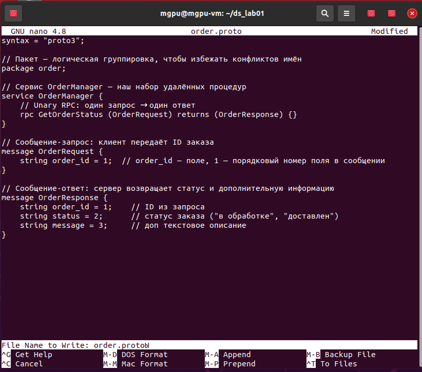
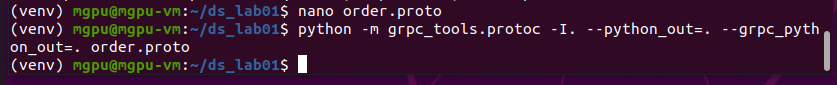
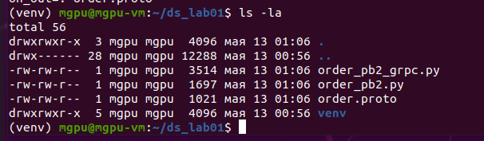
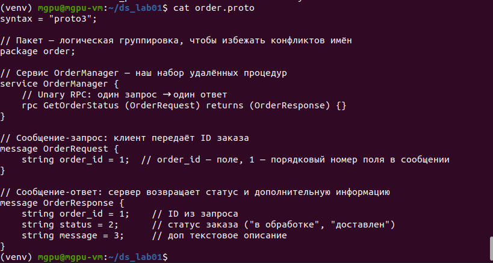
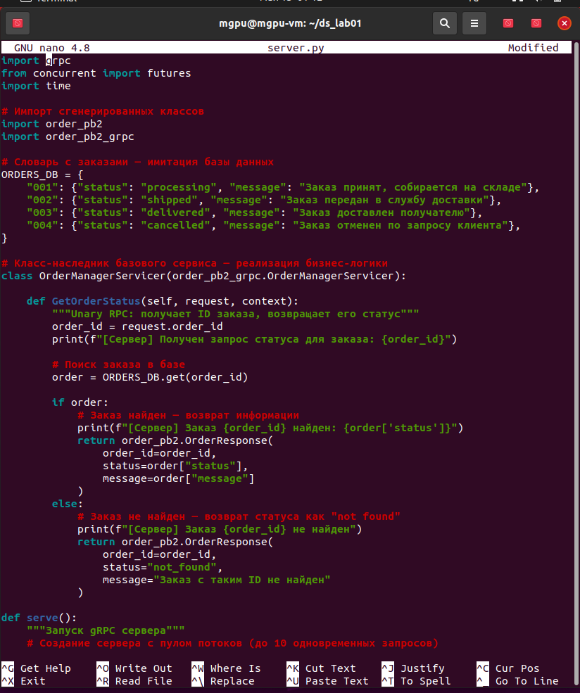
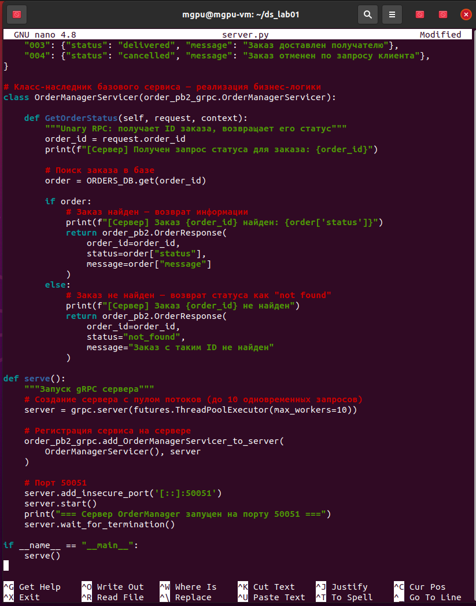
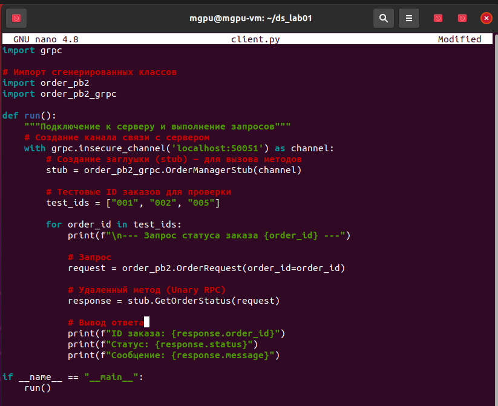
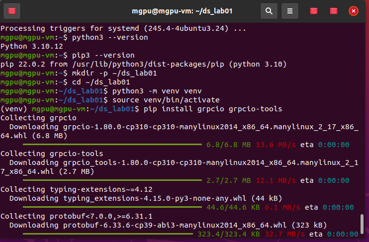
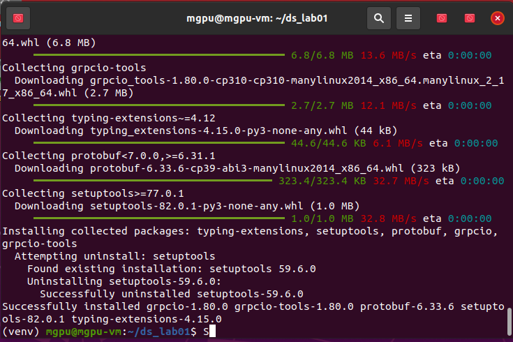
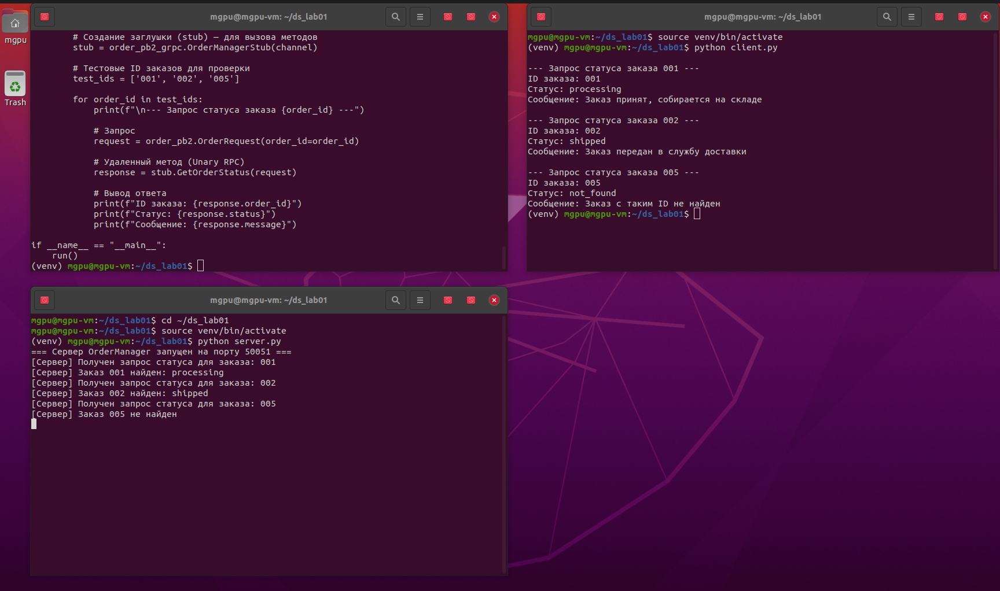

# Лабораторная работа №01. Реализация RPC-сервиса с использованием gRPC

---

## Цель работы

Освоить принципы удаленного вызова процедур (RPC) и их применение в распределенных системах. Изучить основы фреймворка gRPC и языка определения интерфейсов Protocol Buffers (Protobuf). Научиться определять сервисы и сообщения с помощью Protobuf. Реализовать клиент-серверное приложение на языке Python с использованием gRPC. Получить практические навыки в генерации кода, реализации серверной логики и клиентских вызовов для различных типов RPC.

---

## Номер и описание выполняемого варианта

**Вариант 21 — Управление заказами (OrderManager)**

- **Сервис:** OrderManager
- **Метод:** GetOrderStatus(OrderID)
- **Тип RPC:** Unary RPC (один запрос → один ответ)
- **Описание:** Клиент отправляет ID заказа, сервер возвращает текущий статус заказа (processing, shipped, delivered, cancelled или not_found) с дополнительным текстовым описанием.

---

## Листинг .proto файла

Файл контракта, описывающий сервис, методы и структуры сообщений на языке Protocol Buffers.

**Пояснения к структуре:**
- `syntax = "proto3"` — третья версия синтаксиса Protocol Buffers
- `package order` — логическое пространство имён для избежания конфликтов
- `service OrderManager` — объявление gRPC-сервиса
- `rpc GetOrderStatus` — Unary RPC: один запрос, один ответ
- `message OrderRequest` — структура запроса с полем `order_id` (номер 1)
- `message OrderResponse` — структура ответа с полями `order_id` (1), `status` (2), `message` (3)
- Номера полей (1, 2, 3) — используются при бинарной сериализации, должны быть уникальными

  
*Успешная генерация Python-кода из .proto файла*

  
*Созданы файлы order_pb2.py (сообщения) и order_pb2_grpc.py (сервис)*

  
*Содержимое order.proto командой cat*

---

## Листинг server.py

Серверная часть, реализующая бизнес-логику сервиса OrderManager.

  
*Импорты, словарь ORDERS_DB и начало класса OrderManagerServicer*

  
*Метод GetOrderStatus и функция serve()*

**Пояснения к реализации:**
- `ORDERS_DB` — словарь, имитирующий базу данных (4 тестовых заказа)
- `OrderManagerServicer` — наследует сгенерированный класс и переопределяет метод `GetOrderStatus`
- Если заказ найден — возвращается его реальный статус (processing, shipped, delivered, cancelled)
- Если заказ не найден — возвращается статус `not_found` с поясняющим сообщением
- `futures.ThreadPoolExecutor(max_workers=10)` — сервер обрабатывает до 10 запросов одновременно
- `server.add_insecure_port('[::]:50051')` — сервер слушает порт 50051 (insecure — учебный режим без шифрования)

---

## Листинг client.py

Клиентская часть, подключающаяся к серверу и выполняющая вызовы методов.

  
*Функция run() с созданием канала и stub*

**Пояснения к вызовам:**
- `grpc.insecure_channel('localhost:50051')` — канал связи с сервером
- `order_pb2_grpc.OrderManagerStub(channel)` — stub (заглушка) для вызова удалённых методов
- `order_pb2.OrderRequest(order_id=order_id)` — формирование объекта запроса
- `stub.GetOrderStatus(request)` — вызов удалённого метода (Unary RPC)
- Клиент последовательно запрашивает статусы для ID: 001, 002, 005

---

## Скриншоты работы

### Настройка окружения

  
*Установка Python, создание и активация виртуального окружения*

  
*Установка grpcio и grpcio-tools*

### Результат запуска

  
*Вывод консоли сервера (сверху) и клиента (снизу)*

**Результаты выполнения:**
- **Заказ 001:** `processing` — "Заказ принят, собирается на складе"
- **Заказ 002:** `shipped` — "Заказ передан в службу доставки"
- **Заказ 005:** `not_found` — "Заказ с таким ID не найден" (отсутствует в базе)

Сервер корректно обработал все три запроса. Клиент успешно получил и отобразил ответы.

---

## Выводы

В ходе лабораторной работы освоены принципы удалённого вызова процедур (RPC) на практике с использованием фреймворка gRPC и Protocol Buffers.

**Полученные навыки:**
- Определение контракта сервиса в .proto файле со строгой типизацией
- Автоматическая генерация клиентского и серверного кода утилитой protoc
- Реализация Unary RPC (один запрос — один ответ)
- Создание gRPC-сервера с пулом потоков для параллельной обработки
- Создание gRPC-клиента, вызывающего удалённые методы как локальные

**Ключевые преимущества gRPC, выявленные в работе:**
- Строгая типизация через Protobuf исключает ошибки несоответствия типов
- Бинарная сериализация компактнее JSON
- Удалённый вызов выглядит как обычная функция
- Контракт (.proto) служит единым источником правды для клиента и сервера
