# Лабораторная работа №2. Проектирование и реализация клиент-серверной системы. HTTP, веб-серверы и RESTful веб-сервисы

## Цель работы

Изучить методы отправки и анализа HTTP-запросов с использованием инструментов `telnet` и `curl`. Освоить базовую настройку и анализ работы HTTP-сервера `nginx` в качестве обратного прокси. Изучить и применить на практике концепции архитектурного стиля REST для создания веб-сервисов (API) на языке Python.

## Вариант задания

**Вариант 21**

| Часть | Содержание |
|-------|------------|
| HTTP-анализ | Анализ заголовков и кода состояния сайта `gazeta.ru` |
| REST API | Сервис "Музыкальные треки" (сущность: id, title, artist, album) |
| Настройка Nginx | Обратный прокси для Flask API (проксирование `/api/` на порт 5000) |

---

## Теоретические сведения

### HTTP (HyperText Transfer Protocol)

Протокол прикладного уровня для передачи данных. Клиент отправляет запрос, сервер — ответ.

**Структура HTTP-запроса:**
- Метод (GET, POST, PUT, DELETE)
- URI (адрес ресурса)
- Заголовки (метаданные)
- Тело (опционально, для POST/PUT)

**Структура HTTP-ответа:**
- Код состояния (200 OK, 301 Moved Permanently, 404 Not Found)
- Заголовки (Server, Content-Type, Location и др.)
- Тело (HTML, JSON, XML)

**Коды состояния (важные для работы):**
- `200 OK` — успешный запрос
- `301 Moved Permanently` — ресурс навсегда перемещён (редирект)
- `302 Found` — временное перемещение
- `201 Created` — ресурс успешно создан (POST)
- `400 Bad Request` — ошибка в запросе клиента
- `404 Not Found` — ресурс не найден

### Telnet и Curl

| Инструмент | Назначение | Особенности |
|------------|------------|-------------|
| `telnet` | "Ручная" отправка HTTP-запросов | Позволяет увидеть "сырой" ответ сервера, не обрабатывает редиректы, не поддерживает HTTPS |
| `curl` | Автоматическая отправка запросов | Следует редиректам (`-L`), показывает заголовки (`-I`, `-i`), поддерживает HTTPS |

### Nginx как обратный прокси

Обратный прокси — сервер, который принимает запросы от клиентов и перенаправляет их на внутренние серверы (например, Flask). Преимущества:
- Скрытие внутренней архитектуры
- Централизованная обработка трафика
- Возможность кеширования, балансировки нагрузки, SSL-терминации

### REST и RESTful API

REST (Representational State Transfer) — архитектурный стиль для построения веб-сервисов.

**Принципы REST:**
1. Клиент-серверная архитектура
2. Отсутствие состояния (stateless) — каждый запрос содержит всю необходимую информацию
3. Использование стандартных HTTP-методов:
   - `GET` — получение ресурса
   - `POST` — создание ресурса
   - `PUT` / `PATCH` — обновление ресурса
   - `DELETE` — удаление ресурса
4. Единообразие интерфейса (ресурсы идентифицируются через URL)

---

## Ход выполнения работы

### Часть 1. HTTP-анализ сайта gazeta.ru

#### 1.1. Установка утилит

Перед началом работы установлены необходимые пакеты: `curl` и `telnet`.

#### 1.2. Ручной запрос через Telnet

Выполнено подключение к серверу `gazeta.ru` на порт 80 (HTTP). После установки соединения вручную отправлен HTTP-запрос с методом GET и заголовком Host.

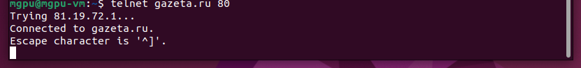

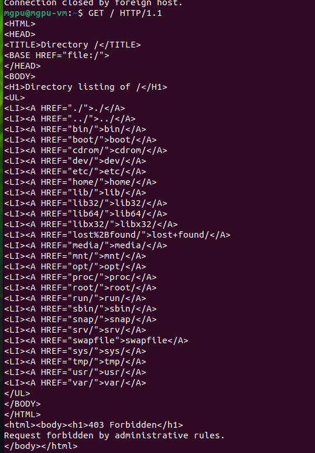

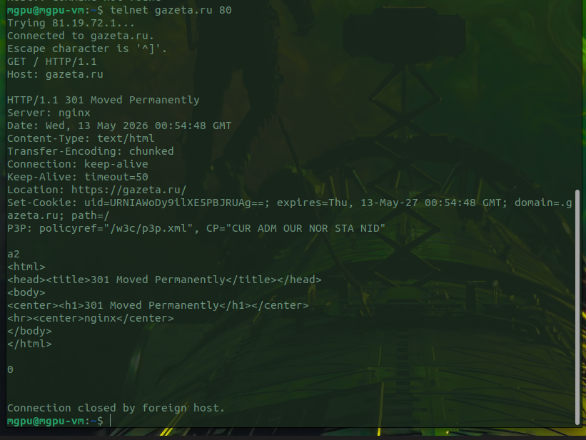

**Анализ ответа (скриншот 3):**

Сервер вернул код `301 Moved Permanently`, заголовок `Location: https://gazeta.ru/` указывает на необходимость перехода на HTTPS-версию. Заголовок `Server: nginx` показывает, что сайт работает под управлением nginx. Также присутствует `Set-Cookie` для установки идентификатора пользователя.

**Вывод:** `telnet` не умеет автоматически следовать редиректам, поэтому соединение закрывается после получения ответа 301.

#### 1.3. Автоматический запрос через Curl

Для сравнения выполнен запрос с опциями `-I` (только заголовки) и `-L` (следовать редиректам).

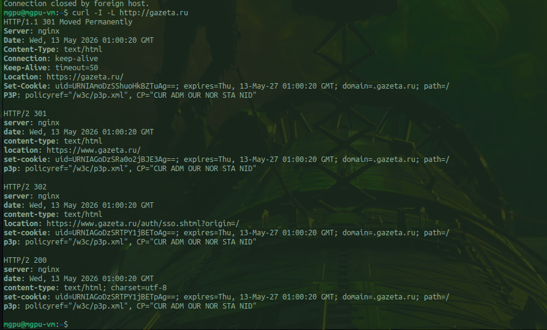

**Анализ цепочки редиректов:**

| Шаг | Код | Редирект | Пояснение |
|-----|-----|----------|-----------|
| 1 | 301 | `http://gazeta.ru` → `https://gazeta.ru/` | Переход на HTTPS |
| 2 | 301 | `https://gazeta.ru/` → `https://www.gazeta.ru/` | Добавление поддомена www |
| 3 | 302 | `https://www.gazeta.ru/` → страница авторизации | Временный редирект на аутентификацию |
| 4 | 200 | Финальная страница | Успешная загрузка содержимого |

**Вывод:** `curl -L` автоматически прошёл все 4 редиректа и получил финальный ответ 200 OK. Это демонстрирует разницу между "ручным" (telnet) и "автоматическим" (curl) анализом HTTP.

---

### Часть 2. Разработка REST API "Музыкальные треки"

#### 2.1. Создание виртуального окружения и установка Flask

Создана директория проекта, внутри развёрнуто виртуальное окружение `venv` (для изоляции зависимостей). После активации окружения установлен фреймворк Flask.

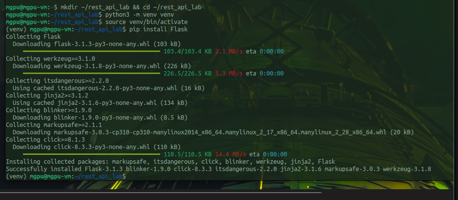

**Пояснения:**
- `venv` — изолированное Python-окружение, чтобы не конфликтовать с системными пакетами
- `activate` — активация окружения (в терминале появляется префикс `(venv)`)
- `pip install Flask` — установка микрофреймворка для создания веб-приложений и API

#### 2.2. Листинг приложения app.py

Создан файл `app.py` с реализацией REST API для управления музыкальными треками.

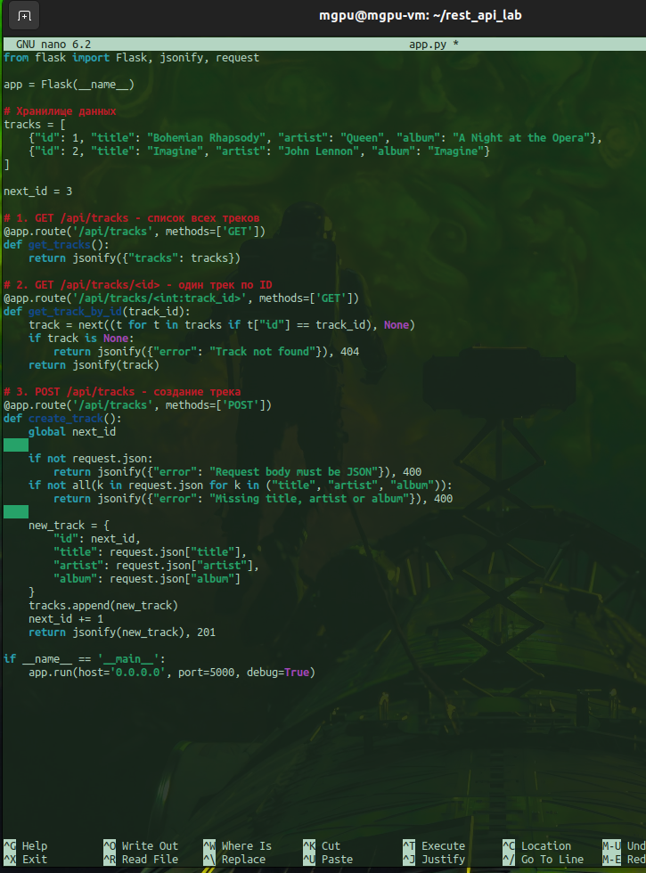

**Структура API (три эндпоинта):**

| Метод | URL | Описание | Код ответа |
|-------|-----|----------|-------------|
| GET | `/api/tracks` | Получить список всех треков | 200 OK |
| GET | `/api/tracks/<id>` | Получить один трек по ID | 200 OK / 404 Not Found |
| POST | `/api/tracks` | Создать новый трек | 201 Created / 400 Bad Request |

**Хранилище данных:** используется список Python в памяти (имитация базы данных). При остановке сервера данные теряются — для лабораторной работы это допустимо.

**Логика работы эндпоинтов:**
- `GET /api/tracks` — возвращает весь список `tracks` в формате JSON
- `GET /api/tracks/<id>` — ищет трек по ID с помощью генераторного выражения `next()`. Если не найден — возвращает 404
- `POST /api/tracks` — проверяет наличие JSON-тела и обязательных полей (`title`, `artist`, `album`), затем создаёт новый трек с автоматическим ID и возвращает его с кодом 201

#### 2.3. Запуск Flask-приложения

Запущен сервер разработки Flask на порту 5000 с доступом ко всем сетевым интерфейсам (`host='0.0.0.0'`).

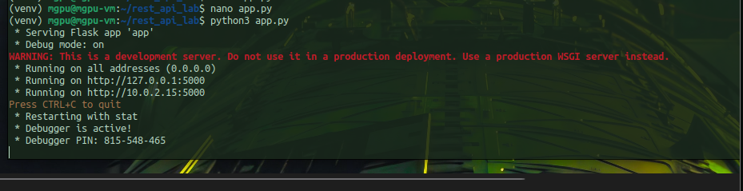

#### 2.4. Тестирование API напрямую (порт 5000)

**Тест 1. Получение всех треков:**
Запрос вернул JSON-массив с двумя начальными треками (Queen и John Lennon).

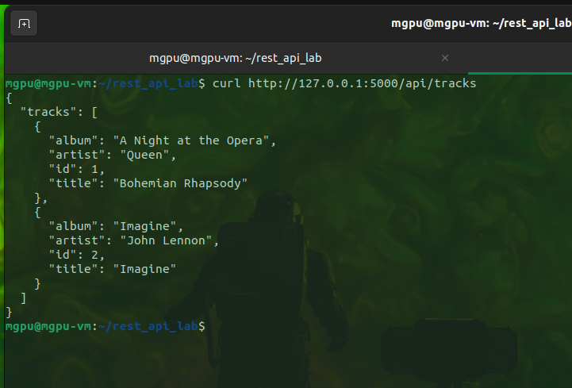

**Тест 2. Получение трека с id=1:**
Запрос вернул данные первого трека (Queen).

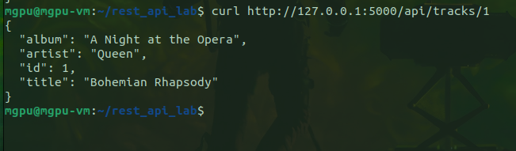

**Тест 3. Создание нового трека:**
POST-запрос с JSON-телом создал трек Nirvana, сервер присвоил ID=3 и вернул созданный объект с кодом 201.

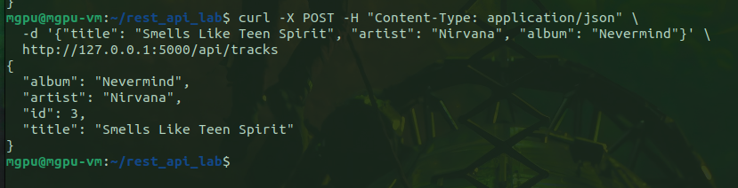

---

### Часть 3. Настройка Nginx как обратного прокси

#### 3.1. Установка и запуск Nginx

Установлен пакет nginx, сервер запущен и добавлен в автозагрузку.

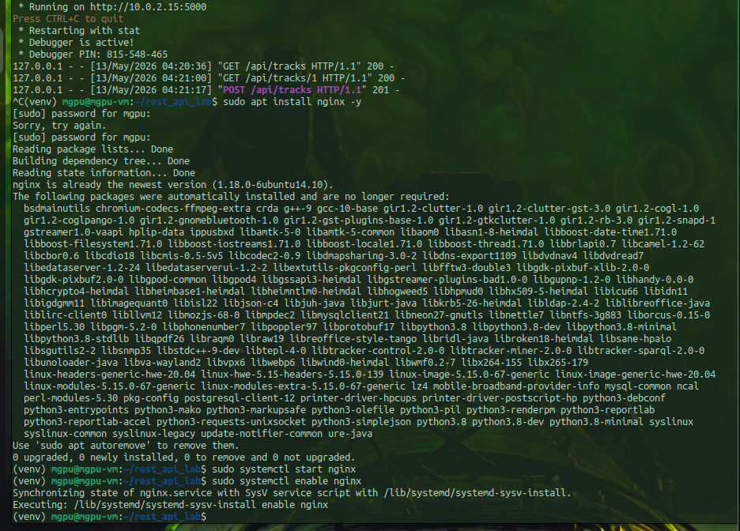

**Проверка работы Nginx:** запрос к `http://localhost` вернул приветственную страницу nginx.

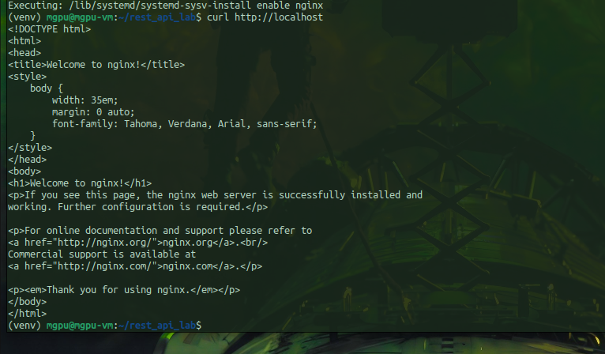

#### 3.2. Конфигурация проксирования

Отредактирован файл конфигурации `/etc/nginx/sites-available/default`.

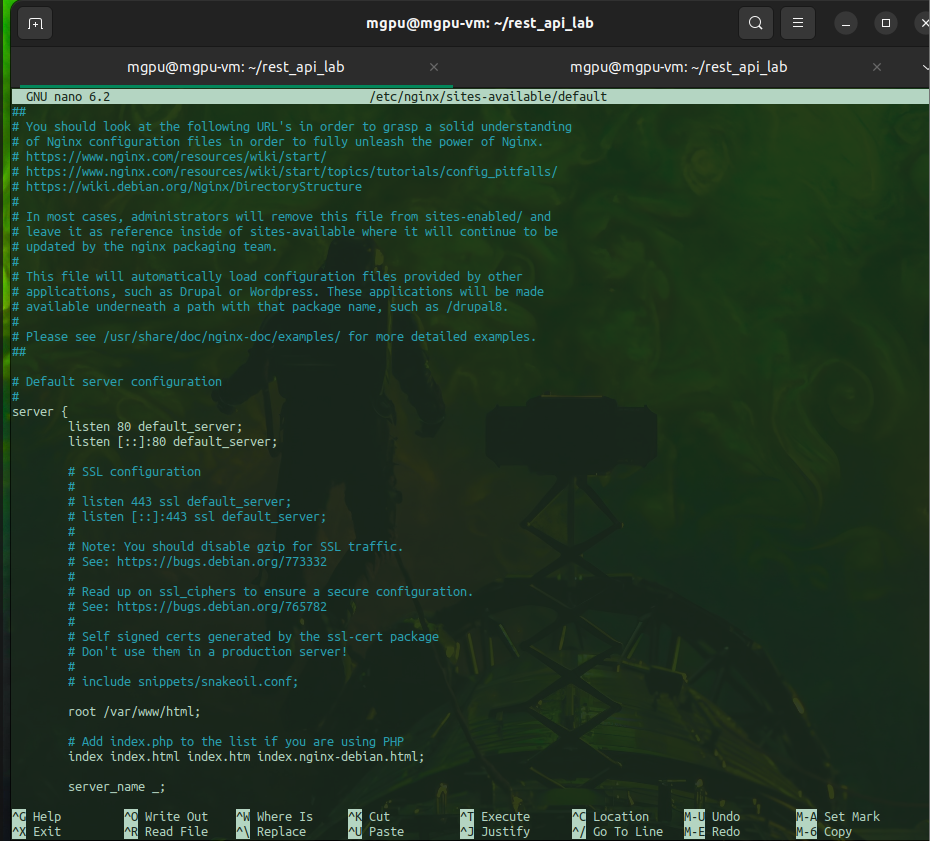

В блок `server { ... }` добавлен новый `location /api/` со следующими директивами:
- `proxy_pass http://127.0.0.1:5000` — перенаправление запросов на Flask
- `proxy_set_header Host $host` — передача оригинального заголовка Host
- `proxy_set_header X-Real-IP $remote_addr` — передача реального IP клиента

#### 3.3. Проверка и перезапуск Nginx

Выполнена проверка синтаксиса конфигурации (`sudo nginx -t`), затем Nginx перезапущен для применения изменений.

---

### Часть 4. Тестирование полной системы (Nginx + Flask)

Flask запущен в одном терминале.

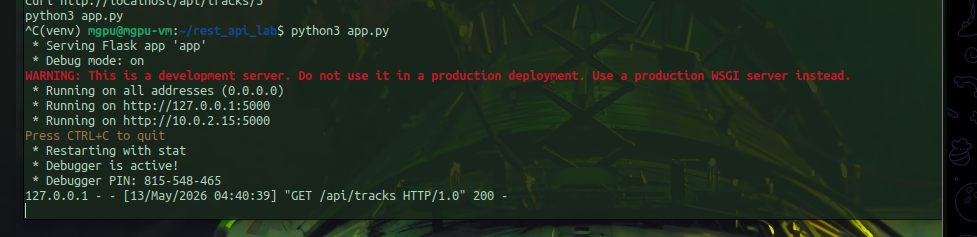

В другом терминале выполнены запросы к Nginx (порт 80):

#### 4.1. Получение всех треков через Nginx

Запрос к `http://localhost/api/tracks` вернул список треков. Nginx успешно перенаправил запрос на Flask.

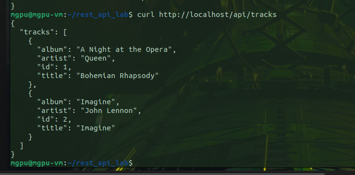

#### 4.2. Создание нового трека через Nginx

POST-запрос создал трек AC/DC с ID=3. Nginx передал запрос в Flask, который добавил данные и вернул ответ.

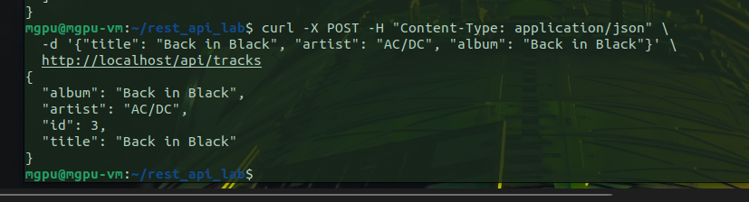

#### 4.3. Получение созданного трека через Nginx

Запрос к `http://localhost/api/tracks/3` вернул данные созданного трека. Nginx корректно передал переменную `3` из URL в Flask.

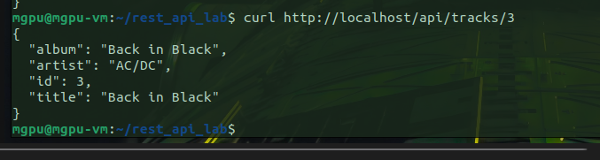

**Логи Flask подтверждают все три запроса:**
- `GET /api/tracks` — 200 OK
- `POST /api/tracks` — 201 Created
- `GET /api/tracks/3` — 200 OK

---

## Выводы

В ходе выполнения лабораторной работы получены следующие навыки и знания:

### 1. Анализ HTTP-протокола
- Изучена структура HTTP-запроса и ответа
- Освоены инструменты `telnet` (ручная отправка) и `curl` (автоматическая)
- Проанализирована цепочка редиректов (301 → 301 → 302 → 200) на примере `gazeta.ru`
- Понята разница между обработкой редиректов в telnet и curl

### 2. Разработка RESTful API
- Создан веб-сервис на Flask с тремя эндпоинтами
- Реализованы операции чтения (GET) и создания (POST)
- Использованы стандартные HTTP-методы и коды ответа (200, 201, 400, 404)
- Данные хранятся в памяти (имитация базы данных)

### 3. Настройка Nginx как обратного прокси
- Nginx настроен принимать запросы на порту 80 и перенаправлять их на Flask (порт 5000)
- Добавлены необходимые заголовки (`Host`, `X-Real-IP`) для корректной работы
- Проверена работоспособность проксирования через `curl` ко всем эндпоинтам API

### 4. Интеграция всех компонентов
- Демонстрация полной цепочки: Клиент → Nginx (80) → Flask (5000) → Ответ
- Все три компонента лабораторной работы успешно объединены в единую систему

---

## Ответы на вопросы для защиты

1. **Зачем нужен обратный прокси (Nginx) перед Flask?**  
   → Принимает все запросы на порт 80, скрывает внутренний сервер, может добавлять кеширование, SSL, балансировку нагрузки.

2. **Что делает директива `proxy_pass`?**  
   → Перенаправляет входящий запрос на указанный внутренний сервер (в данном случае `http://127.0.0.1:5000`).

3. **Почему в POST-запросе нужно указывать `-H "Content-Type: application/json"`?**  
   → Flask использует заголовок `Content-Type`, чтобы правильно распарсить тело запроса в `request.json`.

4. **В чём разница между кодами 301 и 302?**  
   → 301 — перемещение навсегда (браузер кеширует новый адрес), 302 — временное перемещение.

5. **Что такое RESTful API?**  
   → Архитектурный стиль, использующий стандартные HTTP-методы, отсутствие состояния и единообразие интерфейса.

---

## Список скриншотов

| № | Содержание |
|---|------------|
| 1 | Подключение telnet к gazeta.ru |
| 2 | Некорректная отправка запроса |
| 3 | Корректный telnet-запрос и ответ 301 |
| 4 | curl -I -L — цепочка редиректов |
| 5 | Создание venv и установка Flask |
| 6 | Листинг app.py |
| 7 | Запуск Flask на порту 5000 |
| 8 | GET /api/tracks (Flask) |
| 9 | GET /api/tracks/1 (Flask) |
| 10 | POST /api/tracks (Flask) |
| 11 | Установка и запуск Nginx |
| 12 | Проверка Nginx — приветственная страница |
| 13 | Исходный конфиг Nginx |
| 15 | Flask запущен, лог запросов |
| 16 | GET /api/tracks через Nginx |
| 17 | POST /api/tracks через Nginx |
| 18 | GET /api/tracks/3 через Nginx |

---

**Лабораторная работа выполнена в полном объёме. Все требования варианта 21 соблюдены.**
