# Лабораторная работа 3.1. Организация асинхронного взаимодействия микросервисов с помощью брокера сообщений

## Цель работы

Изучить и реализовать два подхода к взаимодействию между сервисами:

1. **Синхронное прямое взаимодействие** с использованием **gRPC**.
2. **Асинхронное взаимодействие** через брокер сообщений **RabbitMQ**.
3. Освоить развертывание инфраструктурных компонентов (RabbitMQ установлен как системная служба).

---

## Вариант 21

| Задание | Описание |
|---------|----------|
| **Задание 1** | Кэширование данных. Producer отправляет ключ и значение. gRPC сервис сохраняет их в словарь в памяти и возвращает `"OK"`. |
| **Задание 2** | Base64 кодирование/декодирование. Producer отправляет действие (`encode` или `decode`) и данные. gRPC сервис выполняет преобразование и возвращает результат. |
| **Задание 3** | Подсчёт символов. Producer отправляет текст. gRPC сервис считает количество символов без пробелов и возвращает число. |

---

## Постановка задачи

Разработана распределённая система, состоящая из трёх компонентов:

- **gRPC сервер** — реализует бизнес-логику трёх методов (кэширование, Base64 преобразование, подсчёт символов без пробелов).
- **Producer** — отправляет сообщения в очередь RabbitMQ.
- **Consumer** — забирает сообщения из очереди, парсит префикс, вызывает соответствующий метод gRPC сервера и выводит результат.

Система демонстрирует переход от синхронного взаимодействия (прямой вызов клиент → сервер) к асинхронному (Producer → RabbitMQ → Consumer → gRPC сервер).

---

## Архитектура

### Часть 1. Синхронное взаимодействие (gRPC)

**Схема взаимодействия:**

**Компоненты:**

| Компонент | Назначение |
|-----------|------------|
| `message_service.proto` | Контракт сервиса на языке Protocol Buffers. Определяет три метода и структуры сообщений. |
| `grpc_server.py` | Реализует логику методов `CacheSet`, `Base64Process`, `CountChars`. Запускает сервер на порту `50051`. |
| `grpc_client.py` | Тестовый клиент, отправляет запросы на сервер и выводит ответы. |

**Особенности реализации:**
- Для хранения кэша используется словарь Python в памяти (`cache_storage = {}`).
- Base64 преобразование выполняется встроенной библиотекой `base64`.
- Подсчёт символов без пробелов реализован через генератор списка: `[c for c in text if c != ' ']`.

**Преимущества синхронного подхода:** простота реализации, немедленный ответ.  
**Недостатки:** сервисы ждут друг друга, отказ одного сервиса блокирует другой.

---

### Часть 2. Асинхронное взаимодействие (RabbitMQ + gRPC)

**Схема взаимодействия:**

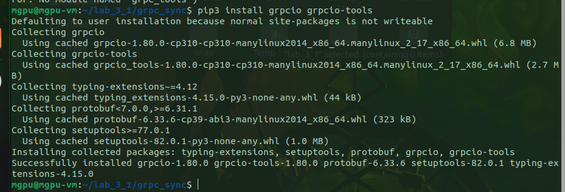

**Компоненты:**

| Компонент | Назначение |
|-----------|------------|
| `producer.py` | Подключается к RabbitMQ, отправляет сообщение в очередь `task_queue`. Сообщение имеет префикс: `cache:`, `encode:`, `decode:` или `chars:`. |
| RabbitMQ | Брокер сообщений. Хранит сообщения в очереди до тех пор, пока Consumer не заберёт их. Настройки: пользователь `user`, пароль `password`, очередь `task_queue` с флагом `durable=True`. |
| `consumer.py` | Подключается к RabbitMQ, забирает сообщения из очереди, парсит префикс, вызывает соответствующий метод gRPC сервера и выводит результат. |

**Особенности реализации:**
- Очередь объявлена как `durable=True` — сообщения не теряются при перезапуске RabbitMQ.
- Используется `basic_qos(prefetch_count=1)` — Consumer обрабатывает только одно сообщение за раз (fair dispatch).
- После обработки отправляется `basic_ack` — подтверждение, что сообщение удаляется из очереди.
- Consumer добавляет путь к папке `grpc_sync` через `sys.path.append()` для импорта сгенерированных gRPC файлов.

**Преимущества асинхронного подхода:**
- Producer и Consumer не зависят друг от друга (могут быть запущены в разное время).
- При отказе Consumer сообщения сохраняются в очереди и будут обработаны позже.
- Возможность масштабирования (несколько Consumer'ов, работающих параллельно).

---

## Стек технологий

| Технология | Назначение |
|------------|------------|
| **Ubuntu 20.04** | Операционная система виртуальной машины |
| **Python 3.10** | Язык программирования |
| **gRPC / Protocol Buffers** | Фреймворк для удалённого вызова процедур и язык описания контракта |
| **RabbitMQ** | Брокер сообщений (установлен как системная служба) |
| **Pika** | Python-клиент для RabbitMQ |
| **Base64** | Встроенная библиотека Python для кодирования/декодирования |

---

## Скриншоты работы

### 1. Подготовка окружения

Установка библиотек `grpcio`, `grpcio-tools`.

---

### 2. Создание .proto файла

Файл контракта `message_service.proto` с тремя методами для варианта 21.

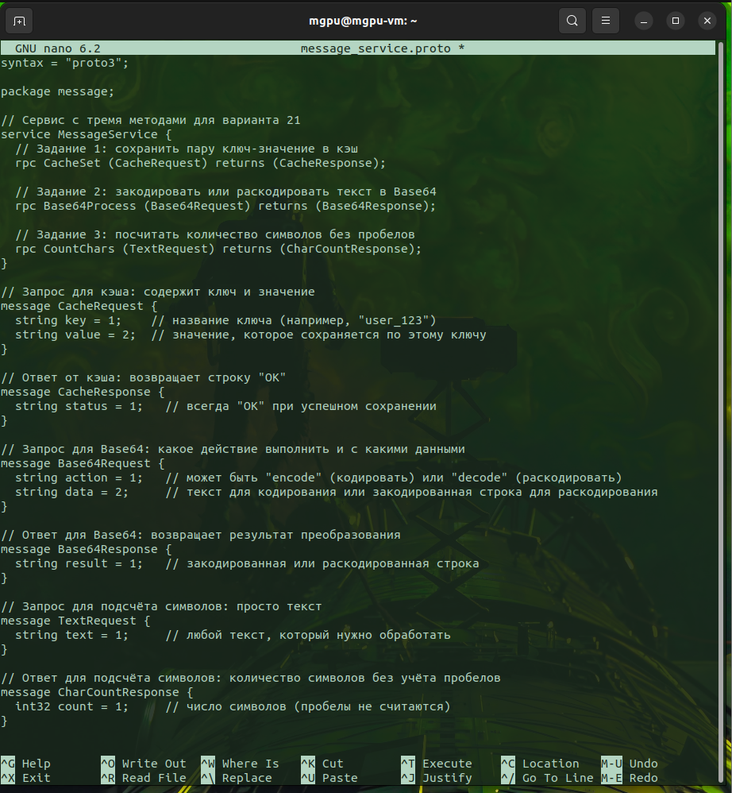

---

### 3. Генерация кода из .proto

Выполнение команды `python3 -m grpc_tools.protoc` и результат — появление файлов `message_service_pb2.py` и `message_service_pb2_grpc.py`.

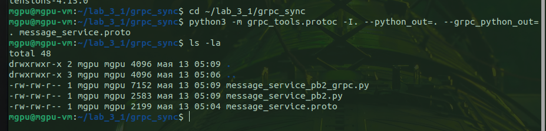

---

### 4. gRPC сервер

Реализация сервера `grpc_server.py` с методами `CacheSet`, `Base64Process`, `CountChars`.

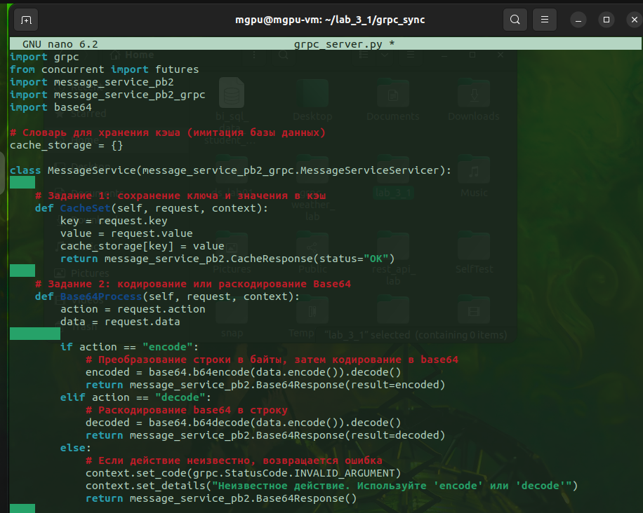

---

### 5. gRPC клиент (тестовый)

Клиент `grpc_client.py` для проверки работы сервера.

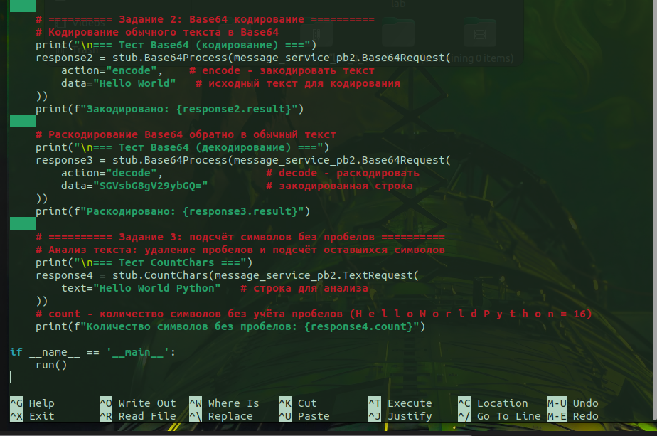

---

### 6. Проверка gRPC взаимодействия

Запуск сервера и клиента.

**Терминал 1 — сервер запущен:**

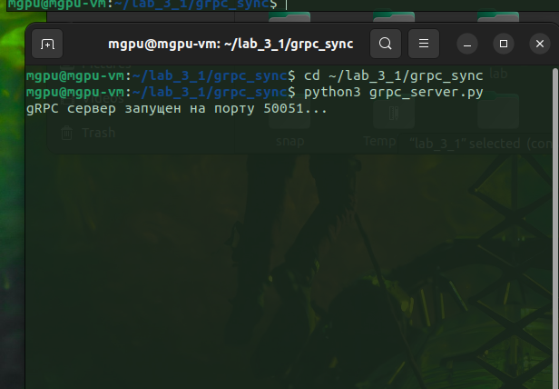

**Терминал 2 — клиент получил ответы:**

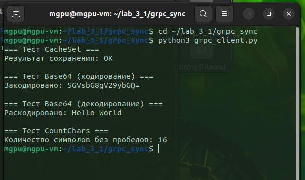

**Результаты клиента:**
- `CacheSet` → `OK`
- `Base64 encode("Hello World")` → `SGVsbG8gV29ybGQ=`
- `Base64 decode("SGVsbG8gV29ybGQ=")` → `Hello World`
- `CountChars("Hello World Python")` → `16`

---

### 7. RabbitMQ

RabbitMQ установлен как системная служба. Статус службы `active (running)`.

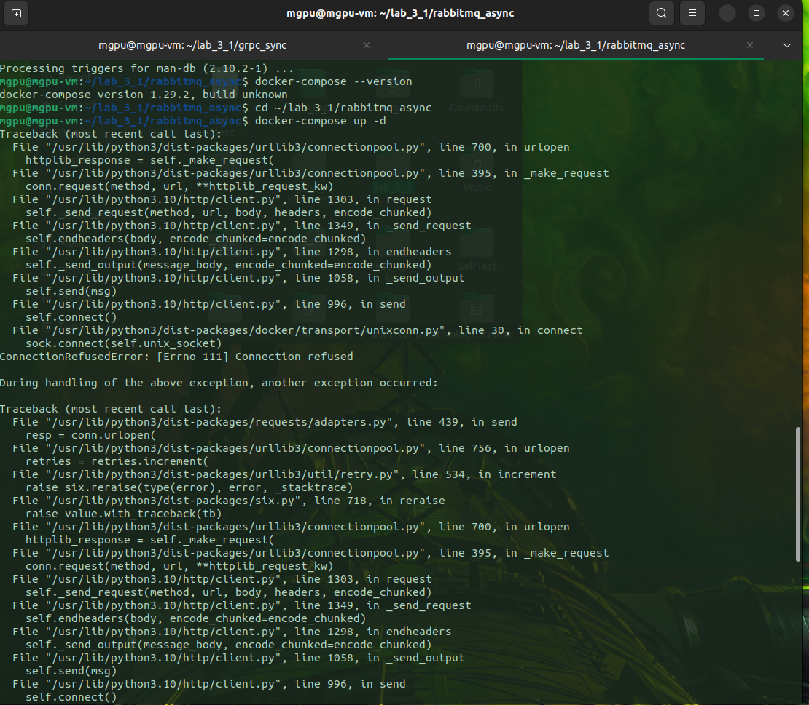

---

### 8. Producer

Файл `producer.py` для отправки сообщений в очередь RabbitMQ.

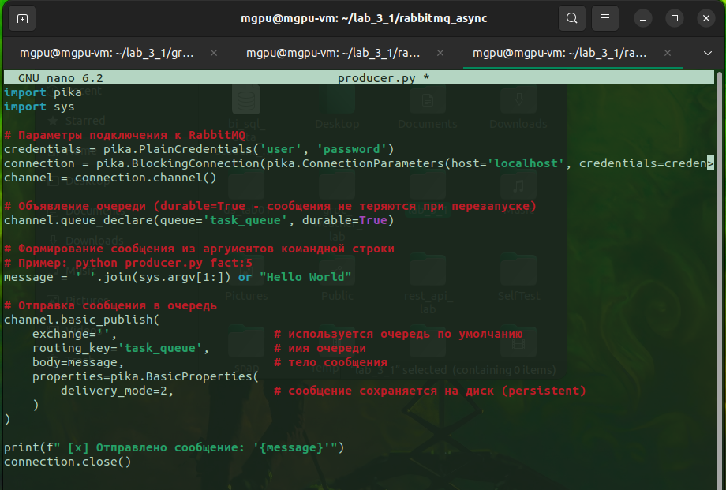

---

### 9. Consumer

Файл `consumer.py` для получения сообщений из очереди и вызова gRPC сервера.

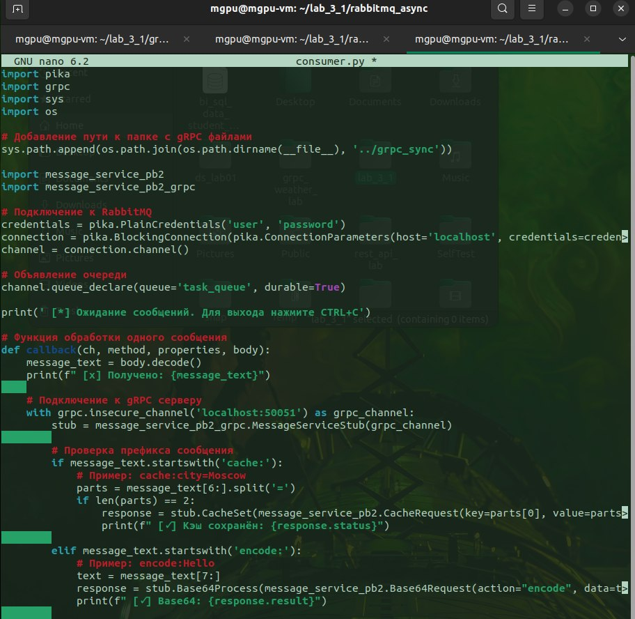

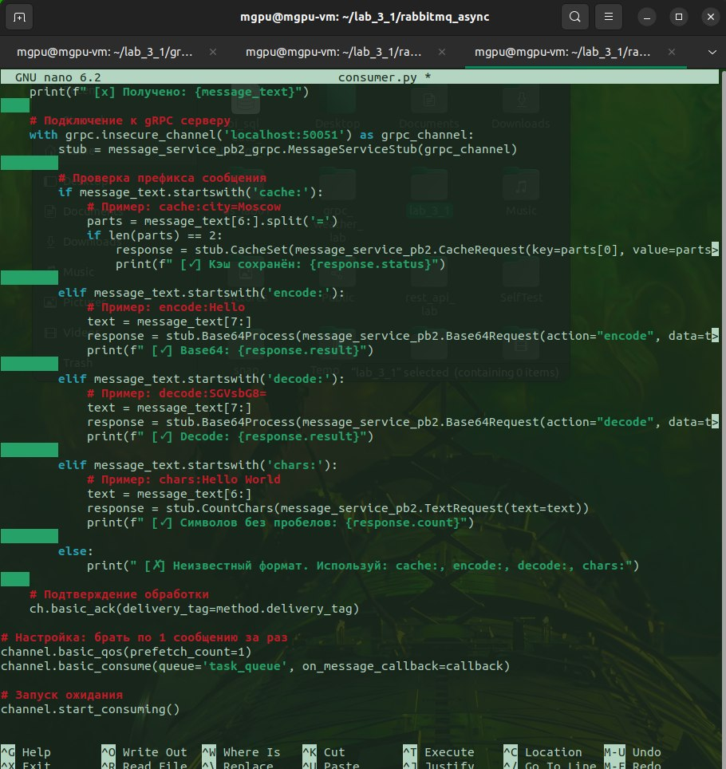

---

### 10. Установка Pika

Установка библиотеки `pika` для работы с RabbitMQ.

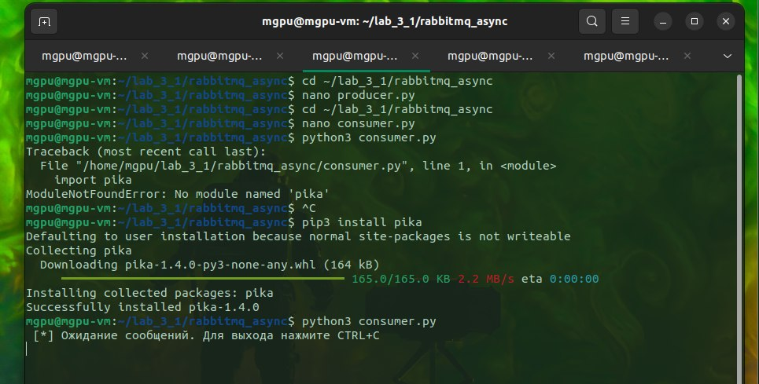

---

### 11. Запуск Consumer

Consumer запущен и ожидает сообщения.

---

### 12. Отправка сообщений через Producer

Отправка четырёх сообщений с разными префиксами.

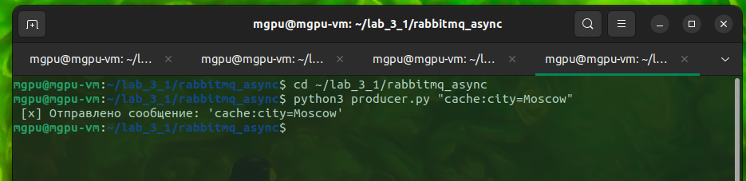

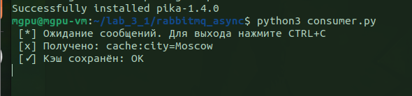

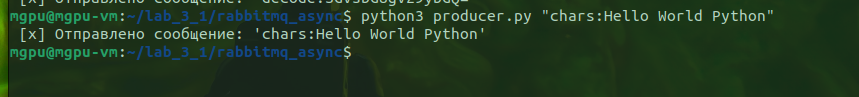

---

### 13. Результат работы Consumer

Consumer получил все четыре сообщения, обработал их через gRPC сервер и вывел результаты.

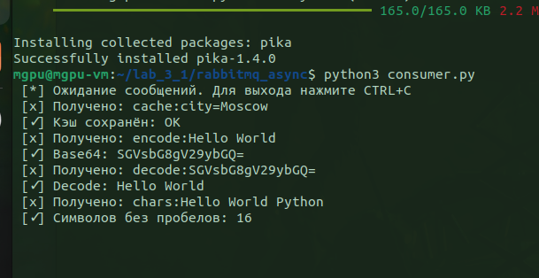

**Таблица результатов:**

| Сообщение | Результат |
|-----------|-----------|
| `cache:city=Moscow` | `OK` |
| `encode:Hello World` | `SGVsbG8gV29ybGQ=` |
| `decode:SGVsbG8gV29ybGQ=` | `Hello World` |
| `chars:Hello World Python` | `16` |

---

## Выводы

В ходе выполнения лабораторной работы:

1. **Реализована синхронная связь через gRPC** — создан `.proto` контракт, сгенерирован код, написан сервер с тремя методами и тестовый клиент. Взаимодействие проверено успешно.

2. **Реализована асинхронная связь через RabbitMQ** — развёрнут брокер сообщений, написан Producer для отправки задач в очередь и Consumer для получения задач и вызова gRPC сервера.

3. **Продемонстрированы преимущества асинхронного подхода** — Producer и Consumer не зависят друг от друга, сообщения сохраняются в очереди при временной недоступности Consumer.

4. **Освоены технологии** — gRPC, Protocol Buffers, RabbitMQ, Pika, Base64.

5. **Все три задания варианта 21 выполнены** — кэширование, Base64 преобразование, подсчёт символов без пробелов.

---

## Ответы на вопросы для защиты

| Вопрос | Ответ |
|--------|-------|
| **Что такое gRPC?** | Фреймворк для удалённого вызова процедур, использующий Protobuf для сериализации данных. |
| **Чем отличается синхронное взаимодействие от асинхронного?** | При синхронном клиент ждёт ответа от сервера. При асинхронном сообщение попадает в очередь, а Consumer обрабатывает его, когда готов. |
| **Зачем нужен брокер сообщений?** | Для развязывания сервисов: Producer не знает о Consumer, сообщения хранятся в очереди до обработки. |
| **Что такое `basic_ack`?** | Подтверждение от Consumer, что сообщение обработано. Без него RabbitMQ не удалит сообщение из очереди. |
| **Что делает `prefetch_count=1`?** | Ограничивает количество сообщений, которые Consumer получает одновременно (не больше одного). |
| **Как RabbitMQ хранит сообщения?** | По умолчанию в оперативной памяти. С флагом `durable=True` и `delivery_mode=2` сообщения сохраняются на диск. |
| **Почему в `.proto` у полей указаны номера (1, 2, 3)?** | Номера используются при бинарной сериализации вместо имён полей — это экономит место и ускоряет обработку. |

---

**Лабораторная работа выполнена в полном объёме. Все требования варианта 21 соблюдены.**
