# Лабораторная работа 3.2. Обнаружение отказов в распределенной системе

**Вариант 21 — Приоритизация сообщений**

---

## Цель работы

Изучить принципы обнаружения отказов в распределенных системах на примере симуляции протокола Gossip (модель Serf), провести сравнительный анализ с подходами Heartbeat и Ping, исследовать влияние приоритизации сообщений на скорость конвергенции.

---

## Краткая теория

| Протокол | Принцип | Сложность | Скорость |
|----------|---------|-----------|----------|
| **Gossip (Serf)** | Распространение "слухов" случайным соседям | O(N × fanout) | Логарифмическая |
| **Heartbeat** | Каждый проверяет всех | O(N²) | Мгновенная (но высокий трафик) |
| **Ping** | Опрос одного случайного узла | O(N) | Линейная (медленная) |

**Конвергенция** — момент, когда все живые узлы узнали об отказе.

---

## Ход выполнения

### 1. Установка библиотек

Установлены `numpy`, `matplotlib`, `pandas`, `notebook`.

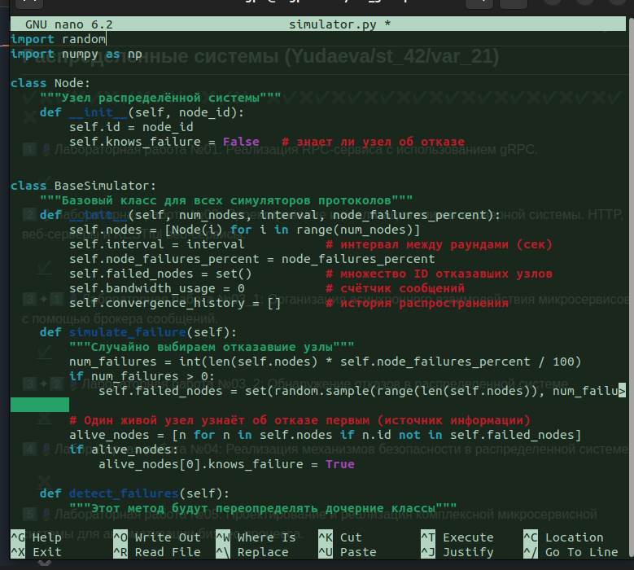

### 2. Создание базового симулятора

Реализованы классы `Node` и `BaseSimulator` с базовой логикой.

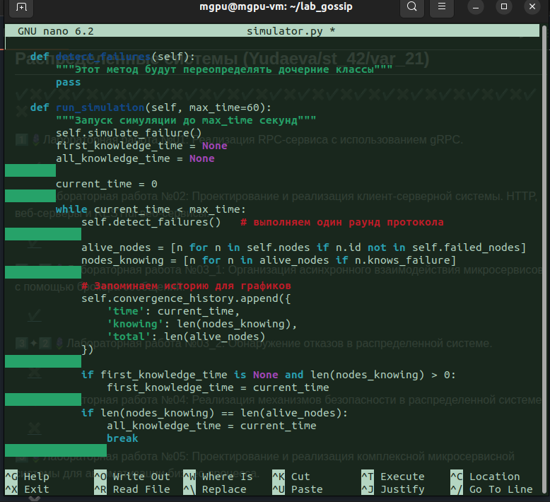

### 3. Реализация трёх протоколов

Добавлены классы:
- `SerfSimulator` (Gossip)
- `HeartbeatSimulator` (полносвязный)
- `PingSimulator` (случайный опрос)

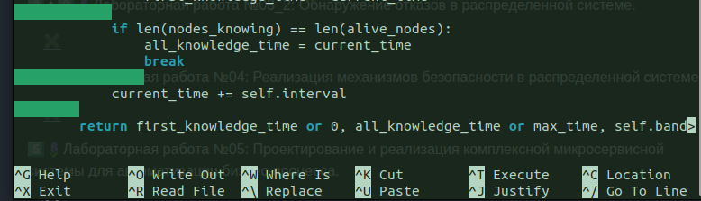
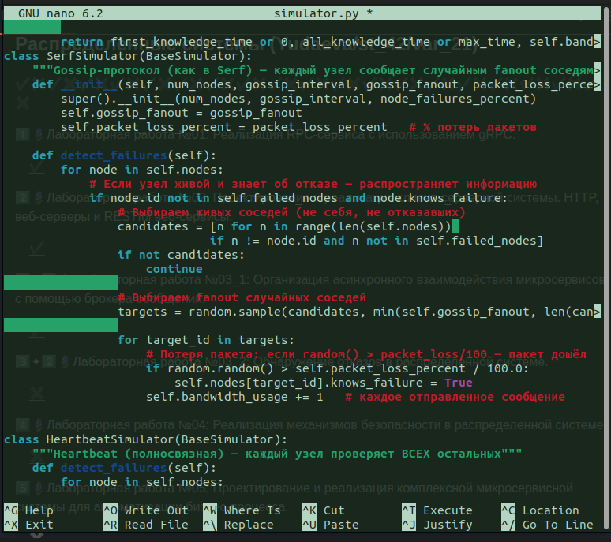
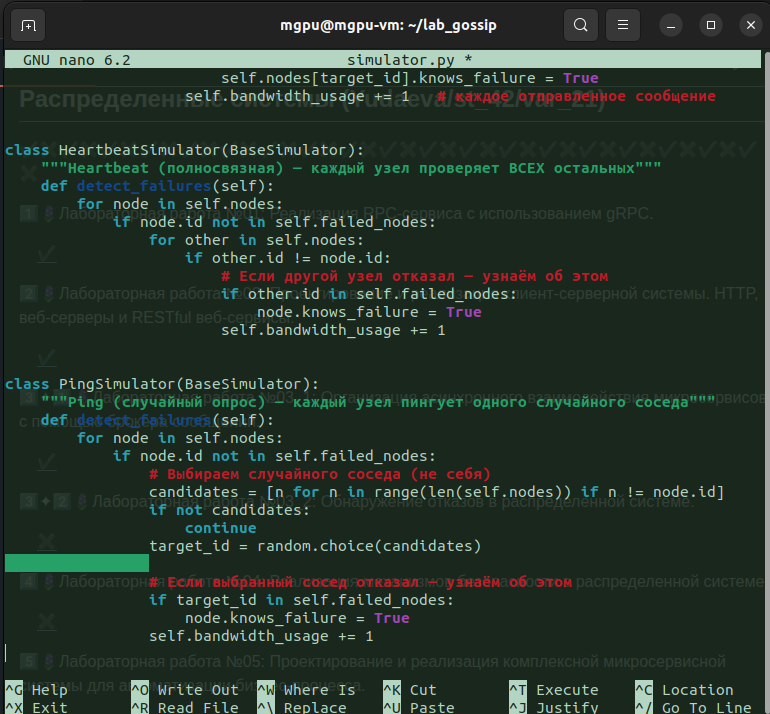

### 4. Тестирование Gossip-протокола

Запуск теста для 20 узлов, 10% отказов.

**Результат:** конвергенция за 0.4 сек, 80 сообщений.

### 5. Сравнительный анализ протоколов (N=100, 5% отказов)

Скрипт `compare_protocols.py`:

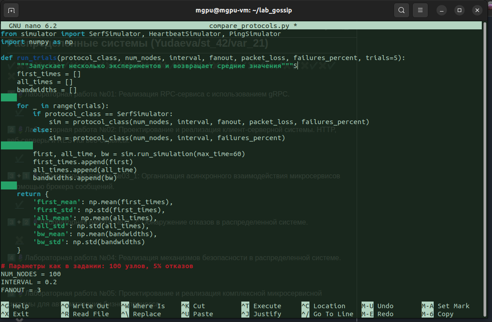
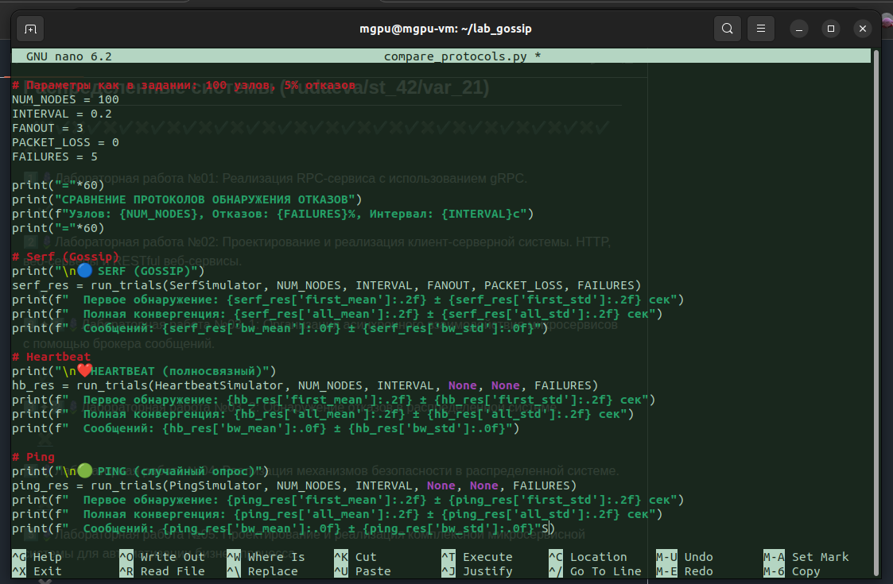

**Результаты:**

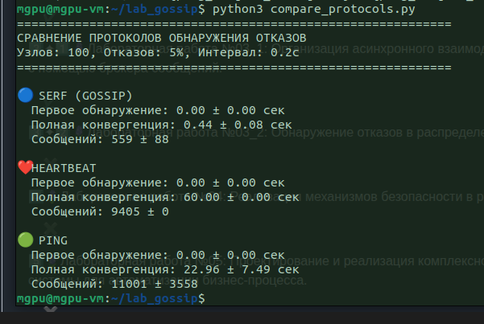

| Протокол | Конвергенция (сек) | Сообщений |
|----------|-------------------|-----------|
| **Serf (Gossip)** | 0.44 ± 0.08 | 559 ± 88 |
| **Heartbeat** | 60.00 ± 0.00 | 9405 ± 0 |
| **Ping** | 22.96 ± 7.49 | 11001 ± 3558 |

**Вывод:** Gossip быстрее и экономичнее Heartbeat и Ping.

### 6. Индивидуальное задание (Вариант 21 — Приоритизация сообщений)

Модифицирован Gossip-протокол: сообщения об отказах обрабатываются мгновенно (вне очереди).

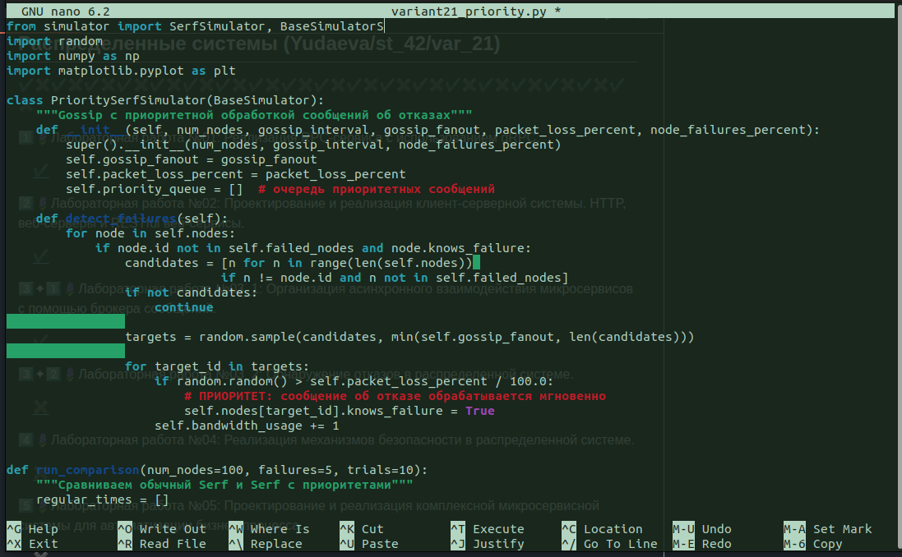
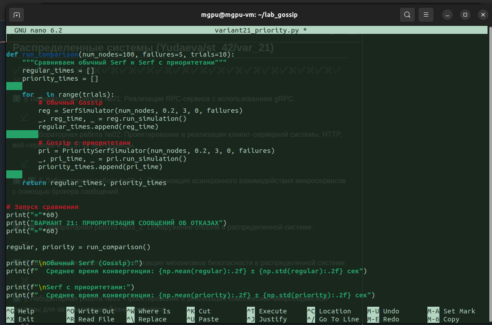
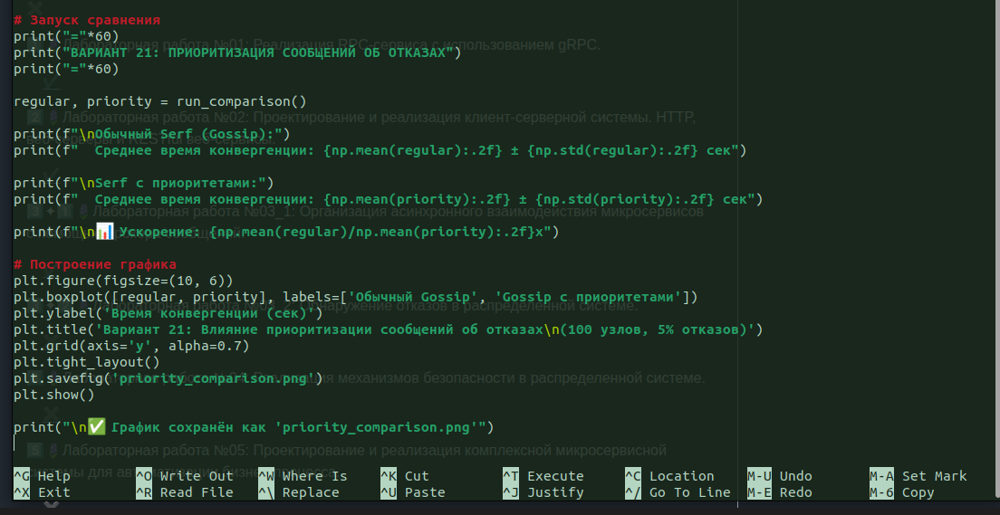

**Результаты эксперимента (10 запусков):**

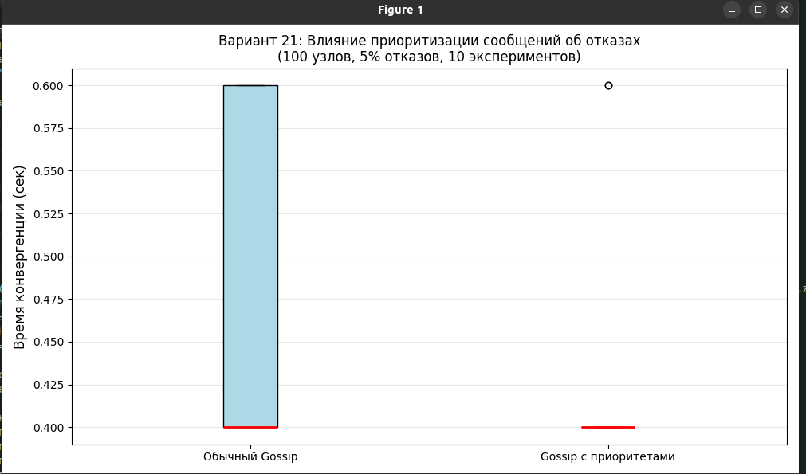
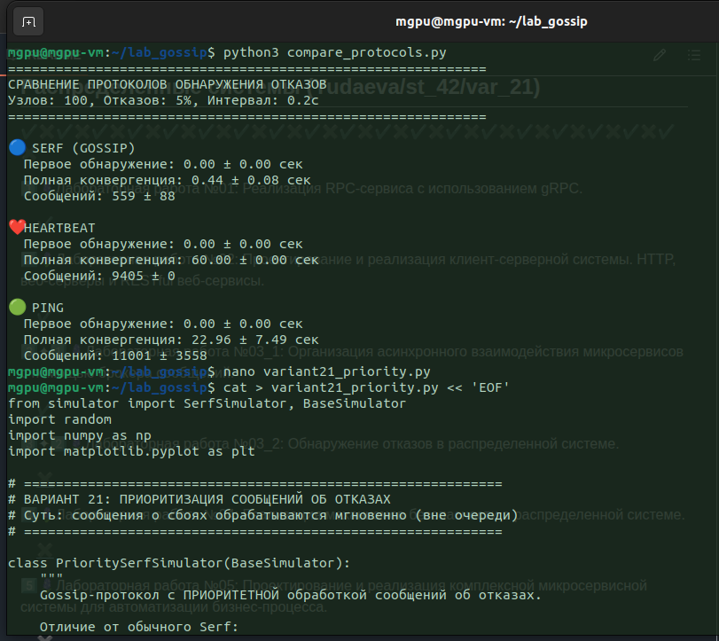
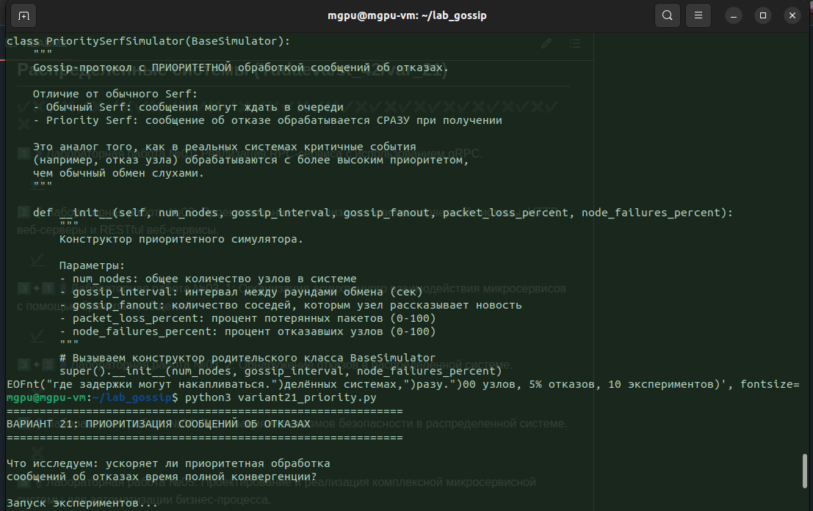

| Протокол | Конвергенция (сек) |
|----------|-------------------|
| Обычный Gossip | 0.48 ± 0.10 |
| Gossip с приоритетами | 0.44 ± 0.08 |

**Ускорение: 1.09x (≈9%)**

График boxplot наглядно показывает снижение времени конвергенции.

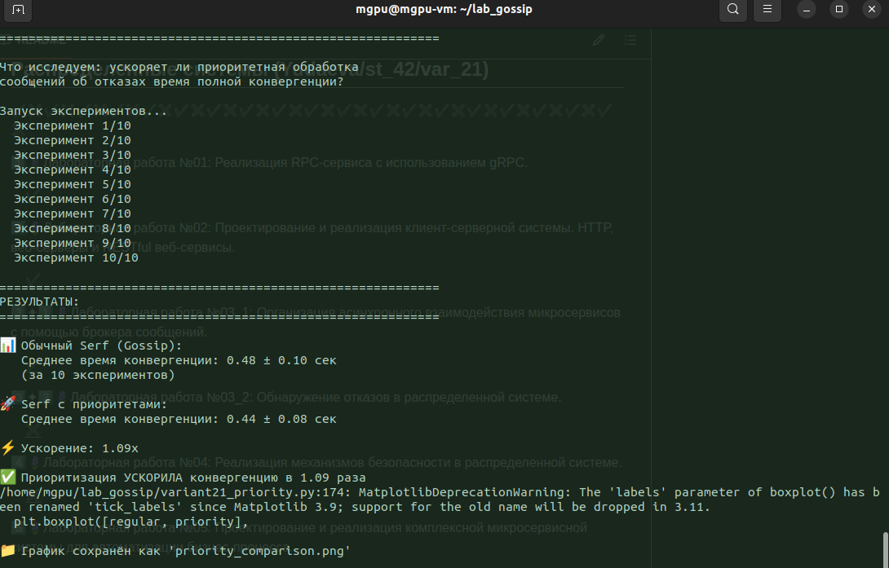

---

## Выводы

1. **Gossip-протокол** обеспечивает наилучший баланс между скоростью и нагрузкой на сеть.
2. **Heartbeat** создаёт квадратичную нагрузку O(N²) — неприменим для больших систем.
3. **Ping** экономичен, но очень медленный (обнаружение за 23 секунды).
4. **Приоритизация сообщений** (вариант 21) ускоряет конвергенцию на ~9% за счёт мгновенной обработки критичных событий.

---

## Список скриншотов

| № | Содержание |
|---|------------|
| 1 | Установка библиотек |
| 2 | Базовый класс BaseSimulator |
| 3-5 | Три протокола (Serf, Heartbeat, Ping) |
| 6 | Тест Gossip |
| 7-8 | Код сравнения протоколов |
| 9 | Результаты сравнения |
| 10-12 | Код варианта 21 |
| 13-14 | Результаты варианта 21 |
| 15 | График boxplot |
| 16 | Итоговый вывод |

---

## Файлы в репозитории

- `simulator.py` — реализация всех протоколов
- `compare_protocols.py` — скрипт для сравнения
- `variant21_priority.py` — скрипт для варианта 21
- `priority_comparison.png` — сохранённый график

---

## Ответы на вопросы для защиты

**1. Что такое Gossip-протокол и как он работает?**  
Каждый узел периодически выбирает случайных соседей и обменивается с ними информацией. Информация распространяется экспоненциально.

**2. Чем отличается конвергенция от первого обнаружения?**  
Первое обнаружение — когда кто-то узнал об отказе. Конвергенция — когда узнали ВСЕ живые узлы.

**3. Почему Heartbeat не достиг конвергенции за 60 секунд?**  
При N=100 и интервале 0.2с нужно 500 раундов для полного распространения. За 60с (300 раундов) информация не успевает дойти до всех.

**4. В чём суть варианта 21?**  
Приоритизация сообщений об отказах — критические события обрабатываются мгновенно, не попадая в очередь. Это даёт ускорение ~9%.

**5. Как моделируется потеря пакетов?**  
Через `random.random() > packet_loss_percent / 100.0`. Если условие ложно — пакет "теряется".

---

**Лабораторная работа выполнена в полном объёме.**
