# Лабораторная работа №04. Реализация механизмов безопасности и отказоустойчивости в распределенной системе

## Цель работы

Разработать распределенную систему, обеспечивающую защищенную передачу данных с использованием взаимной аутентификации (mTLS) и симметричного шифрования, а также продемонстрировать механизмы отказоустойчивости (failover) через автоматическое переключение между узлами.

---

## Номер и описание выполняемого варианта

**Вариант 21 — Отложенная обработка (Task Queue)**

| Параметр | Значение |
|----------|----------|
| Название | Отложенная обработка (Task Queue) |
| Описание | Сервер принимает задачу и возвращает ID задачи. Клиент опрашивает статус выполнения. Обработка асинхронная (фоновый поток), имитация долгой операции 5 секунд |
| Реализованные методы | `POST /api/task` — создание задачи, `GET /api/task/{id}/status` — получение статуса |

---

## Стек технологий

| Технология | Назначение |
|------------|------------|
| Ubuntu 20.04 LTS | Операционная система |
| Python 3.8+ | Язык программирования |
| Flask | Веб-фреймворк |
| requests | HTTP-клиент |
| cryptography | Шифрование Fernet и работа с SSL |
| OpenSSL | Генерация сертификатов |

---

## Ход выполнения работы

### Шаг 1. Подготовка окружения

Создана директория проекта, виртуальное окружение `venv`, установлены необходимые библиотеки.

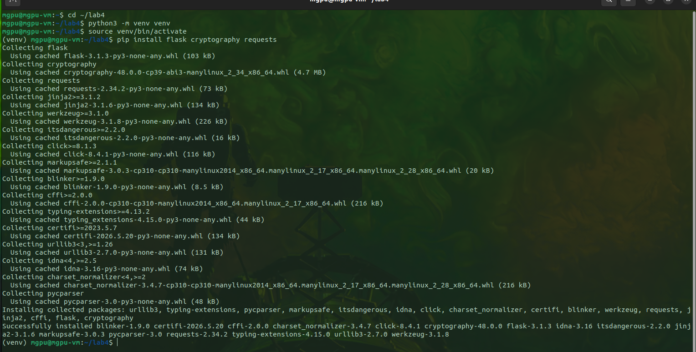
*Установка библиотек flask, cryptography, requests*

### Шаг 2. Генерация сертификатов (PKI)

Создан скрипт `generate_certificates.sh` для генерации сертификатов CA, сервера и клиента.

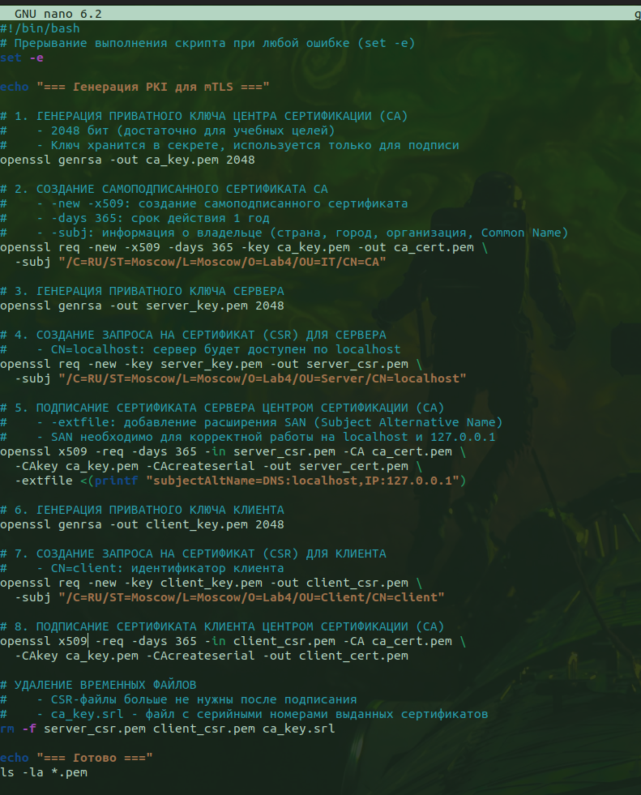
*Листинг generate_certificates.sh*

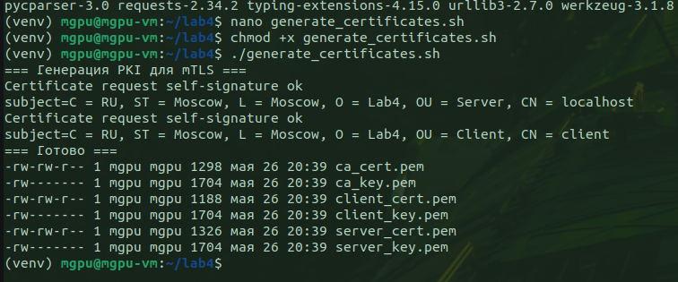
*Результат генерации: 6 файлов .pem*

### Шаг 3. Генерация ключа Fernet

Создан скрипт `generate_key.py` для генерации симметричного ключа шифрования.

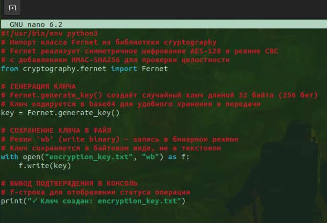
*Листинг generate_key.py*

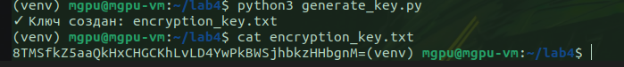
*Создан ключ encryption_key.txt*

### Шаг 4. Реализация сервера (server.py)

Реализован сервер с поддержкой mTLS, синхронной обработки и отложенных задач (вариант 21).

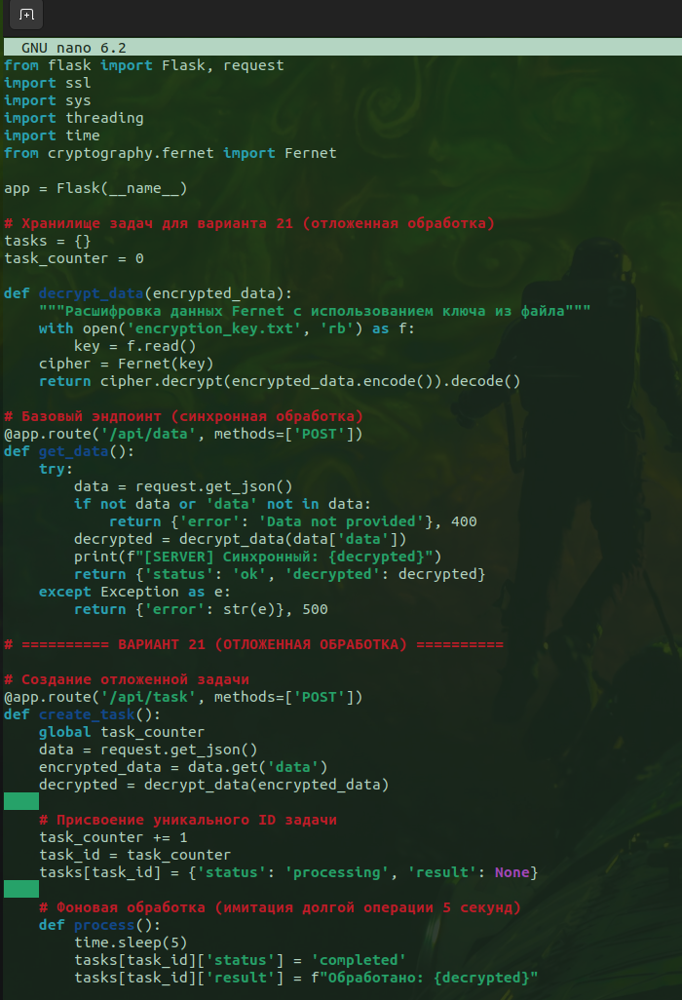
*Листинг server.py (начало)*

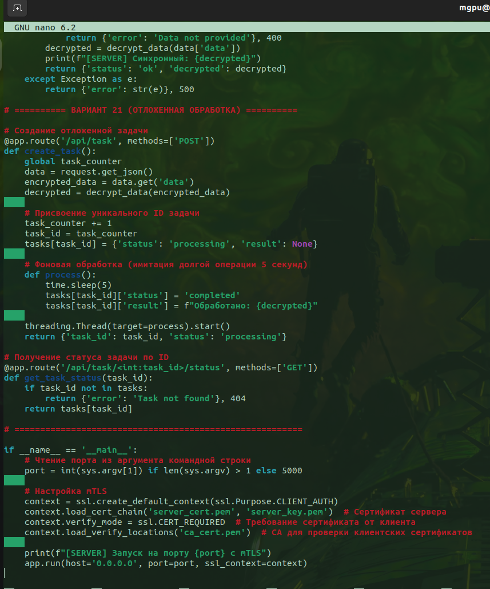
*Листинг server.py (продолжение — вариант 21)*

### Шаг 5. Реализация координатора (coordinator.py)

Реализован координатор-прокси с балансировкой нагрузки и отказоустойчивостью (failover).

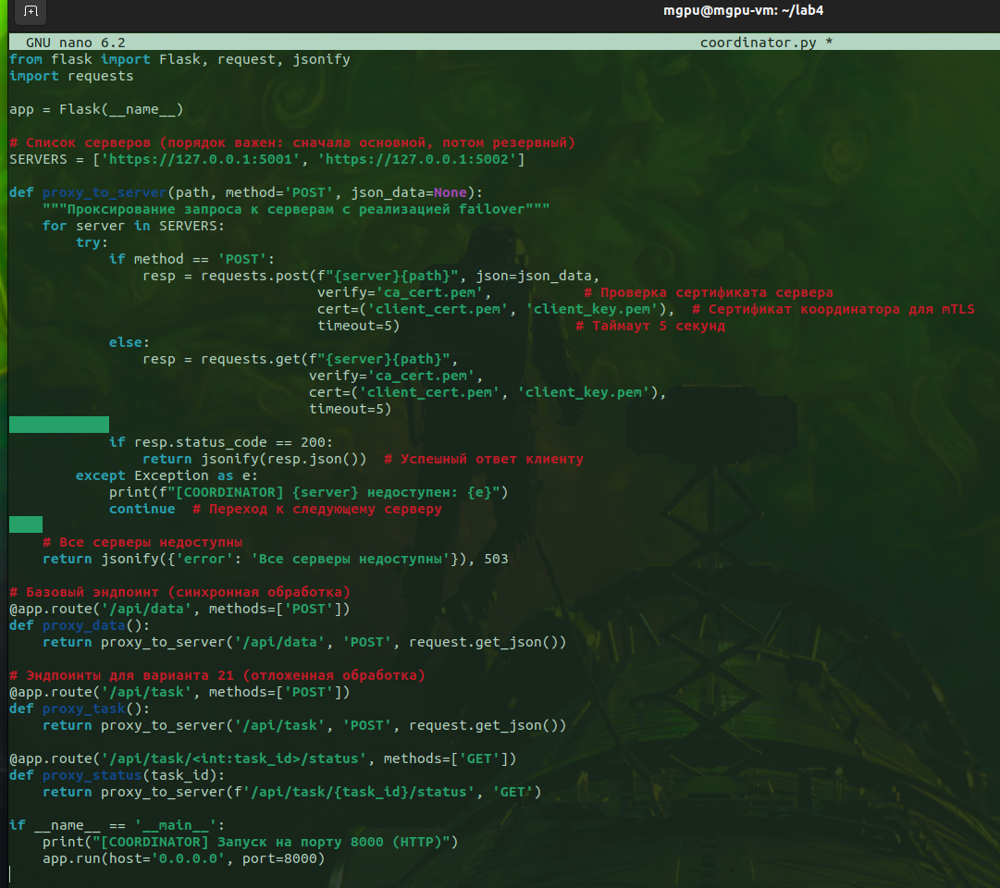
*Листинг coordinator.py*

### Шаг 6. Реализация клиента (client.py)

Реализован клиент с шифрованием данных и поддержкой отложенных задач (вариант 21).

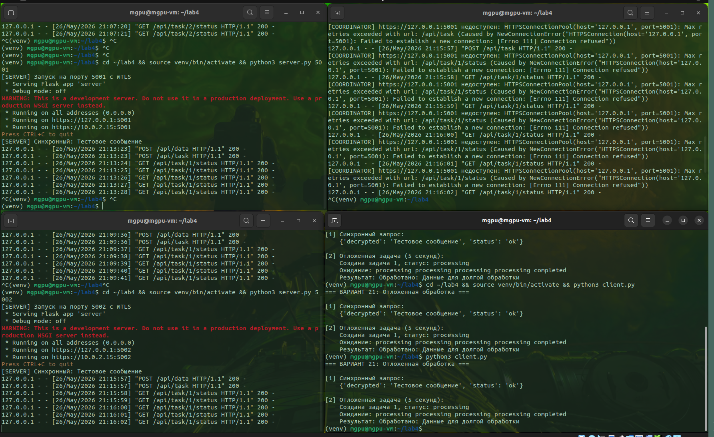
*Листинг client.py*

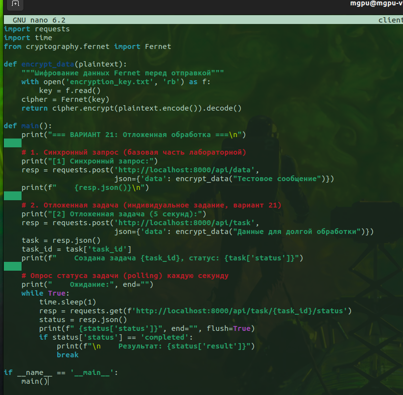
*Листинг client.py (продолжение)*

### Шаг 7. Запуск компонентов

Система запущена в 4 терминалах в следующем порядке:

**Терминал 1 — Сервер 1 (порт 5001)**

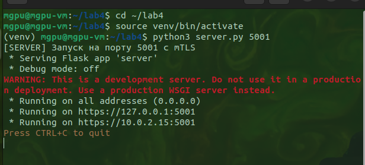
*Запуск server.py 5001*

**Терминал 2 — Сервер 2 (порт 5002)**

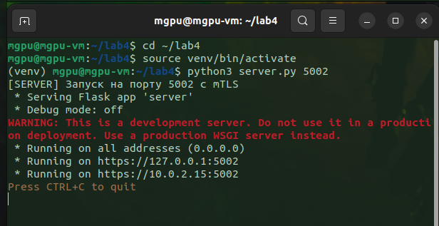
*Запуск server.py 5002*

**Терминал 3 — Координатор (порт 8000)**

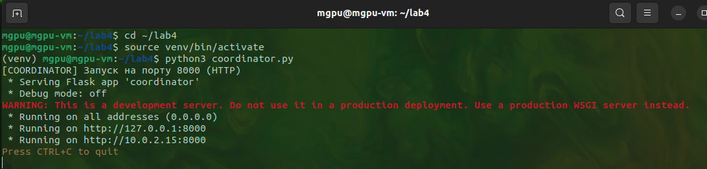
*Запуск coordinator.py*

**Терминал 4 — Клиент**

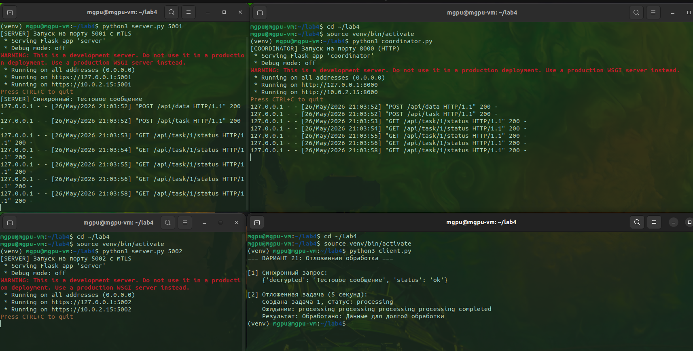
*Запуск client.py*

### Шаг 8. Выполнение индивидуального задания (Вариант 21)

Клиент последовательно выполняет:
1. Синхронный запрос (базовая часть)
2. Создание отложенной задачи с получением `task_id`
3. Опрос статуса задачи (polling) каждую секунду до завершения

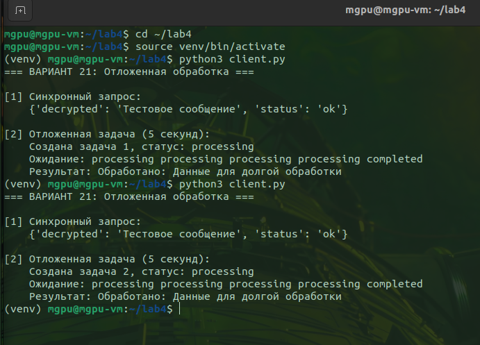
*Результат работы клиента: синхронный запрос и отложенная задача*

### Шаг 9. Демонстрация отказоустойчивости (Failover)

После успешной обработки запросов Сервером 1:

**Остановка Сервера 1 (Ctrl+C)**

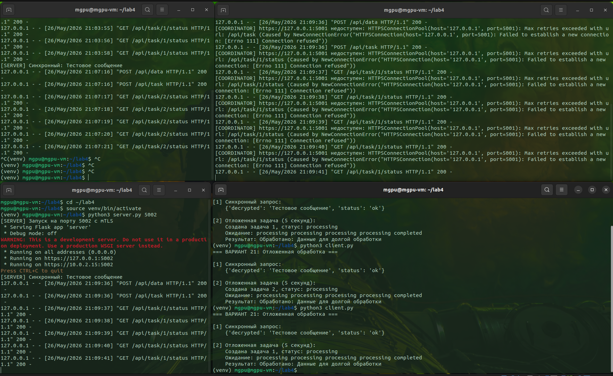
*Лог Сервера 1 после обработки запросов*

**Повторный запуск клиента — координатор переключается на Сервер 2**

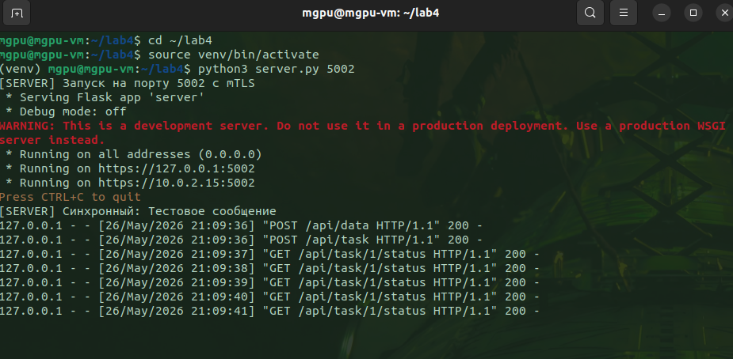
*Сервер 2 обрабатывает запросы после отказа Сервера 1*

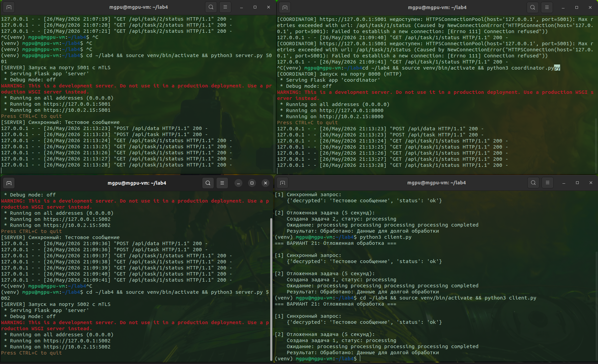
*Лог координатора с переключением с 5001 на 5002*

**Клиент получает успешный ответ от Сервера 2**

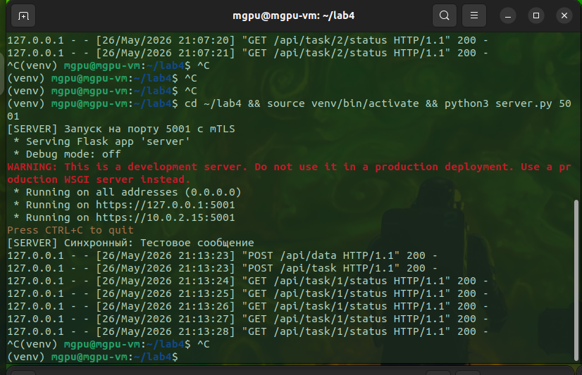
*Клиент выполнил запрос после остановки Сервера 1*

---

## Результаты работы

### Выполненные задачи

| Задача | Статус |
|--------|--------|
| Настройка PKI (генерация сертификатов CA, сервера, клиента) | ✅ |
| Реализация mTLS между координатором и серверами | ✅ |
| Шифрование данных Fernet (клиент → сервер) | ✅ |
| Координатор с балансировкой нагрузки | ✅ |
| Отказоустойчивость (failover) — переключение с 5001 на 5002 | ✅ |
| Индивидуальное задание — вариант 21 (отложенная обработка) | ✅ |

### Демонстрация отказоустойчивости

| Этап | Результат |
|------|-----------|
| Штатный режим | Клиент → Координатор → Сервер 1 (5001) → ответ |
| Остановка Сервера 1 | Координатор фиксирует `Connection refused` |
| Переключение | Координатор пробует Сервер 2 (5002) |
| Итог | Клиент получает успешный ответ от Сервера 2 |

### Выполнение варианта 21

| Метод | Результат |
|-------|-----------|
| `POST /api/task` | Возвращён `task_id` со статусом `processing` |
| `GET /api/task/{id}/status` | Опрос статуса через 1 секунду |
| Асинхронная обработка | Через 5 секунд статус меняется на `completed` |
| Результат | `Обработано: Данные для долгой обработки` |

---

## Выводы

В ходе выполнения лабораторной работы:

1. **Настроена PKI** — сгенерированы сертификаты X.509 для CA, серверов и клиента с использованием OpenSSL.

2. **Реализована безопасность** — настроено mTLS между координатором и серверами (проверка сертификатов с обеих сторон), данные шифруются алгоритмом Fernet (AES-128-CBC + HMAC-SHA256).

3. **Разработаны компоненты** — созданы серверы обработки данных, координатор-прокси с балансировкой, клиент с шифрованием.

4. **Обеспечена отказоустойчивость** — координатор автоматически переключается на резервный сервер (порт 5002) при недоступности основного (порт 5001).

5. **Выполнено индивидуальное задание (Вариант 21)** — реализована система отложенной обработки задач с асинхронным выполнением в фоновом потоке и опросом статуса.

---

## Список скриншотов

| № | Содержание |
|---|------------|
| 1 | Установка библиотек flask, cryptography, requests |
| 2 | Листинг generate_certificates.sh |
| 3 | Результат генерации сертификатов (ls -la *.pem) |
| 4 | Листинг generate_key.py |
| 5 | Создание ключа encryption_key.txt |
| 6 | Листинг server.py (начало) |
| 7 | Листинг server.py (вариант 21) |
| 8 | Листинг coordinator.py |
| 9 | Листинг client.py (часть 1) |
| 10 | Листинг client.py (часть 2) |
| 11 | Запуск Сервера 1 (порт 5001) |
| 12 | Запуск Сервера 2 (порт 5002) |
| 13 | Запуск координатора (порт 8000) |
| 14 | Запуск клиента |
| 15 | Результат работы клиента (вариант 21) |
| 16 | Лог Сервера 1 после обработки |
| 17 | Сервер 2 обрабатывает запросы после отказа |
| 18 | Лог координатора — переключение с 5001 на 5002 |
| 19 | Клиент выполнил запрос после остановки Сервера 1 |
