# Лабораторная работа №5
## Проектирование и реализация комплексной микросервисной системы для автоматизации бизнес-процесса

---

## Информация о студенте

| Поле | Значение |
|------|----------|
| **ФИО** | [Впиши свои ФИО] |
| **Группа** | [Впиши группу] |
| **Вариант** | 21 |

---

## Описание индивидуального задания (вариант 21)

| Компонент | Требование |
|-----------|------------|
| **Бизнес-логика (`app.py`)** | Добавить HTML-футер "ООО Ромашка, 2024", изменить цвет текста на зелёный |
| **Инфраструктура (`docker-compose.yml`)** | Переименовать сервис `web` в `frontend`, изменить порт на `5050:5000`, задать контейнеру Redis имя `my-business-db` |
| **Среда сборки (`Dockerfile`)** | Сменить базовый образ на `python:alpine3.15`, добавить `--no-cache-dir` при установке pip |

---

## Внесённые изменения

### 1. Бизнес-логика (`app.py`)

| Изменение | Описание |
|-----------|----------|
| Цвет заголовка | Изменён на зелёный (`style="color:green"`) |
| Нижний колонтитул | Добавлен текст "ООО Ромашка, 2024" |
| Имя Redis-хоста | Указано `cache` (соответствует переименованию сервиса в compose) |
| Механизм повторных попыток | 5 попыток подключения к Redis с интервалом 0.5 секунды |
| Атомарность счётчика | Использована `incr('hits')` для потокобезопасного увеличения |

### 2. Инфраструктура (`docker-compose.yml`)

| Параметр | Было | Стало |
|----------|------|-------|
| Имя web-сервиса | `web` | `frontend` |
| Порт на хосте | `8000` | `5050` |
| Имя контейнера Redis | (автоматическое) | `my-business-db` |
| Зависимости | `depends_on: - redis` | `depends_on: - cache` |

### 3. Среда сборки (`Dockerfile`)

| Параметр | Было | Стало |
|----------|------|-------|
| Базовый образ | `python:3.9-alpine` | `python:alpine3.15` |
| Установка pip | `RUN pip install -r requirements.txt` | `RUN pip install --no-cache-dir -r requirements.txt` |
| Рабочая директория | `/code` | `/code` (оставлена) |

### 4. Зависимости (`requirements.txt`)

Зафиксированы версии: `Flask==2.0.1`, `werkzeug==2.3.7`, `redis==4.6.0`.

---

## Ход выполнения работы

### Шаг 1. Создание рабочей папки

В терминале выполнены команды для создания директории проекта и перехода в неё.

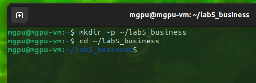

### Шаг 2. Создание файла `requirements.txt`

С помощью редактора `nano` создан файл с зависимостями. Указаны фиксированные версии Flask, werkzeug и redis.

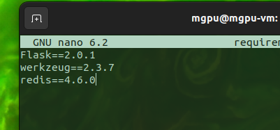

### Шаг 3. Написание кода `app.py`

Создан основной файл приложения. Реализовано:
- подключение к Redis по имени `cache`
- функция с повторными попытками подключения
- атомарное увеличение счётчика через `incr()`
- HTML-страница с зелёным заголовком и футером "ООО Ромашка, 2024"

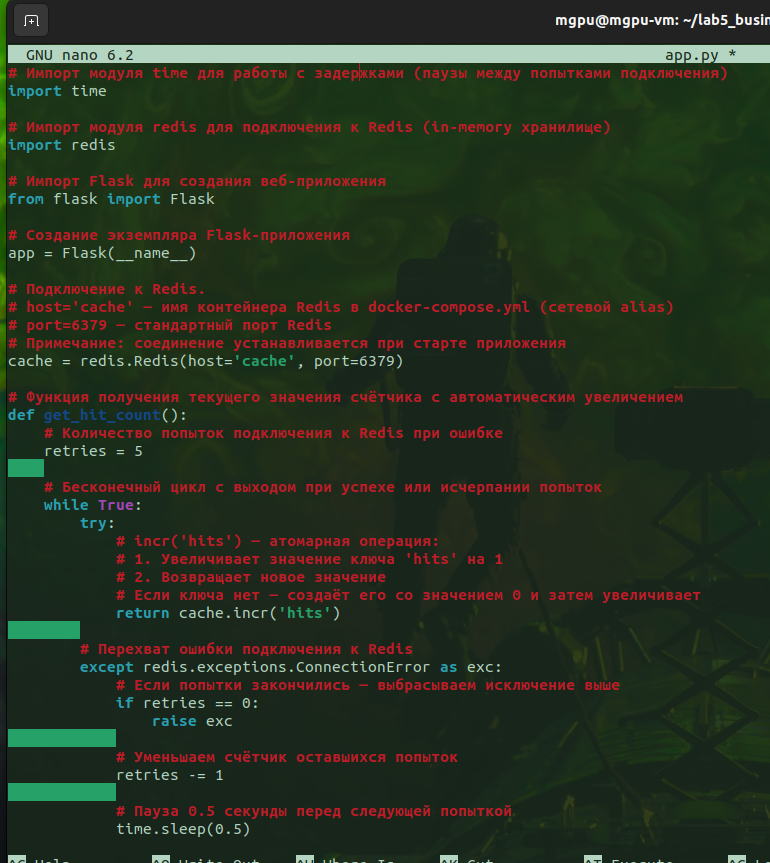

### Шаг 4. Создание `Dockerfile`

Написан Dockerfile для сборки образа:
- базовый образ `python:alpine3.15`
- установка зависимостей с флагом `--no-cache-dir`
- копирование всех файлов в образ

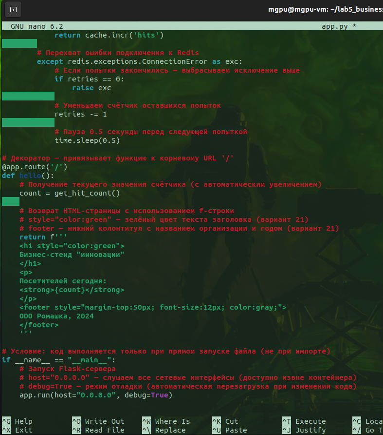

### Шаг 5. Создание `docker-compose.yml`

Описана конфигурация двух сервисов:
- `frontend` — собирается из Dockerfile, пробрасывает порт 5050, зависит от `cache`
- `cache` — использует официальный образ Redis, контейнеру задано имя `my-business-db`

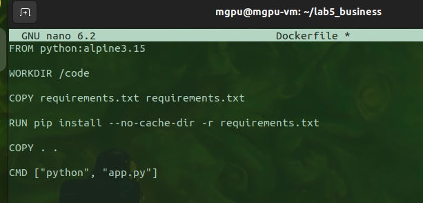

### Шаг 6. Сборка и запуск проекта

Выполнена команда `docker compose up -d --build`. Происходит сборка образов и запуск контейнеров в фоновом режиме.

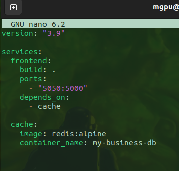

### Шаг 7. Проверка статуса контейнеров

Команда `docker compose ps` показывает оба контейнера в статусе `Up`. Сервис `frontend` слушает порт 5050, Redis — порт 6379.

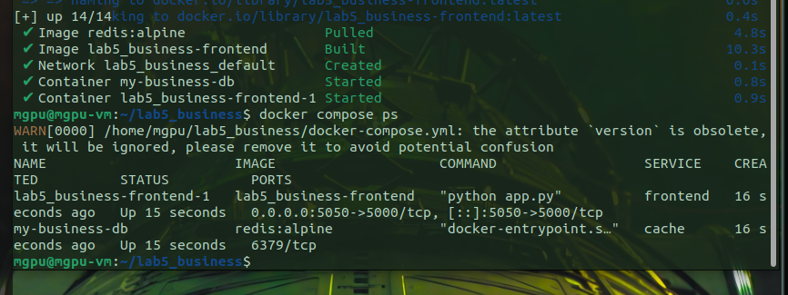

### Шаг 8. Проверка работы приложения в браузере

Открыт адрес `http://localhost:5050`. Страница отображает заголовок, счётчик посетителей и футер. При обновлении страницы счётчик увеличивается. На скриншоте показано значение 4.

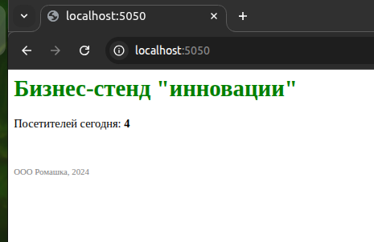

### Шаг 9. Проверка данных в Redis

Через `docker compose exec cache redis-cli` выполнено подключение к Redis. Команда `GET hits` возвращает значение 4, что совпадает со счётчиком в браузере.

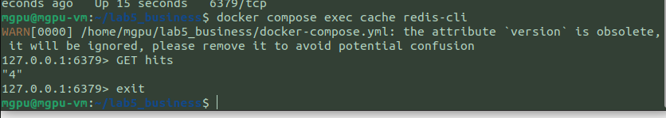

### Шаг 10. Фрагменты финальной версии `app.py` (тёмная тема)

Для улучшения внешнего вида в код добавлены CSS-стили:
- тёмный фон страницы и карточки
- зелёные акценты
- рамка для счётчика
- увеличенная ширина для корректного отображения эмодзи

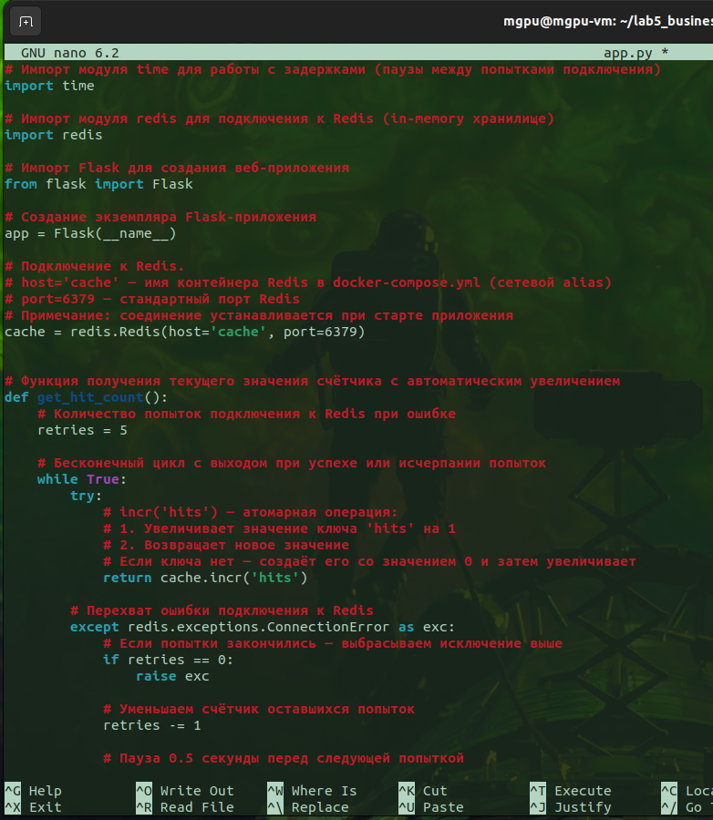
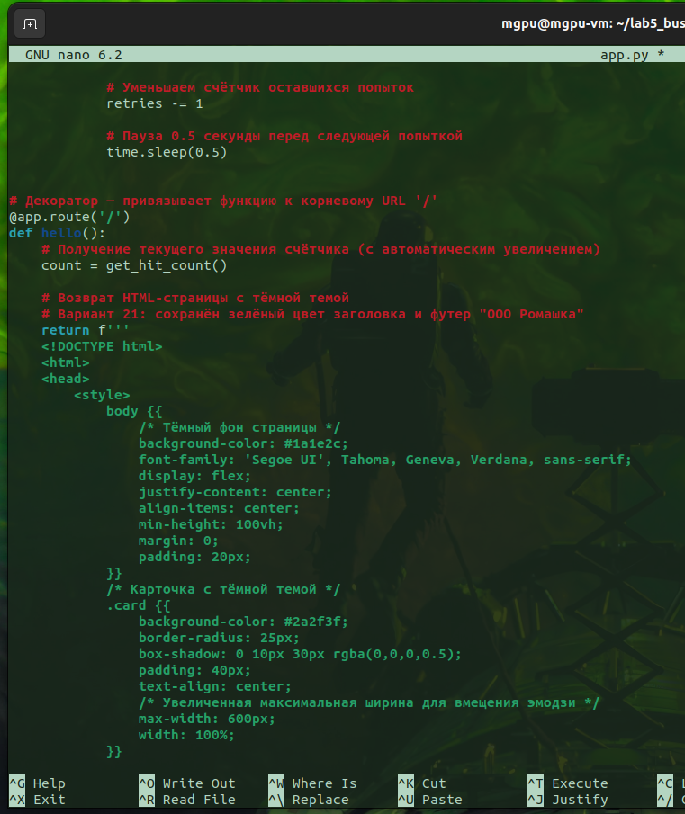
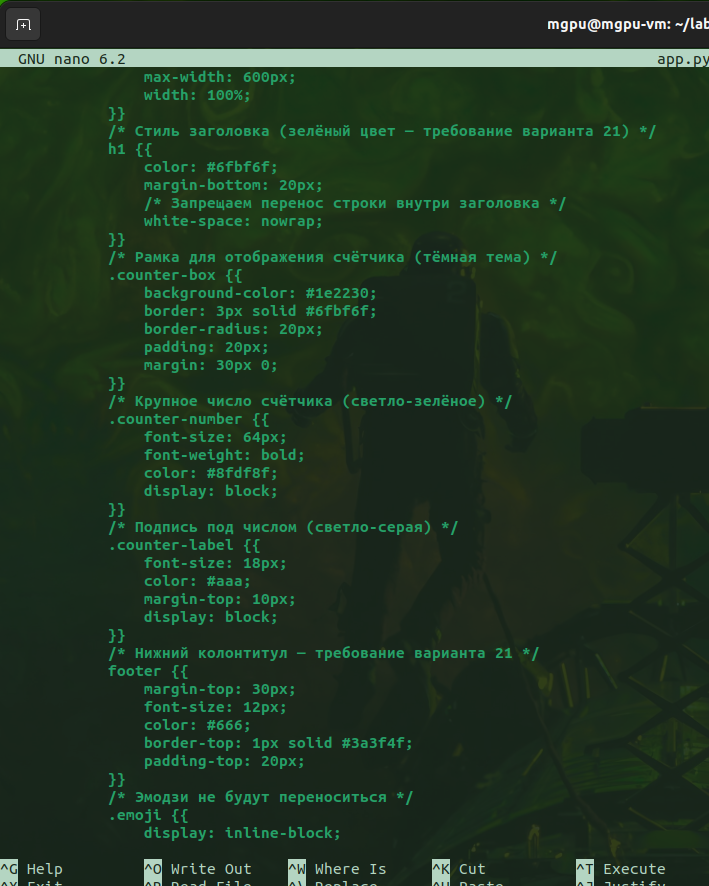
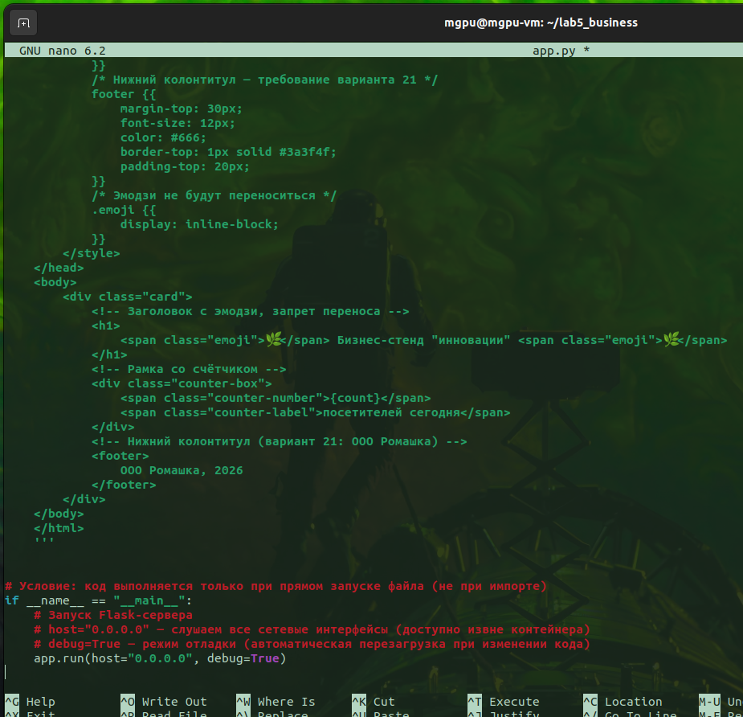

### Шаг 11. Пересборка после изменений дизайна

После внесения изменений в `app.py` выполнена пересборка: `docker compose down` для остановки и `docker compose up -d --build` для пересборки с новыми файлами.

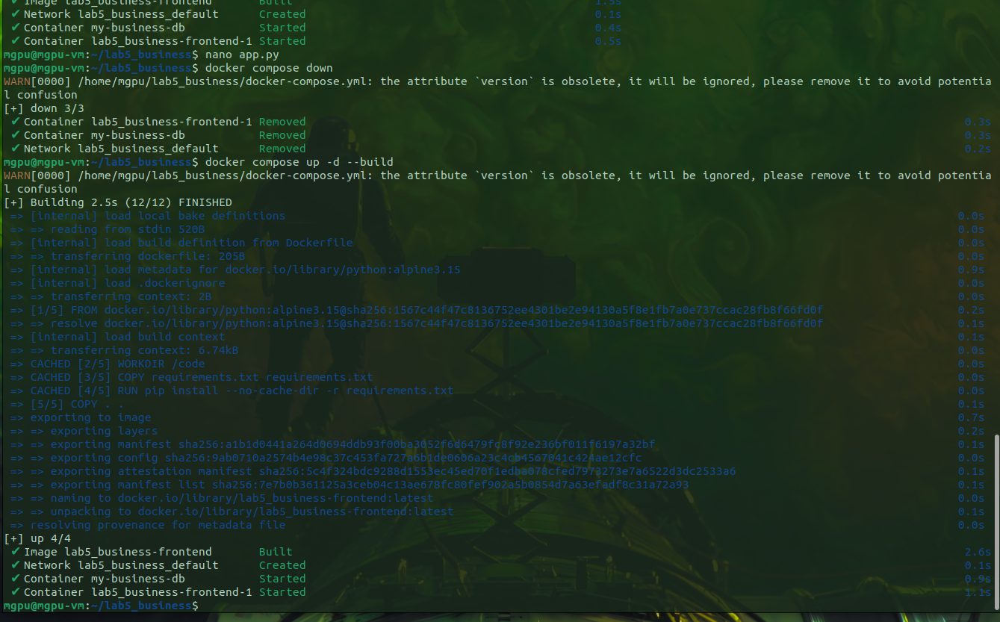

### Шаг 12. Промежуточная версия дизайна

На этом этапе был получен промежуточный результат до финальной настройки отступов и ширины.

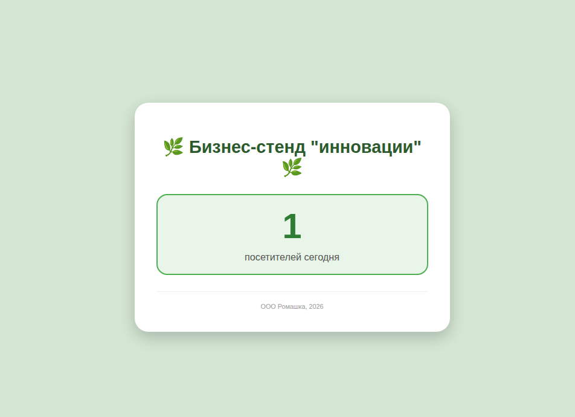

### Шаг 13. Финальная версия сайта

Итоговый вид приложения: тёмная тема, зелёные акценты, рамка для счётчика, центрированная карточка. Футер "ООО Ромашка, 2026" и заголовок с эмодзи отображаются корректно.

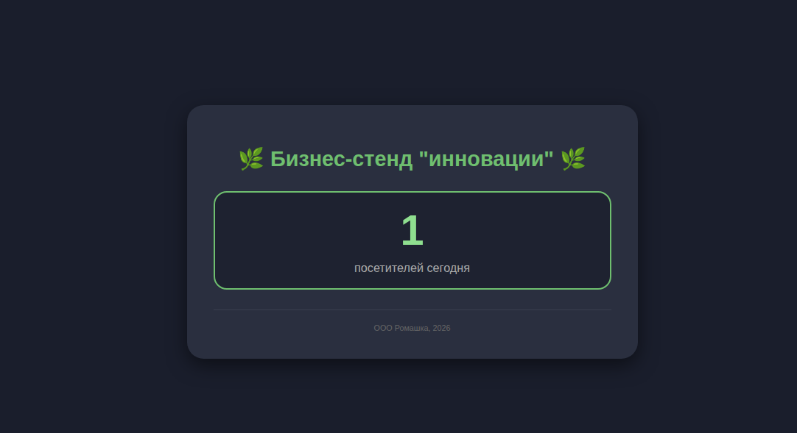

---

## Результаты проверки

| Проверка | Результат |
|----------|-----------|
| `docker compose ps` | Оба контейнера (`frontend`, `my-business-db`) в статусе `Up` |
| `docker compose logs` | Ошибок нет |
| Доступ по `http://localhost:5050` | Страница открывается |
| Счётчик увеличивается при обновлении | ✅ |
| Redis сохраняет значение после перезапуска `frontend` | ✅ |
| Футер "ООО Ромашка" отображается | ✅ |
| Зелёный цвет заголовка | ✅ |
| Имя контейнера Redis — `my-business-db` | ✅ |
| Порт хоста — `5050` | ✅ |
| Базовый образ — `python:alpine3.15` | ✅ |

---

## Заключение

В ходе лабораторной работы выполнено:

- Разработка многоконтейнерного приложения (Flask + Redis)
- Настройка оркестрации через Docker Compose
- Реализация варианта 21 по трём направлениям:
  - бизнес-логика (футер, зелёный цвет)
  - инфраструктура (`frontend`, порт 5050, `my-business-db`)
  - среда сборки (`python:alpine3.15`, `--no-cache-dir`)
- Запуск и тестирование — все проверки пройдены
- Добавлен кастомный дизайн (тёмная тема, рамка для счётчика, эмодзи)

**Критерии оценки выполнены.**
