# Лабораторная работа №1

## Основы работы с SQL-запросами: создание запросов и манипуляции с данными

**Вариант:** 21

---

### Цель работы
Научиться писать запросы `SELECT` для аналитики и выполнять `CRUD` операции в локальной базе данных PostgreSQL.

---

## Часть 1. Общие задания (Guided Labs)

### 1.1. Персонал (Salespeople)

**Задание:** Вывести `username` первых 10 нанятых женщин-продавцов (`gender='Female'`). Сортировка по `hire_date`.

**Выполнение:** Запрос с фильтром по полу `Female`, сортировкой по дате найма и ограничением `LIMIT 10`.

**Результат выполнения:**  
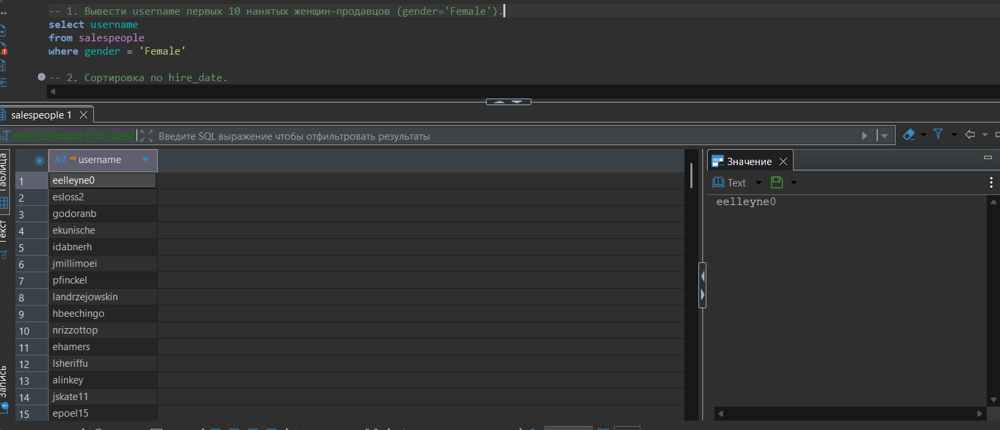

---

**Задание:** Сортировка по `hire_date` (результат выполнения с сортировкой).

**Результат выполнения:**  
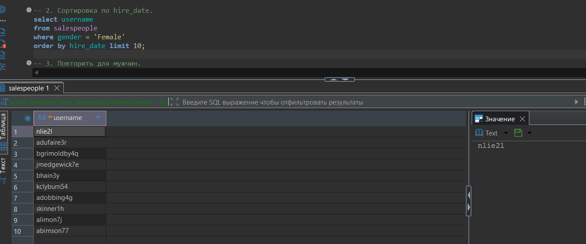

---

**Задание:** Повторить для мужчин.

**Выполнение:** Запрос с фильтром по полу `Male`, сортировкой по дате найма и ограничением `LIMIT 10`.

**Результат выполнения:**  
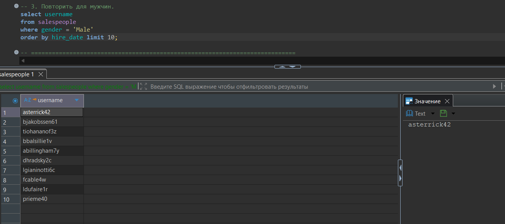

---

### 1.2. Клиенты (Customers)

**Задание:** Все `email` клиентов из 'FL', сортировка по алфавиту.

**Выполнение:** Фильтрация по штату `FL` с сортировкой по `email` в алфавитном порядке.

**Результат выполнения:**  
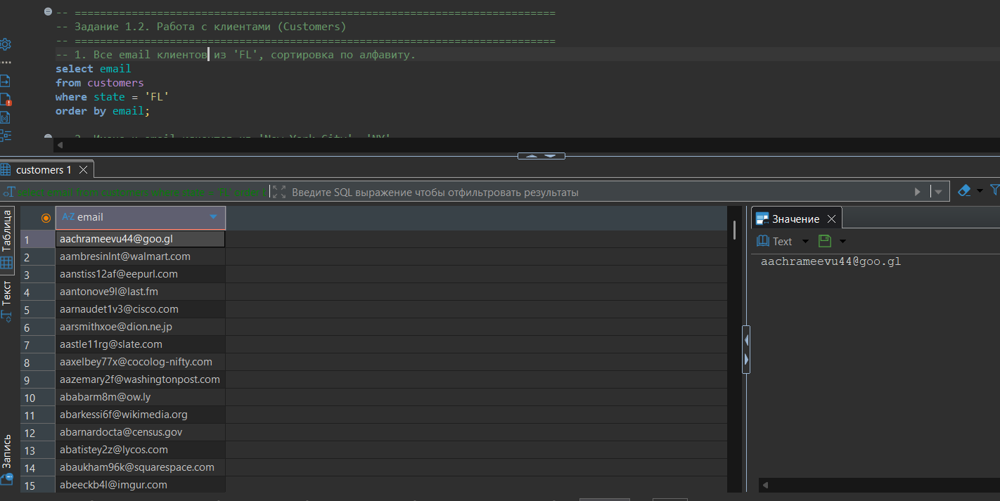

---

**Задание:** Имена и `email` клиентов из 'New York City', 'NY'.

**Выполнение:** Отбор клиентов из Нью-Йорка для получения исходного набора данных.

**Результат выполнения:**  
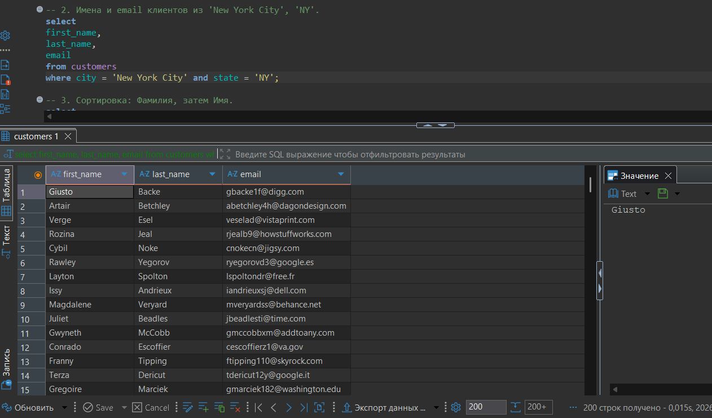

---

**Задание:** Сортировка: Фамилия, затем Имя.

**Выполнение:** Сортировка сначала по фамилии, затем по имени.

**Результат выполнения:**  
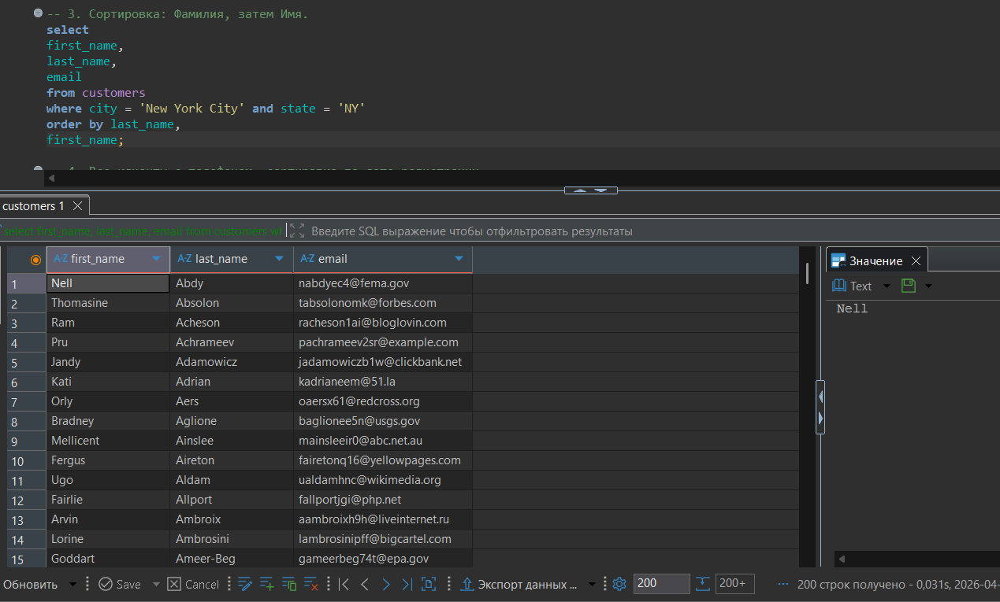

---

**Задание:** Все клиенты с телефоном, сортировка по дате регистрации.

**Выполнение:** Условие `phone IS NOT NULL AND phone != ''` отсеивает записи без номера телефона. Сортировка по дате регистрации (`date_added`) позволяет увидеть самых новых клиентов первыми.

**Результат выполнения:**  
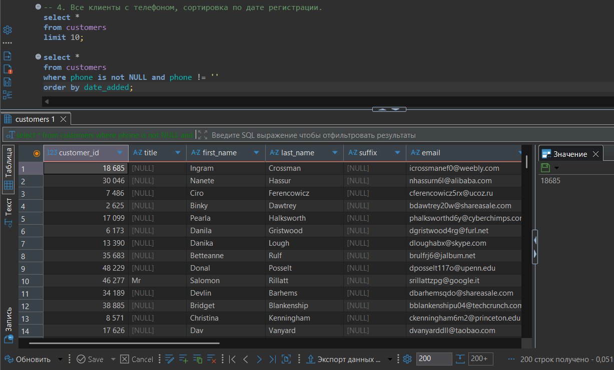

---

## Часть 2. Индивидуальные задания (Вариант 21)

### Задание 2.1. SELECT + Сортировка

**Задание:** Товары (products) дороже $30000.

**Выполнение:** Запрос фильтрует товары с базовой ценой (`base_msrp`) выше $30000 для получения списка дорогих товаров.

**Результат выполнения:**  
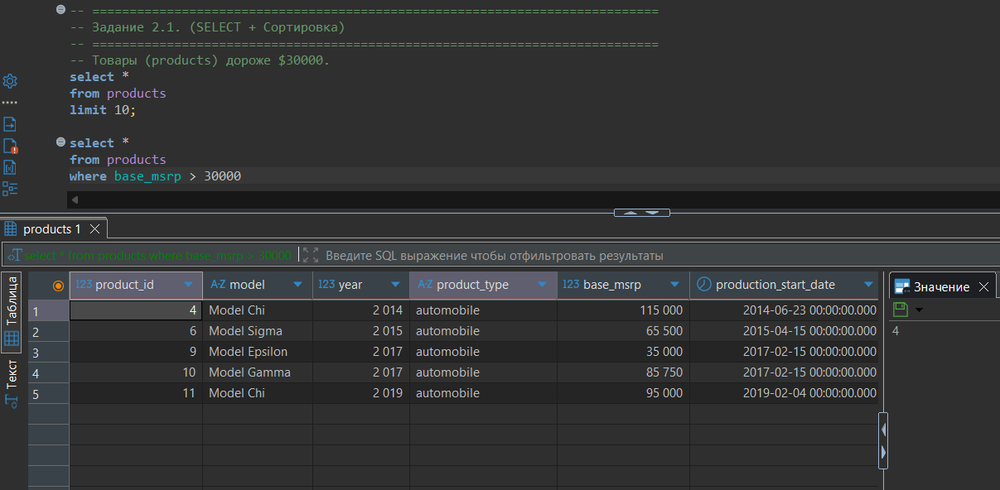

---

**Задание:** Сортировка: цена убыв.

**Выполнение:** Добавлена сортировка от самых дорогих к более дешевым с помощью `ORDER BY base_msrp DESC`.

**Результат выполнения:**  
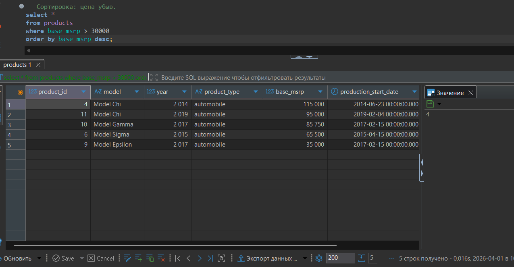

---

### Задание 2.2. Логика и Фильтры

**Задание:** Письма (emails), которые отскочили (bounced = 't'/'Yes').

**Выполнение:** Оператор `IN ('t', 'Yes')` позволяет отобрать все письма, у которых поле `bounced` содержит любое из указанных значений, обозначающих отскок.

**Результат выполнения:**  
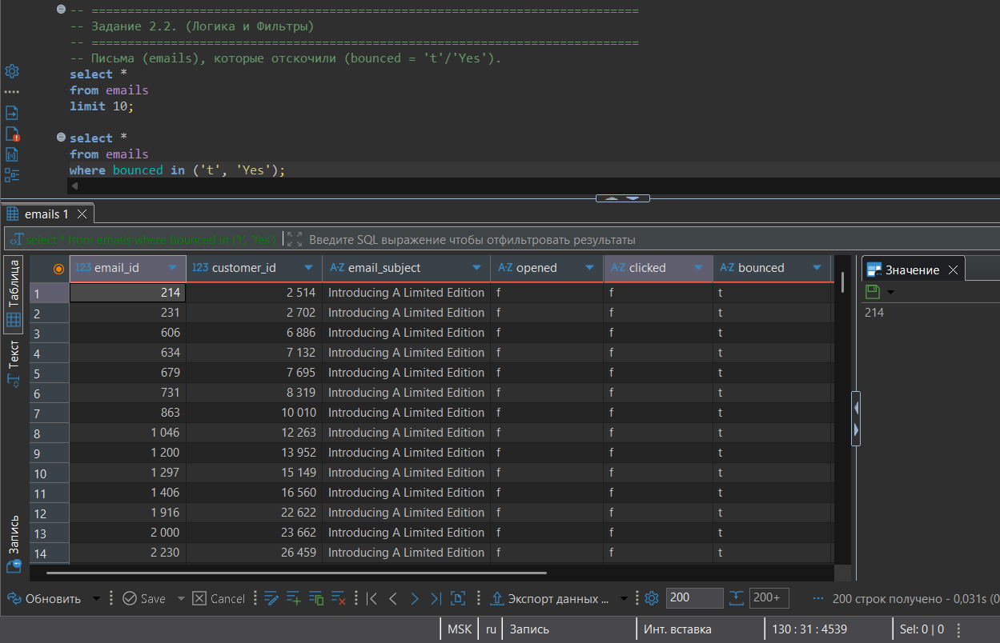

---

## Часть 3. CRUD операции (Локально)

### Задание 1.3*. Спецпроект — customers_nyc

**Задание:** Создать копию клиентов из NYC, удалить с индексом 10014, добавить колонку event, заполнить 'thank-you party'.

**Выполнение:** Последовательно выполняются операции:

1. **Создание таблицы:** `DROP TABLE IF EXISTS customers_nyc; CREATE TABLE customers_nyc AS SELECT * FROM customers WHERE city = 'New York City' AND state = 'NY';`
   - Результат: создано 731 запись

**Результат:**  
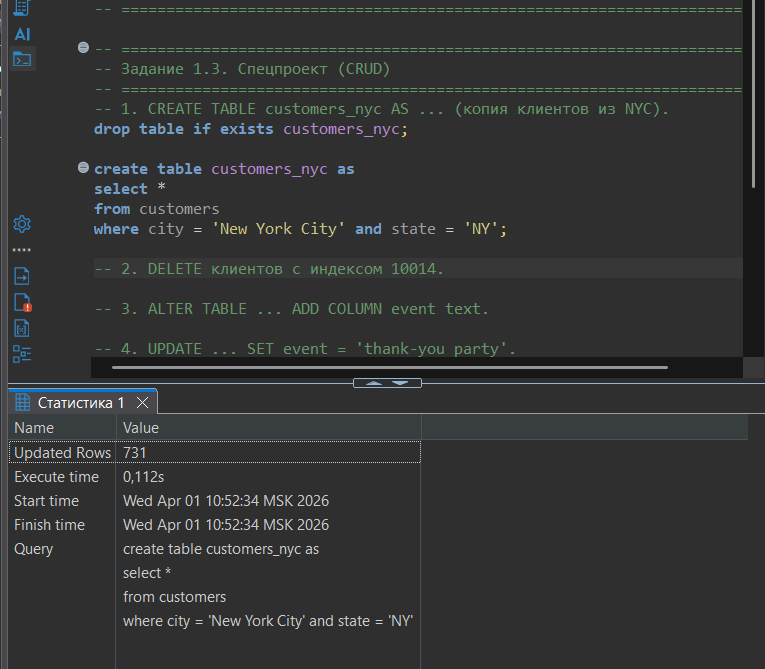

---

2. **Удаление клиентов:** `DELETE FROM customers_nyc WHERE postal_code = '10014';`
   - Результат: удалено 27 записей

**Результат:**  
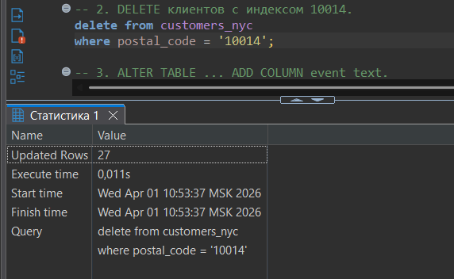

---

3. **Добавление колонки:** `ALTER TABLE customers_nyc ADD COLUMN event text;`
   - Результат: колонка успешно добавлена

**Результат:**  
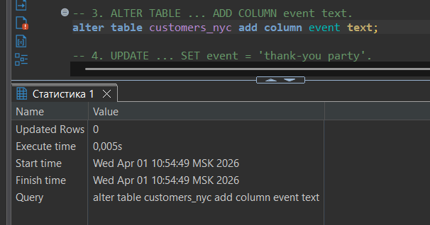

---

4. **Обновление данных:** `UPDATE customers_nyc SET event = 'thank-you party';`
   - Результат: обновлено 704 записи

**Результат:**  
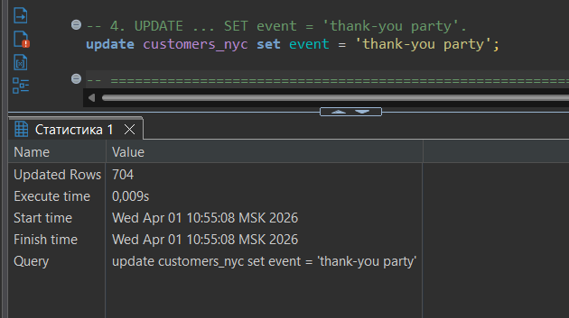

---

### Задание 2.3*. CRUD — failed_emails

**Задание:** Создать таблицу failed_emails из bounced писем, добавить retry='N', удалить тему 'Welcome'.

**Выполнение:**

1. **Создание таблицы:** `CREATE TABLE failed_emails AS SELECT * FROM emails WHERE bounced IN ('t', 'Yes');`
   - Результат: создано 1606 записей

**Результат:**  
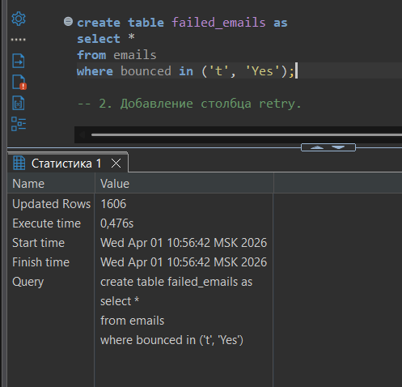

---

2. **Добавление колонки retry:** `ALTER TABLE failed_emails ADD COLUMN retry VARCHAR(1);`
   - Результат: колонка успешно добавлена

**Результат:**  
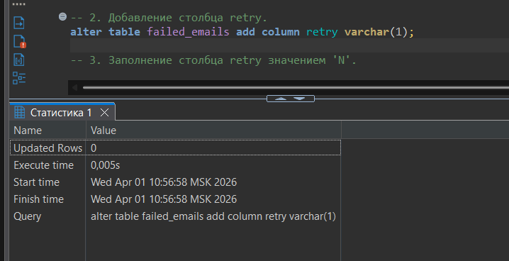

---

3. **Заполнение колонки retry:** `UPDATE failed_emails SET retry = 'N';`
   - Результат: обновлено 1606 записей

**Результат:**  
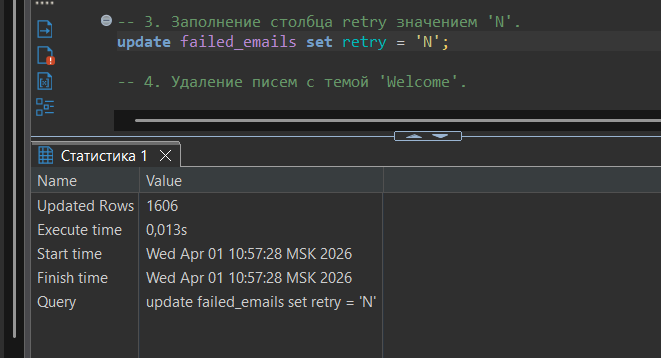

---

4. **Удаление писем с темой 'Welcome':** `DELETE FROM failed_emails WHERE email_subject = 'Welcome';`
   - Результат: удалено 0 записей (тема 'Welcome' отсутствует в таблице)

**Результат:**  
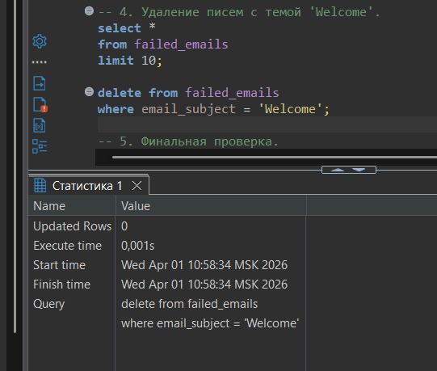

---

5. **Финальная проверка:** `SELECT * FROM failed_emails;`
   - Результат: отображены все 1606 записей с добавленной колонкой `retry = 'N'`

**Результат:**  
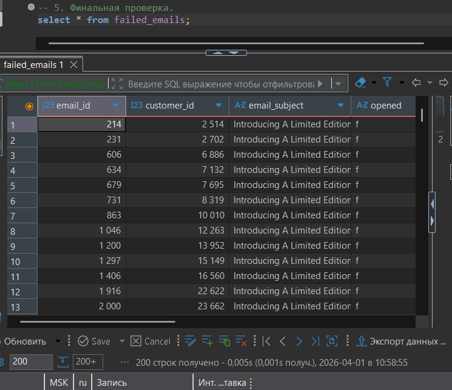

---

## Вывод

В ходе выполнения лабораторной работы были освоены:
- Написание SELECT-запросов с фильтрацией (`WHERE`) и сортировкой (`ORDER BY`)
- Использование `LIMIT` для ограничения количества записей
- Работа с CRUD операциями: `CREATE TABLE AS`, `DELETE`, `ALTER TABLE`, `UPDATE`, `DROP TABLE IF EXISTS`
- Выполнение запросов на основном сервере (только чтение) и локально (полный доступ к CRUD)

**Статистика выполнения:**
- Часть 1.1: 3 запроса (скриншоты 1-3)
- Часть 1.2: 4 запроса (скриншоты 4-7)
- Часть 2.1: 2 запроса (скриншоты 8-9)
- Часть 2.2: 1 запрос (скриншот 10)
- Задание 1.3*: 4 операции (скриншоты 11-14)
- Задание 2.3*: 5 операций (скриншоты 15-19)

Все запросы выполнены корректно, результаты соответствуют ожидаемым.
