# Лабораторная работа №2

## Использование соединений (JOIN), подзапросов и функций преобразования данных

**Вариант:** 21

---

### Цель работы
Освоить методы объединения таблиц (JOIN, UNION), работу с подзапросами и функции преобразования данных (CASE, COALESCE) в PostgreSQL.

---

## Часть 1. Общие задания (Guided Labs)

### 2.1. Поиск покупателей авто (INNER JOIN)

**Задание:** Получить контактные данные всех клиентов, купивших автомобиль, для обзвона. Использовать таблицы `sales`, `customers`, `products`.

**Выполнение:** Первичный запрос с `INNER JOIN` для соединения трех таблиц: продажи → клиенты → товары.

**Результат выполнения:**  
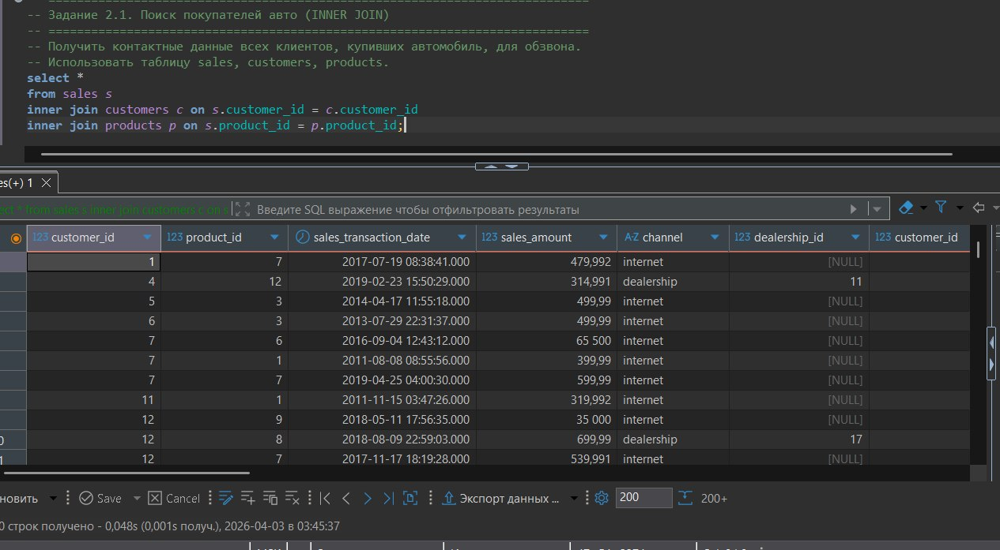

---

**Задание:** Добавить условие фильтрации `product_type = 'automobile'`.

**Выполнение:** Добавлено условие `WHERE` для отбора только продаж автомобилей.

**Результат выполнения:**  
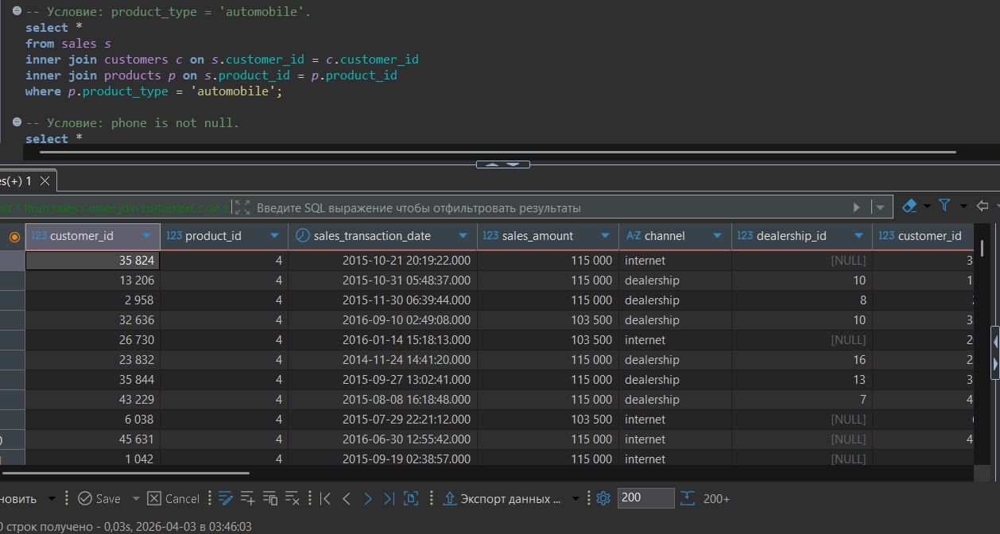

---

**Задание:** Добавить условие `phone is not null`.

**Выполнение:** Дополнительная фильтрация для исключения клиентов без номера телефона.

**Результат выполнения:**  
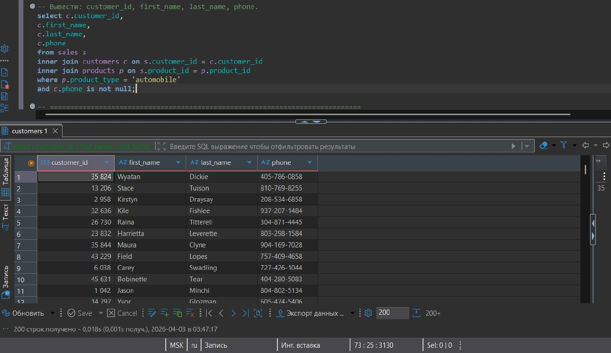

---

**Задание:** Вывести только необходимые поля: `customer_id`, `first_name`, `last_name`, `phone`.

**Выполнение:** Запрос с конкретным перечнем полей в `SELECT`.

**Результат выполнения:**  

---

### 2.2. Вечеринка в Лос-Анджелесе (UNION)

**Задание:** Составить список приглашенных на мероприятие — клиенты И сотрудники из Лос-Анджелеса.

**Выполнение (Запрос 1):** Клиенты из `city = 'Los Angeles'`.

**Результат выполнения:**  

---

**Задание (Запрос 2):** Продавцы (`salespeople`), работающие в дилерских центрах (`dealerships`) в Лос-Анджелесе.

**Выполнение:** `INNER JOIN` таблиц `salespeople` и `dealerships` с фильтром по городу.

**Результат выполнения:**  
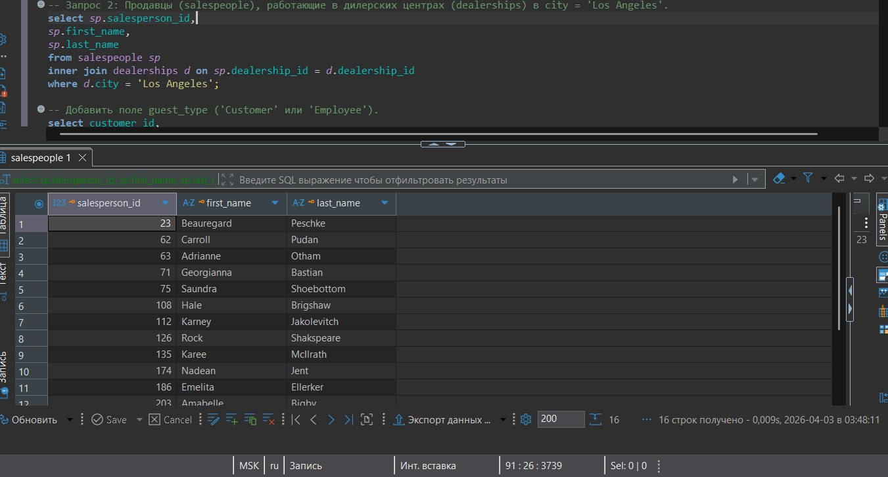

---

**Задание:** Добавить поле `guest_type` ('Customer' или 'Employee').

**Выполнение:** Добавление константного поля с помощью `'Customer' as guest_type` и `'Employee' as guest_type`.

**Результат выполнения:**  
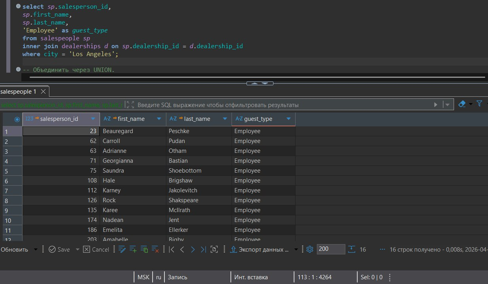

---

**Задание:** Объединить результаты через `UNION`.

**Выполнение:** Использование оператора `UNION` для объединения двух запросов с удалением дубликатов.

**Результат выполнения:**  

---

**Задание:** Отсортировать объединенный список.

**Выполнение:** Добавлен `ORDER BY guest_type, last_name` для сортировки сначала по типу гостя, затем по фамилии.

**Результат выполнения:**  

---

### 2.3. Создание витрины данных (Data Transformation)

**Задание:** Подготовить "плоскую" таблицу для аналитиков данных.

**Шаг 1. Соединить таблицы через `LEFT JOIN`:**

**Выполнение:** Базовое соединение таблиц `sales`, `customers`, `products`, `dealerships` с `LEFT JOIN`.

**Результат выполнения:**  
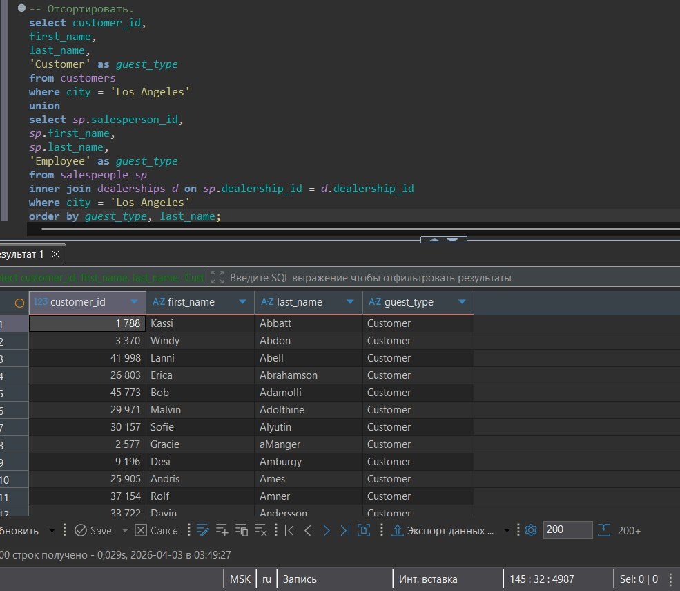

---

**Шаг 2. Очистить данные (COALESCE):**

**Выполнение:** Замена `NULL` значений `dealership_id` на `-1` с помощью `COALESCE`.

**Результат выполнения:**  

---

**Шаг 3. Создать признак (Feature Engineering):**

**Выполнение:** Создание столбца `high_savings` через `CASE`: 1 если `(base_msrp - sales_amount) > 500`, иначе 0.

**Результат выполнения:**  
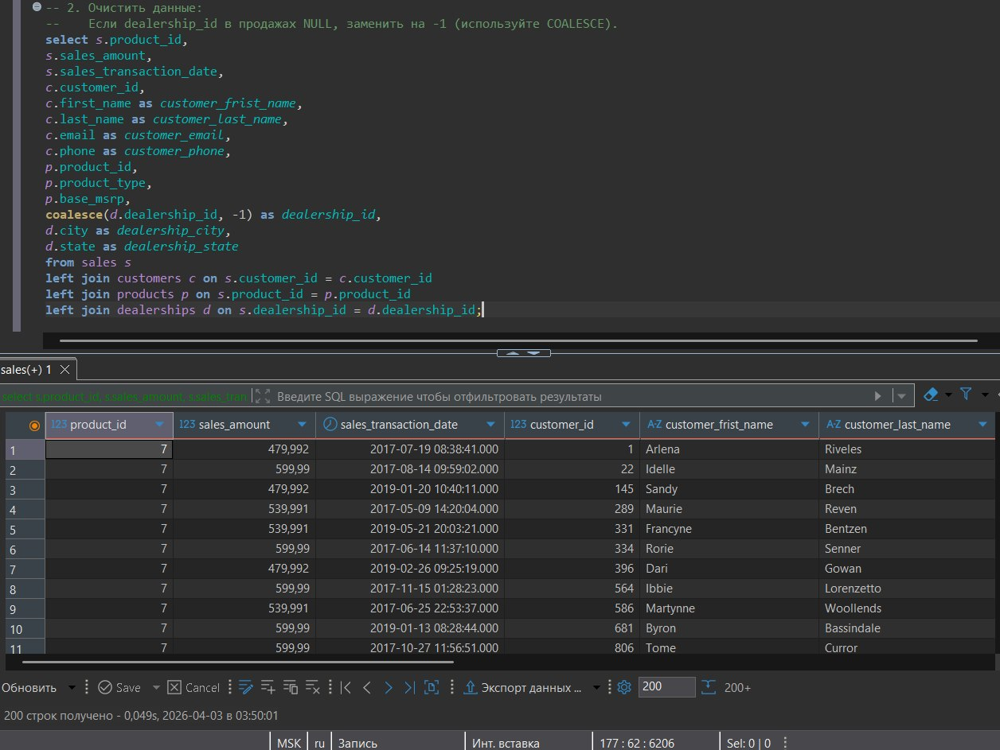

---

## Часть 2. Индивидуальные задания (Вариант 21)

### Задача 1. Использование JOIN (соединение 2-3 таблиц)

**Задание:** Вывести детали продаж (клиент, товар) для дилера с ID=10.

**Выполнение:** `INNER JOIN` таблиц `sales`, `products`, `customers` с условием `s.dealership_id = 10`.

**Результат выполнения:**  
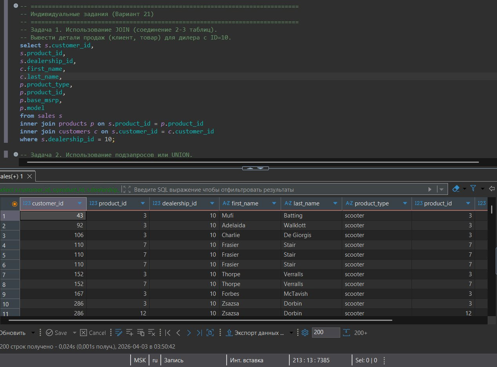

---

### Задача 2. Использование подзапросов или UNION

**Задание:** Найти клиентов, у которых сумма одной покупки превышала 50 000.

**Выполнение:** Сначала найдены уникальные `customer_id` из `sales` с `sales_amount > 50000`, затем использован подзапрос в `WHERE` для получения данных клиентов.

**Результат выполнения:**  

---

**Задание:** Финальный запрос с сортировкой.

**Выполнение:** Добавлен `ORDER BY customer_id` для упорядочивания результатов.

**Результат выполнения:**  
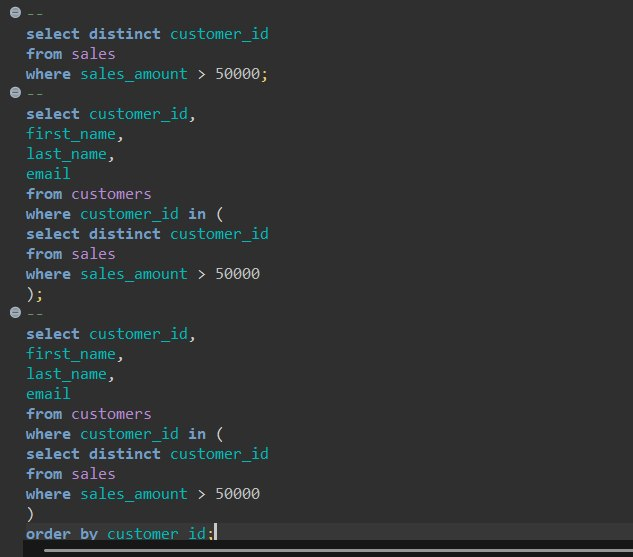

---

### Задача 3. Преобразование данных (CASE, COALESCE, CAST)

**Задание:** Привести `sales_transaction_date` к формату 'YYYY-MM-DD' (через `::DATE`).

**Выполнение:** Первичный просмотр исходных данных.

**Результат выполнения:**  
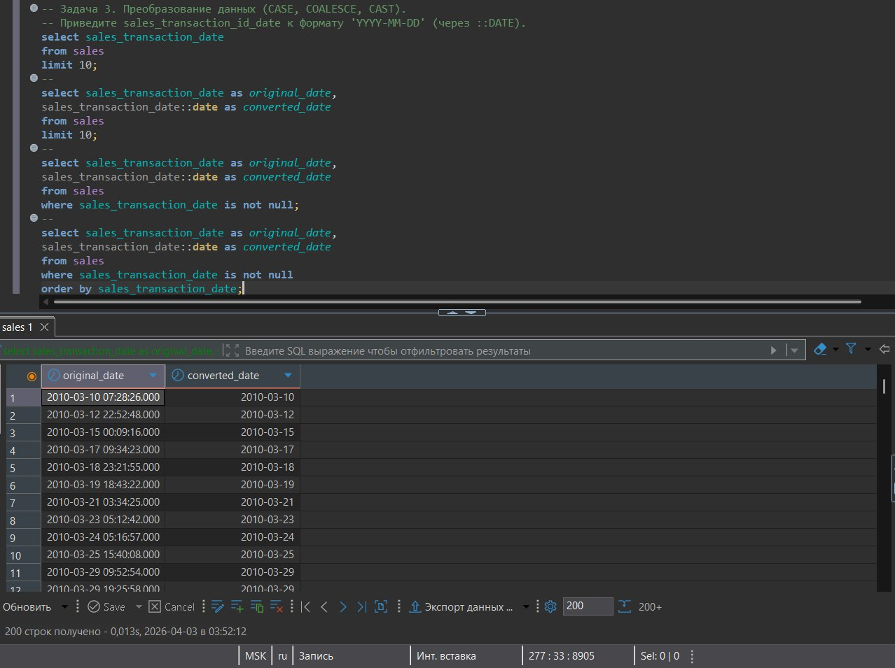

---

**Задание:** Преобразование с фильтрацией `NOT NULL`.

**Выполнение:** Использование `sales_transaction_date::date as converted_date` для преобразования типа данных.

**Результат выполнения:**  
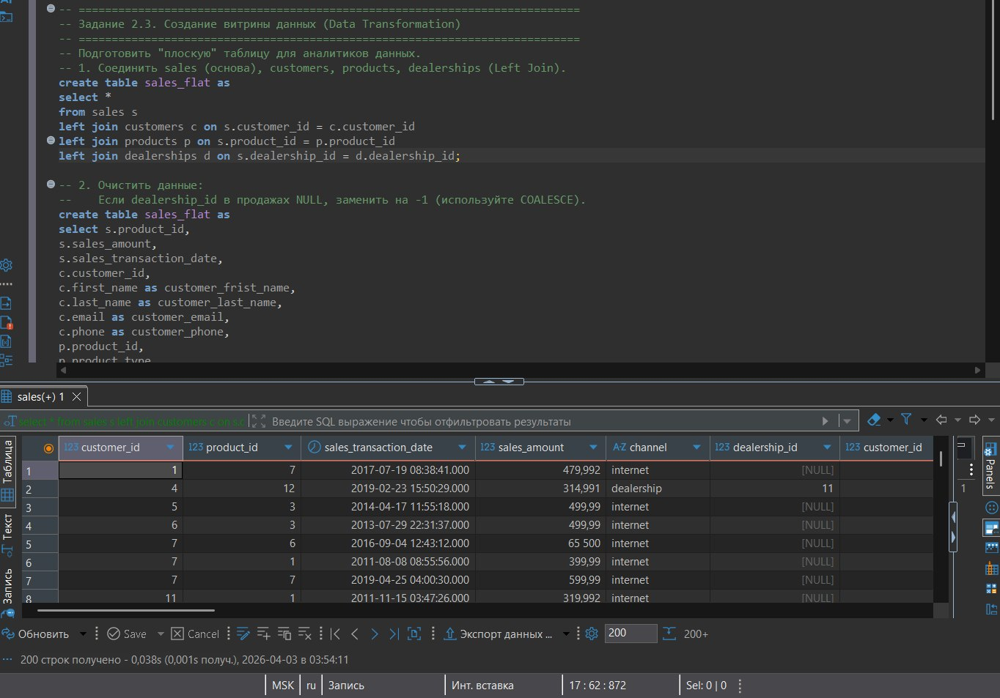

---

## Часть 3. CRUD операции (Локально)

### Задание 2.3*. Создание витрины данных (локально)

**Задание:** Создать таблицу `sales_flat` с соединением всех таблиц.

**Выполнение:** `CREATE TABLE sales_flat AS SELECT * FROM sales LEFT JOIN ...`

**Результат выполнения:**  
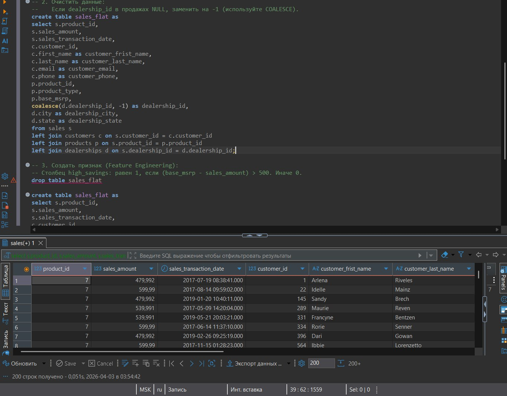

---

**Задание:** Очистка данных через `COALESCE` и создание таблицы.

**Выполнение:** Создание таблицы с заменой `NULL` на `-1` для `dealership_id`.

**Результат выполнения:**  
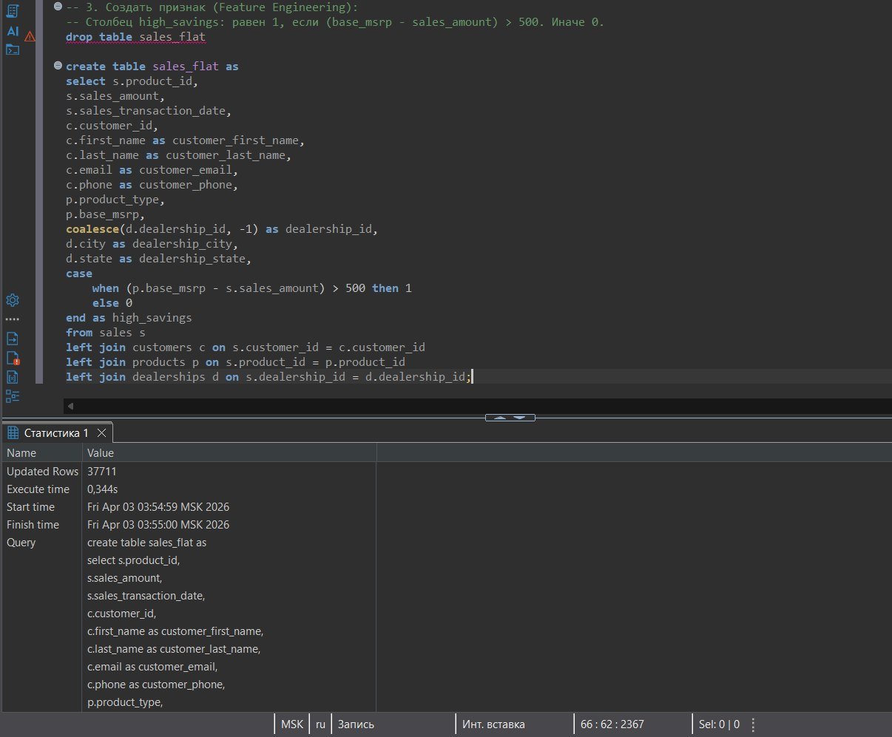

---

**Задание:** Финальная версия таблицы с признаком `high_savings`.

**Выполнение:** 
1. `DROP TABLE sales_flat` — удаление предыдущей версии
2. `CREATE TABLE sales_flat AS SELECT ... CASE WHEN ... END as high_savings` — создание таблицы с вычисляемым полем

**Результат выполнения:**  
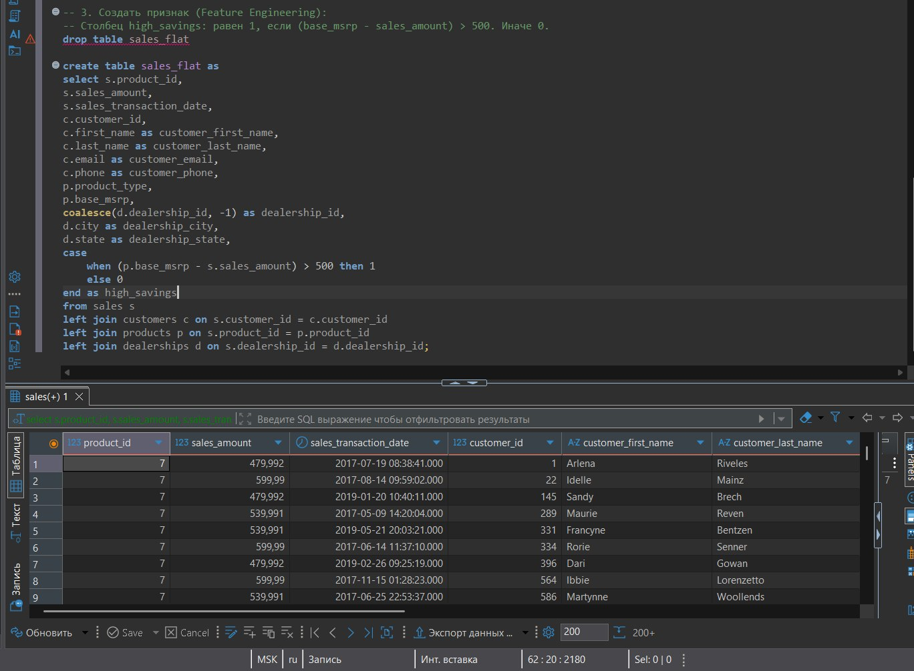

**Статистика выполнения:**
- Обновлено строк: 37711
- Время выполнения: 0,344s
- Старт: Fri Apr 03 03:54:59 MSK 2026
- Финиш: Fri Apr 03 03:55:00 MSK 2026

---

## Вывод

В ходе выполнения лабораторной работы были освоены:

**Теоретические концепции:**
- `INNER JOIN` — для получения только совпадающих записей из нескольких таблиц
- `LEFT JOIN` — для сохранения всех записей из левой таблицы
- `UNION` — для объединения результатов разных запросов
- Подзапросы — для фильтрации с использованием результатов вложенных запросов
- Функции преобразования: `COALESCE` (замена NULL), `CASE` (условная логика), `CAST`/`::` (преобразование типов)

**Практические навыки:**
- Соединение 3 и более таблиц в одном запросе
- Создание "плоских" таблиц (витрин данных) для аналитиков
- Feature Engineering — создание новых признаков на основе существующих данных
- Очистка данных от `NULL` значений
- Преобразование типов данных дат

**Статистика выполнения:**
- Часть 2.1: 4 запроса (скриншоты 1-4)
- Часть 2.2: 5 запросов (скриншоты 5-9)
- Часть 2.3: 3 запроса (скриншоты 10-12)
- Индивидуальные задачи: 3 задачи (скриншоты 13-17)
- Локальные CRUD операции: 3 операции (скриншоты 18-20)

Все запросы выполнены корректно, результаты соответствуют ожидаемым. Создана таблица `sales_flat` с 37711 записями, содержащая все необходимые для анализа данные и вычисленный признак `high_savings`.
