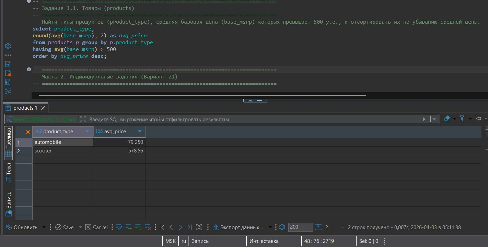
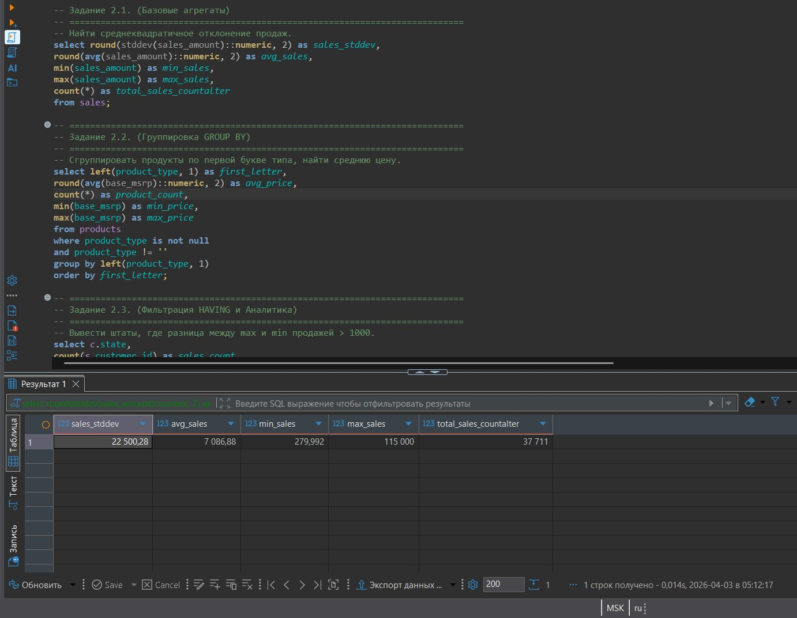
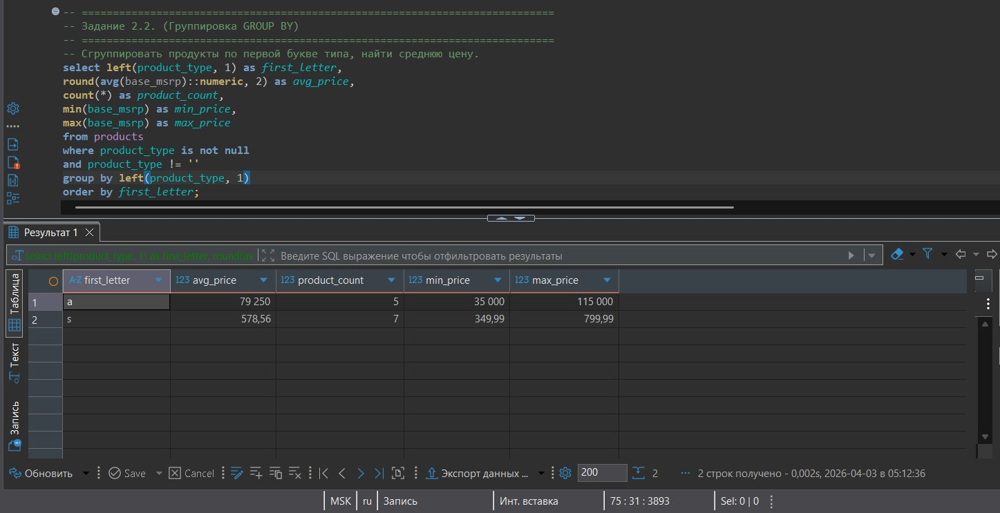
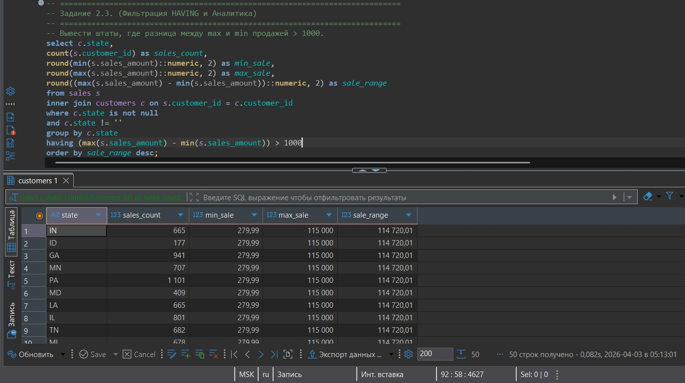

# Лабораторная работа №3

## Агрегации и аналитические функции

**Вариант:** 21

---

### Цель работы
Научиться выполнять быстрый и эффективный анализ данных, используя возможности агрегирования SQL. Освоить синтаксис группировки данных, фильтрации групп и вычисления статистических показателей.

---

## Часть 1. Общие задания (Guided Labs)

### 1.1. Товары (products)

**Задание:** Найти типы продуктов (`product_type`), средняя базовая цена (`base_msrp`) которых превышает 500 у.е., и отсортировать их по убыванию средней цены.

**Выполнение:** Запрос с группировкой по `product_type`, вычислением средней цены через `AVG()`, фильтрацией групп через `HAVING` и сортировкой по убыванию.

**Результат выполнения:**  

---

## Часть 2. Индивидуальные задания (Вариант 21)

### Задание 2.1. Базовые агрегаты

**Задание:** Найти среднеквадратичное отклонение продаж.

**Выполнение:** Запрос использует агрегатные функции: `STDDEV()` для вычисления стандартного отклонения, `AVG()` для среднего значения, `MIN()`, `MAX()` для минимального и максимального значения, `COUNT()` для общего количества продаж.

**Результат выполнения:**  

**Полученные значения:**
- Стандартное отклонение (`sales_stddev`): 22 500,28
- Средняя сумма продажи (`avg_sales`): 7 086,88
- Минимальная продажа (`min_sales`): 279,992
- Максимальная продажа (`max_sales`): 115 000
- Общее количество продаж (`total_sales_counter`): 37 711

---

### Задание 2.2. Группировка GROUP BY

**Задание:** Сгруппировать продукты по первой букве типа, найти среднюю цену.

**Выполнение:** Использование функции `LEFT(product_type, 1)` для извлечения первой буквы типа продукта. Группировка по первой букве с вычислением средней цены, количества продуктов, минимальной и максимальной цены в каждой группе.

**Результат выполнения:**  

**Полученные значения:**
- **Буква 'a'** (вероятно, 'automobile'): средняя цена 79 250, количество 5 товаров, мин. 35 000, макс. 115 000
- **Буква 's'** (вероятно, 'scooter'): средняя цена 578,56, количество 7 товаров, мин. 349,99, макс. 799,99

---

### Задание 2.3. Фильтрация HAVING и Аналитика

**Задание:** Вывести штаты, где разница между `max` и `min` продажей > 1000.

**Выполнение:** Соединение таблиц `sales` и `customers` через `INNER JOIN`, группировка по штатам, вычисление разницы между максимальной и минимальной продажей, фильтрация групп через `HAVING` (разница > 1000) и сортировка по убыванию разницы.

**Результат выполнения:**  

**Полученные значения (первые 10 штатов):**
- IN: 665 продаж, разница 114 720,01
- ID: 177 продаж, разница 114 720,01
- GA: 941 продажа, разница 114 720,01
- MN: 707 продаж, разница 114 720,01
- PA: 1 101 продажа, разница 114 720,01
- MD: 409 продаж, разница 114 720,01
- LA: 665 продаж, разница 114 720,01
- IL: 801 продажа, разница 114 720,01
- TN: 682 продажи, разница 114 720,01
- MI: 678 продаж, разница 114 720,01

---

## Вывод

В ходе выполнения лабораторной работы были освоены:

**Агрегатные функции PostgreSQL:**
- `COUNT(*)` — подсчет общего количества строк
- `AVG()` — вычисление среднего арифметического
- `MIN()` / `MAX()` — поиск минимального и максимального значения
- `STDDEV()` — вычисление стандартного отклонения

**Группировка и фильтрация:**
- `GROUP BY` — разделение данных на подмножества для анализа
- `HAVING` — фильтрация результатов после группировки
- Отличие `WHERE` (фильтрация строк до группировки) от `HAVING` (фильтрация групп после агрегации)

**Практические навыки:**
- Вычисление статистических показателей для анализа данных
- Группировка с использованием функций преобразования (`LEFT()`)
- Соединение таблиц с последующей агрегацией
- Фильтрация групп по условиям на агрегированные значения

**Статистика выполнения:**
- Часть 1.1: 1 запрос (скриншот 1)
- Задание 2.1: 1 запрос (скриншот 2)
- Задание 2.2: 1 запрос (скриншот 3)
- Задание 2.3: 1 запрос (скриншот 4)

Все запросы выполнены корректно, результаты соответствуют ожидаемым. Выявлены значительные различия в ценовых категориях разных типов продуктов, а также определены штаты с наибольшим разбросом сумм продаж.
