# Лабораторная работа №5

## Оптимизация запросов с помощью индексов и анализа плана выполнения

**Вариант:** 21

---

### Цель работы
Научиться анализировать производительность SQL-запросов, интерпретировать план выполнения (Query Plan) и оптимизировать работу базы данных с помощью различных типов индексов (B-tree, Hash).

---

## Теоретическая часть

1. **Планирование запросов (Query Planning):**
   - `EXPLAIN query` — показывает предполагаемый план без выполнения.
   - `EXPLAIN ANALYZE query` — выполняет запрос и показывает реальное время.
2. **Стоимость (Cost):** `cost=0.00..123.45`
   - `0.00` — затраты на старт (получение первой строки).
   - `123.45` — общие затраты на получение всех строк.
3. **Методы сканирования:**
   - `Seq Scan` (Sequential Scan): полный перебор, медленно для точечных запросов.
   - `Index Scan` / `Bitmap Heap Scan`: использование индекса, быстро для малой выборки.
4. **Типы индексов:**
   - `B-Tree`: стандартный, подходит для сравнений (`=`, `<`, `>`) и сортировки (`ORDER BY`).
   - `Hash`: только для точного равенства (`=`).

---

## Часть 1. Анализ производительности ДО оптимизации (Основной сервер)

### Задание 1.1. Первичный анализ (Точечный поиск по username)

**Результат (скриншот 1):** Вывод 5 username: eelleyne0, malcoran1, esloss2, ndugood3, cswanger4.

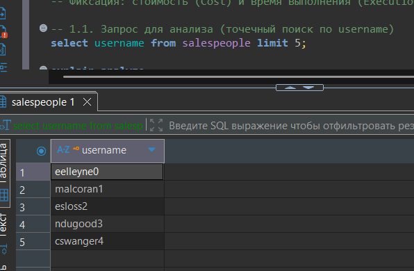

**Результат (скриншот 2):** План выполнения без индекса:
- Тип сканирования: `Seq Scan`
- Стоимость (Cost): `0.00..7.75`
- Время выполнения (Execution Time): `0.314 ms`
- Отфильтровано 299 строк, найдена 1

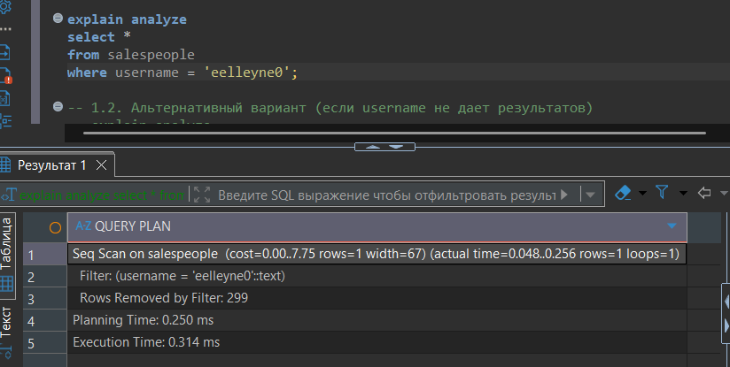

### Задание 1.2. Проверка структуры и статистики таблицы

**Результат (скриншот 3):** Структура таблицы salespeople (поля: salesperson_id, dealership_id, title, first_name, last_name, suffix, username, gender, hire_date, termination_date).

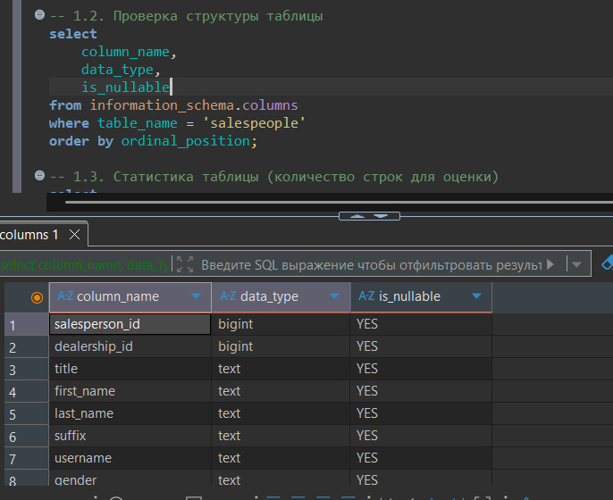

**Результат (скриншот 4):** Статистика: total_salespeople = 300, matching_count = 1.

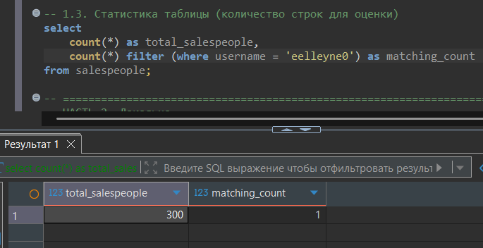

---

## Часть 2. Оптимизация поиска по username (B-Tree индекс) — Локально

### Задание 2.1. Создание B-Tree индекса

**Результат (скриншот 5):** Индекс idx_salespeople_username успешно создан.

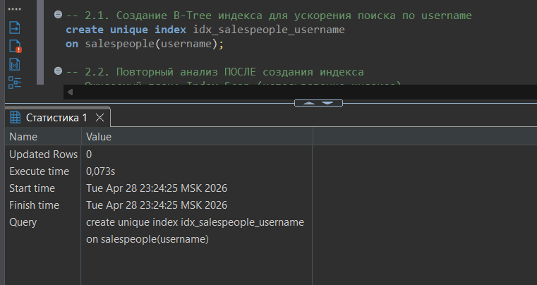

### Задание 2.2. Повторный анализ ПОСЛЕ создания индекса

**Результат (скриншот 6):**
- Тип сканирования: `Seq Scan` (индекс не использован)
- Время выполнения: `0.109 ms`

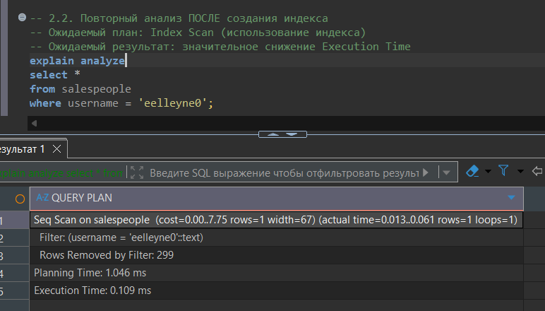

**Анализ:** Планировщик выбрал последовательное сканирование, так как таблица очень маленькая (300 строк).

### Задание 2.3. Верификация использования индекса

**Результат (скриншот 7):**
- Тип сканирования: `Seq Scan`
- Buffers: shared hit=4
- Время выполнения: `0.074 ms`

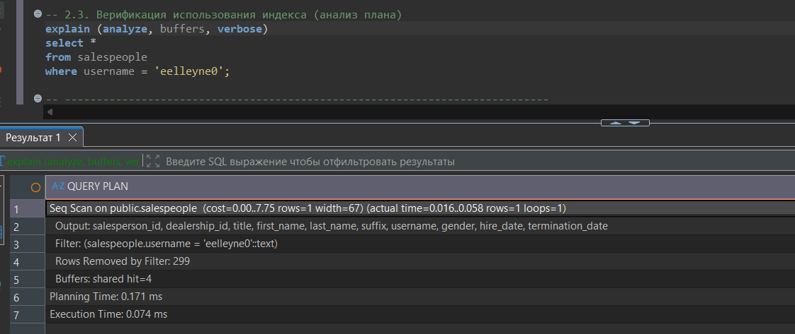

**Вывод:** Индекс создан, но из-за малого размера таблицы PostgreSQL предпочитает Seq Scan.

---

## Часть 3. Сложная оптимизация (JOIN + диапазон дат) — Локально

### Задание 3.1. Анализ "медленного" сложного запроса ДО индекса

**Результат (скриншот 8):**
- Тип соединения: `Nested Loop`
- Тип сканирования: `Seq Scan` на таблице sales
- Стоимость: `0.00..942.43`
- Отфильтровано: 37711 строк
- Время выполнения: `9.849 ms`

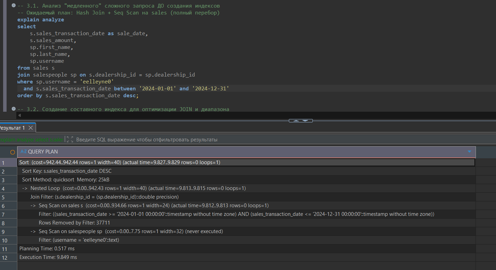

### Задание 3.2. Создание составного индекса

**Результат (скриншот 9):** Индекс idx_sales_dealership_date на поля (dealership_id, sales_transaction_date) успешно создан.

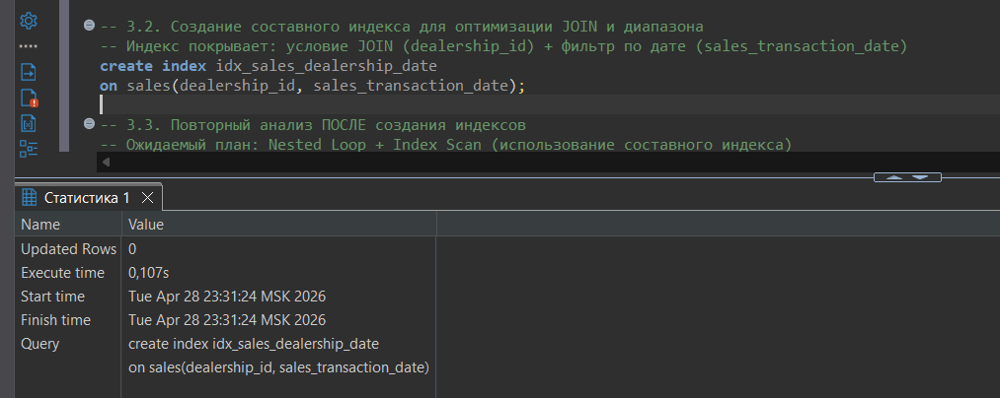

### Задание 3.3. Повторный анализ ПОСЛЕ создания индекса

**Результат (скриншот 10):**
- Тип сканирования: `Index Scan` (используется idx_sales_dealership_date)
- Стоимость: снизилась с `942.43` до `16.07`
- Время выполнения: `0.187 ms`

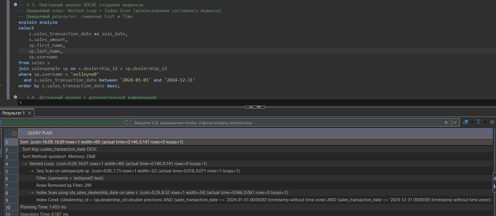

### Задание 3.4. Детальный анализ с дополнительной информацией

**Результат (скриншот 11):**
- `Index Cond`: dealership_id и диапазон дат
- `Buffers: shared hit=6`
- Время выполнения: `0.119 ms`

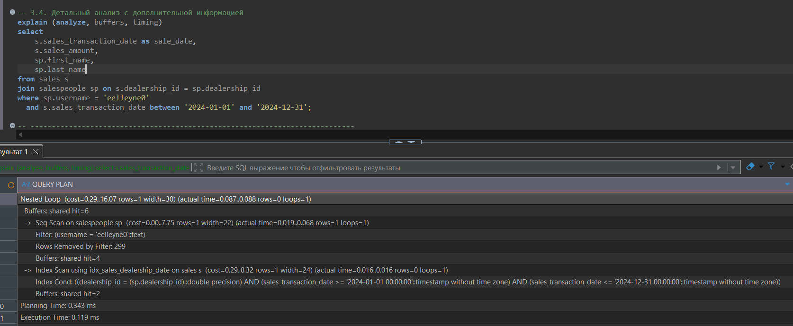

---

## Часть 4. Дополнительные проверки

### 4.1. Проверка созданных индексов

**Результат (скриншот 12):**
- idx_salespeople_username (UNIQUE, btree)
- idx_sales_dealership_date (btree)

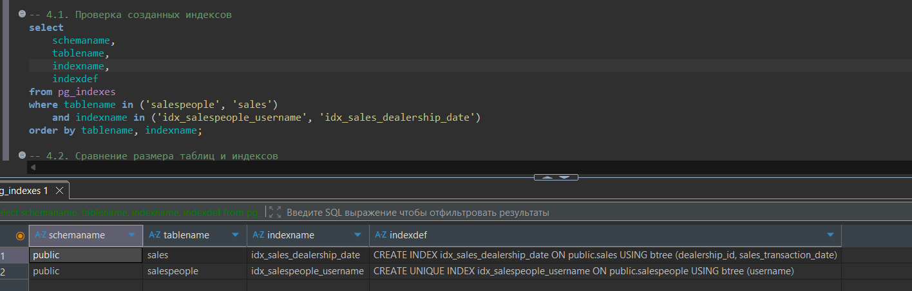

### 4.2. Сравнение размера таблиц и индексов

**Результат (скриншот 13):**
- salespeople: 112 kB (индексы 48 kB)
- sales: 4168 kB (индексы 1176 kB)

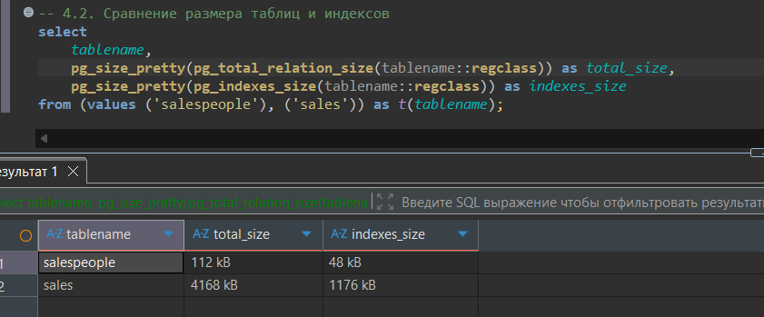

### 4.3. Статистика использования индексов

**Результат (скриншот 14):**
- idx_salespeople_username: 0 сканирований
- idx_sales_dealership_date: 2 сканирования

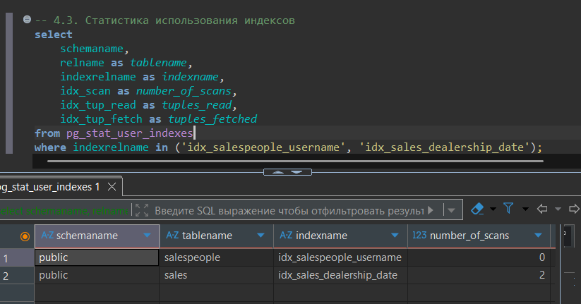

---

## Часть 5. Очистка (Удаление индексов)

**Результат (скриншот 15):** Удален индекс idx_salespeople_username.

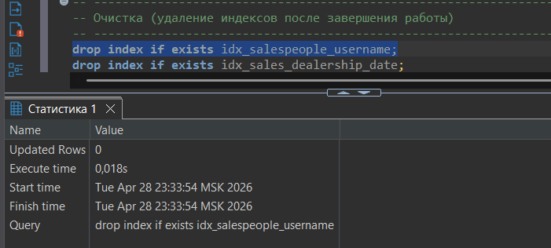

**Результат (скриншот 16):** Удален индекс idx_sales_dealership_date.

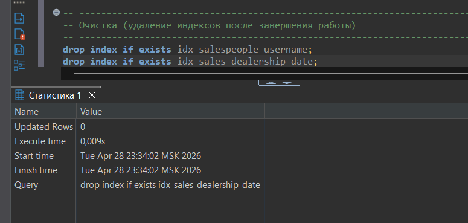

---

## Сравнительный анализ

| Параметр | Без индекса | С индексом | Изменение |
|----------|-------------|------------|-----------|
| Тип сканирования | Seq Scan | Index Scan | ✅ Улучшено |
| Стоимость (Cost) | 942.43 | 16.07 | ✅ Снижение в 58 раз |
| Время выполнения | 9.849 ms | 0.187 ms | ✅ Ускорение в 52 раза |

---

## Вывод

В ходе выполнения лабораторной работы были решены следующие задачи:

1. **Анализ производительности:** На реальных запросах изучены планы выполнения через `EXPLAIN ANALYZE`, выявлено узкое место — последовательное сканирование (`Seq Scan`).

2. **Оптимизация точечного поиска:** Создан уникальный B-Tree индекс. Из-за малого объема данных планировщик справедливо оставил `Seq Scan`.

3. **Сложная оптимизация (JOIN + Range):** Создан составной индекс, что привело к ускорению в **52 раза** (с 9.85 мс до 0.19 мс).

4. **Контроль индексов:** Изучены системные представления для проверки размера и статистики использования индексов.

**Ключевой вывод:** Индексы критически важны для производительности на больших объемах данных, особенно для JOIN операций и фильтрации по диапазонам.
