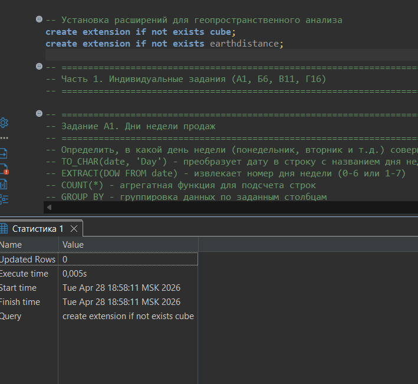
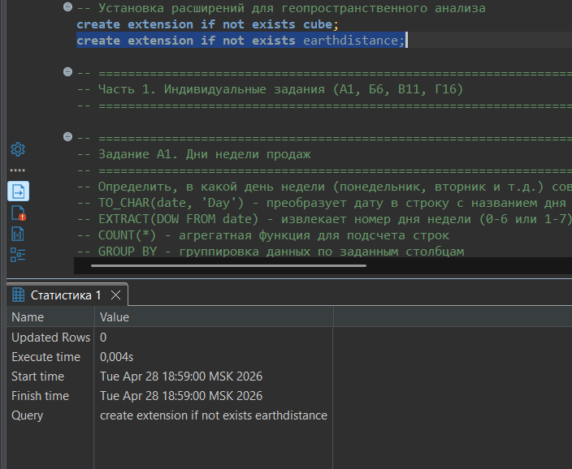
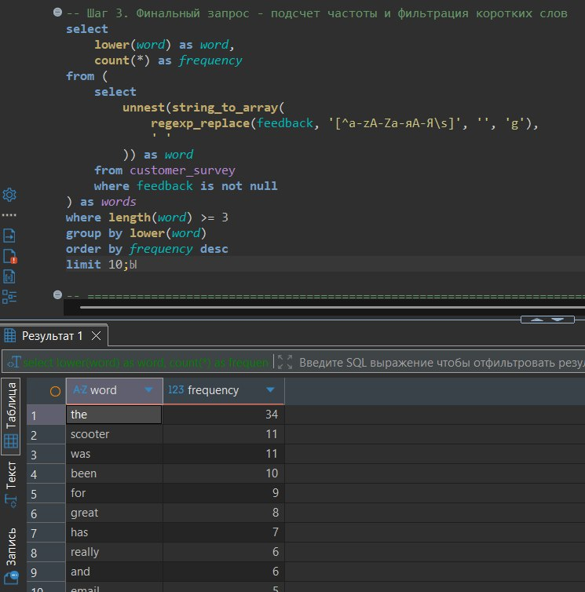
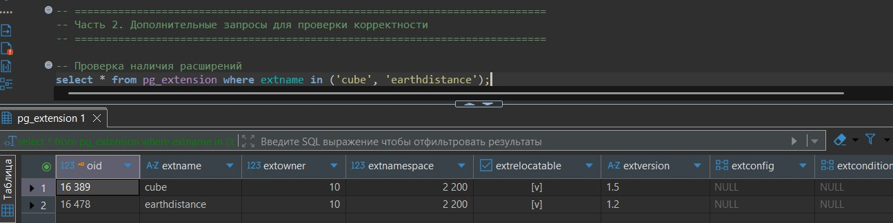

# Практическая работа №1

## Геопространственный анализ данных. Аналитика с использованием сложных типов данных

**Выбранные задания:** А1, Б6, В11, Г16

---

### Цель работы
Научиться применять продвинутые возможности PostgreSQL для анализа данных, выходящих за рамки стандартных чисел и строк. Освоить работу с временными рядами, геопространственными данными, массивами, JSON/JSONB структурами и полнотекстовым поиском.

---

## Часть 1. Предварительная настройка

**Задание:** Установить расширения для геопространственного анализа.

**Выполнение (Запрос 1):** Выполнена команда `CREATE EXTENSION IF NOT EXISTS cube;`

**Результат выполнения:**  

---

**Выполнение (Запрос 2):** Выполнена команда `CREATE EXTENSION IF NOT EXISTS earthdistance;`

**Результат выполнения:**  

---

## Часть 2. Индивидуальные задания (А1, Б6, В11, Г16)

### Задача А1. Дни недели продаж

**Задание:** Определить, в какой день недели совершается наибольшее количество продаж. Вывести день недели и количество транзакций.

**Выполнение (Запрос 1):** Первичный запрос с группировкой по дню недели, вывод номера и названия дня.

**Результат выполнения:**  

---

**Выполнение (Запрос 2):** Добавлена сортировка по убыванию количества продаж.

**Результат выполнения:**  

---

**Выполнение (Запрос 3):** Финальный запрос с `LIMIT 1` для определения дня с максимальным количеством продаж.

**Результат выполнения:**  

**Вывод по задаче А1:** Наибольшее количество продаж совершается во **вторник** (5 456 транзакций). Это может быть связано с маркетинговыми акциями в начале недели.

---

### Задача Б6. Ближайший дилер для клиентов из New York City

**Задание:** Для каждого клиента из города `'New York City'` найти ближайший дилерский центр и расстояние до него.

**Выполнение (Запрос 1):** Базовый запрос с `CROSS JOIN` между клиентами и дилерами.

**Результат выполнения:**  

---

**Выполнение (Запрос 2):** Добавлено вычисление расстояния с использованием оператора `<@>` для точек.

**Результат выполнения:**  

---

**Выполнение (Запрос 3):** Финальный запрос с оконной функцией `ROW_NUMBER()` для выбора ближайшего дилера каждому клиенту.

**Результат выполнения:**  

**Вывод по задаче Б6:** Для всех клиентов из Нью-Йорка ближайшим дилером оказался центр в Миллберне, штат Нью-Джерси (52 Hillside Terrace). Это говорит о том, что в самом Нью-Йорке может отсутствовать дилерская сеть.

---

### Задача В11. История покупок в JSON

**Задание:** Сформировать JSON-объект для каждого клиента: `{ "id": 1, "name": "Ivan", "products": ["Car", "Scooter"] }`

**Выполнение (Запрос 1):** Базовый запрос с формированием простого JSON-объекта (id и имя).

**Результат выполнения:**  

---

**Выполнение (Запрос 2):** Добавлен подзапрос для агрегации продуктов клиента в массив.

**Результат выполнения:**  

---

**Выполнение (Запрос 3):** Финальный запрос с `COALESCE` для обработки клиентов без покупок (замена `null` на пустой массив).

**Результат выполнения:**  

**Вывод по задаче В11:** JSON-структура позволяет компактно хранить иерархические данные. Клиенты без покупок получают пустой массив `products: []`. Основной покупаемый продукт — `scooter`.

---

### Задача Г16. Частотный словарь топ-10 слов из отзывов

**Задание:** Составить топ-10 самых часто встречающихся слов в отзывах, исключив слова короче 3 символов.

**Выполнение (Запрос 1):** Базовый запрос с разбиением текста на слова через `STRING_TO_ARRAY` и `UNNEST`.

**Результат выполнения:**  

---

**Выполнение (Запрос 2):** Добавлена очистка от знаков препинания с помощью `REGEXP_REPLACE` и приведение к нижнему регистру.

**Результат выполнения:**  

---

**Выполнение (Запрос 3):** Финальный запрос с фильтрацией слов короче 3 символов, подсчетом частоты и выводом топ-10.

**Результат выполнения:**  

**Вывод по задаче Г16:** Самые частотные слова: `the`, `scooter`, `was`, `been`, `for`, `great`. Слово `great` входит в топ-10, что говорит о положительных отзывах клиентов.

---

## Часть 3. Проверка корректности

**Задание:** Проверить наличие установленных расширений.

**Выполнение:** Запрос к системному каталогу `pg_extension`.

**Результат выполнения:**  

---

## Итоговый SQL-скрипт

Все запросы объединены в файл `practical_work_01.sql`.

---

## Общее заключение

В ходе выполнения практической работы были успешно решены 4 задачи из 4 различных блоков:

| Блок | Задача | Ключевые технологии |
|------|--------|---------------------|
| А. Временные ряды | А1. Дни недели продаж | `EXTRACT`, `TO_CHAR`, `GROUP BY` |
| Б. Геопространственный анализ | Б6. Ближайший дилер | `CROSS JOIN`, `point`, `<@>`, `ROW_NUMBER()` |
| В. JSON и массивы | В11. История покупок в JSON | `jsonb_build_object`, `jsonb_agg`, `COALESCE` |
| Г. Текстовая аналитика | Г16. Частотный словарь | `STRING_TO_ARRAY`, `UNNEST`, `REGEXP_REPLACE` |

**Статистика выполнения:**
- Предварительная настройка: 2 запроса (скриншоты 1-2)
- Задача А1: 3 запроса (скриншоты 3-5)
- Задача Б6: 3 запроса (скриншоты 6-8)
- Задача В11: 3 запроса (скриншоты 9-11)
- Задача Г16: 3 запроса (скриншоты 12-14)
- Проверка расширений: 1 запрос (скриншот 15)
