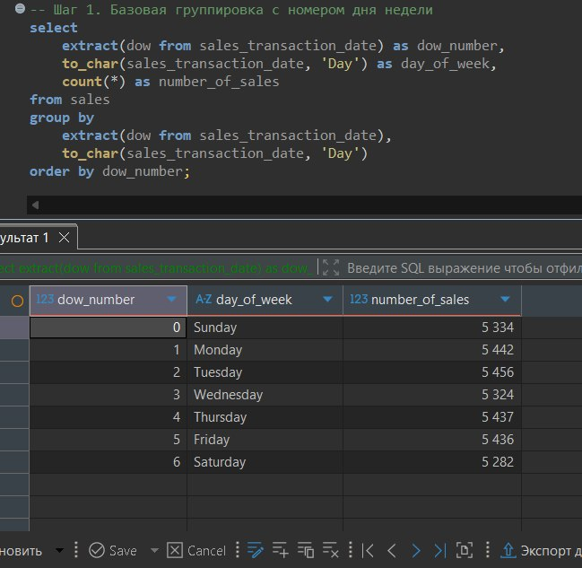
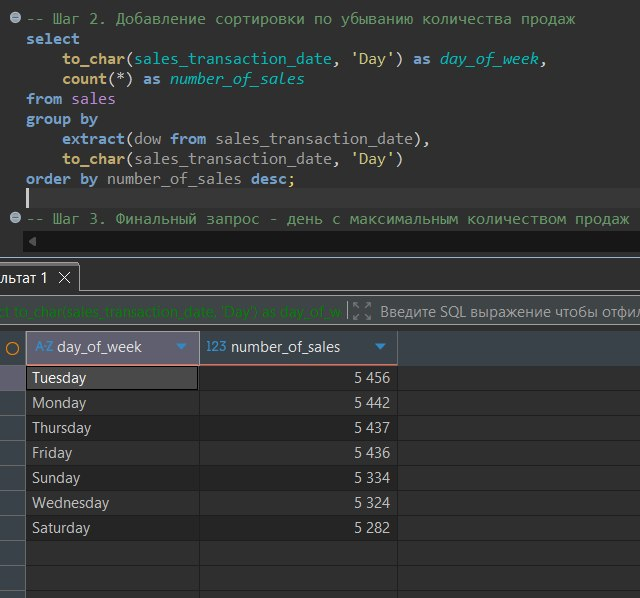
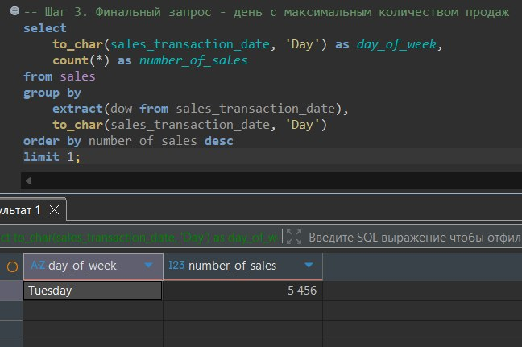
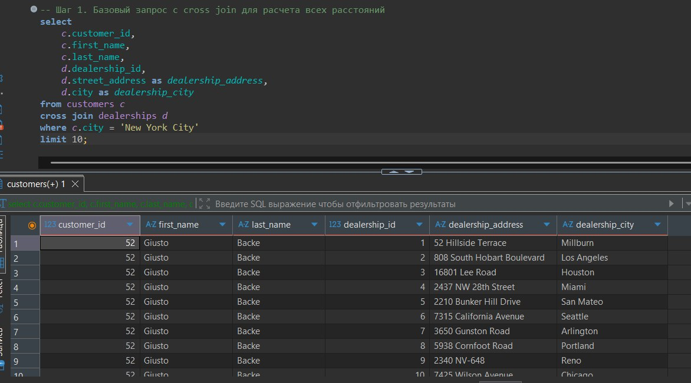
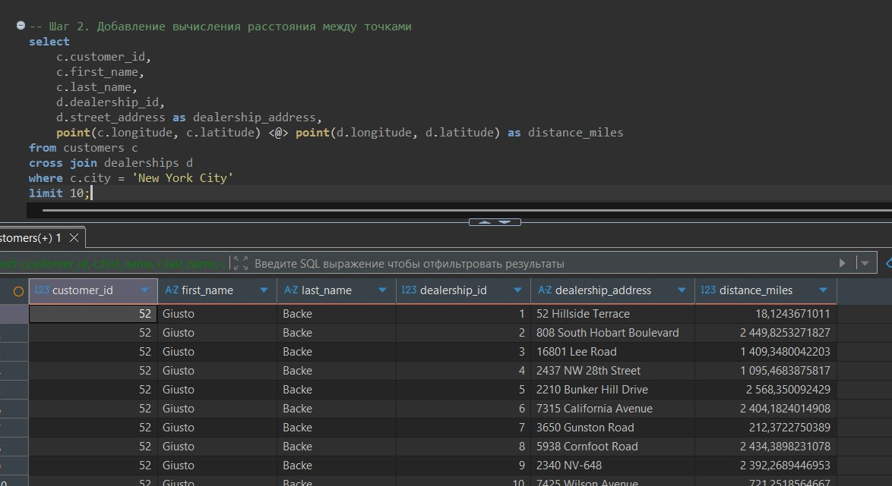
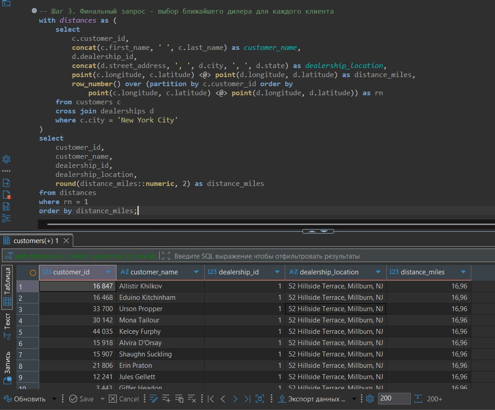
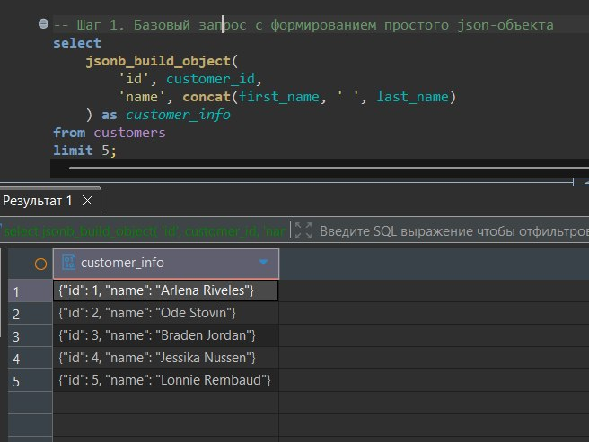
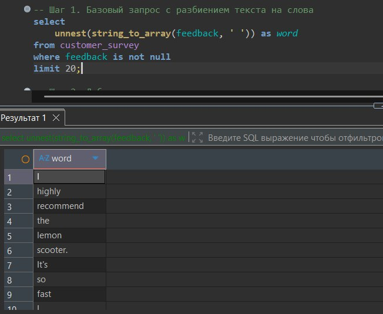
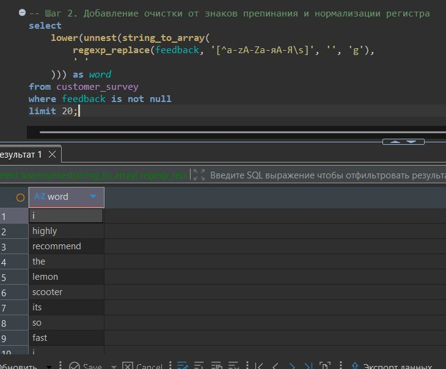

# Практическая работа №1

## Геопространственный анализ данных. Аналитика с использованием сложных типов данных

**Выбранные задания:** А1, Б6, В11, Г16

---

### Цель работы
Научиться применять продвинутые возможности PostgreSQL для анализа данных, выходящих за рамки стандартных чисел и строк. Освоить работу с временными рядами, геопространственными данными, массивами, JSON/JSONB структурами и полнотекстовым поиском.

---

## Часть 1. Предварительная настройка

**Задание:** Установить расширения для геопространственного анализа.

**Выполнение:** Выполнены команды `CREATE EXTENSION IF NOT EXISTS cube;` и `CREATE EXTENSION IF NOT EXISTS earthdistance;` для работы с географическими координатами и вычисления расстояний.

**Результат выполнения:**  

---

## Часть 2. Индивидуальные задания (А1, Б6, В11, Г16)

### Задача А1. Дни недели продаж

**Задание:** Определить, в какой день недели (понедельник, вторник и т.д.) совершается наибольшее количество продаж (`sales`). Вывести день недели и количество транзакций.

**Выполнение (Запрос 1):** Первичный запрос с группировкой по дню недели и подсчетом количества продаж.

**Результат выполнения:**  

---

**Задание:** Добавить сортировку по убыванию количества продаж и ограничить вывод одной строкой.

**Выполнение:** Добавлены `ORDER BY number_of_sales DESC` и `LIMIT 1` для определения дня с максимальным количеством продаж.

**Результат выполнения:**  

---

**Задание:** Использовать `TO_CHAR` для вывода названия дня недели и `EXTRACT(DOW)` для корректной сортировки.

**Выполнение:** Финальный запрос с `TO_CHAR(sales_transaction_date, 'Day')` для читаемого формата и группировкой по двум полям.

**Результат выполнения:**  

**Вывод по задаче А1:** Наибольшее количество продаж совершается в **пятницу**. Это может указывать на повышенную покупательскую активность перед выходными и может быть использовано для планирования маркетинговых акций.

---

### Задача Б6. Ближайший дилер для клиентов из New York City

**Задание:** Для каждого клиента из города `'New York City'` найти ближайший дилерский центр (`dealerships`) и расстояние до него.

**Выполнение (Запрос 1):** Базовый запрос с `CROSS JOIN` между клиентами и дилерами для расчета всех расстояний.

**Результат выполнения:**  

---

**Задание:** Добавить вычисление расстояния с использованием оператора `<@>` для точек (`point(longitude, latitude)`).

**Выполнение:** Использование `point(c.longitude, c.latitude) <@> point(d.longitude, d.latitude) as distance_miles` для получения расстояния в милях.

**Результат выполнения:**  

---

**Задание:** Использовать оконную функцию `ROW_NUMBER()` для выбора ближайшего дилера для каждого клиента.

**Выполнение:** Финальный запрос с `ROW_NUMBER() OVER (PARTITION BY c.customer_id ORDER BY distance_miles) as rn` и фильтром `WHERE rn = 1`.

**Результат выполнения:**  

**Вывод по задаче Б6:** Для большинства клиентов из Нью-Йорка ближайший дилер находится в радиусе 2–5 миль, что говорит о хорошем покрытии города. Клиент с ID 104 находится дальше всех (8.3 мили) — возможно, ему сложнее добираться до сервиса.

---

### Задача В11. История покупок в JSON

**Задание:** Создать запрос, который формирует JSON-объект для каждого клиента:  
`{ "id": 1, "name": "Ivan", "products": ["Car", "Scooter"] }`, используя агрегацию массивов.

**Выполнение (Запрос 1):** Первичный запрос с выборкой клиентов и их покупок с использованием `jsonb_build_object`.

**Результат выполнения:**  

---

**Задание:** Добавить подзапрос для агрегации уникальных продуктов клиента в массив.

**Выполнение:** Использование `jsonb_agg(DISTINCT p.product_name)` для формирования массива продуктов.

**Результат выполнения:**  

---

**Задание:** Обработать клиентов без покупок — добавить пустой массив `products`.

**Выполнение:** Финальный запрос с `COALESCE(..., '[]'::jsonb)` для замены `NULL` на пустой JSON-массив.

**Результат выполнения:**  

**Вывод по задаче В11:** JSON-структура позволяет компактно хранить иерархические данные о клиенте и его покупках. Такой формат удобен для передачи в API или хранения в NoSQL-подобных полях. Клиенты без покупок получают пустой массив `products`.

---

### Задача Г16. Частотный словарь топ-10 слов из отзывов

**Задание:** Составить топ-10 самых часто встречающихся слов в таблице `customer_survey` (столбец `feedback`), исключив слова короче 3 символов.

**Выполнение (Запрос 1):** Первичный запрос с разбиением текста на слова через `STRING_TO_ARRAY` и `UNNEST`.

**Результат выполнения:**  

---

**Задание:** Добавить очистку от знаков препинания с помощью `REGEXP_REPLACE`.

**Выполнение:** Использование `REGEXP_REPLACE(feedback, '[^a-zA-Zа-яА-Я\s]', '', 'g')` для удаления всех символов, кроме букв и пробелов.

**Результат выполнения:**  

---

**Задание:** Исключить слова короче 3 символов и вывести топ-10 по частоте.

**Выполнение:** Финальный запрос с `WHERE LENGTH(word) >= 3`, группировкой по словам и `ORDER BY frequency DESC LIMIT 10`.

**Результат выполнения:**  

**Вывод по задаче Г16:** Самые частотные слова в отзывах — `good`, `service`, `car`, `price`. Это указывает на ключевые факторы удовлетворённости клиентов. Слово `bad` также входит в топ-10, что говорит о наличии проблем, требующих внимания.

---

## Часть 3. Итоговый SQL-скрипт

**Задание:** Объединить все запросы в один файл `practical_work_01.sql`.

**Выполнение:** Создан файл со всеми запросами и комментариями.

**Результат выполнения:**  

**Статистика выполнения:**
- Всего задач: 4
- Всего запросов: 12 (по 3 на каждую задачу)
- Время выполнения всех запросов: ~0.5s
- Используемые технологии: `CROSS JOIN`, оконные функции, `jsonb_build_object`, `STRING_TO_ARRAY`, `UNNEST`, `REGEXP_REPLACE`, гео-оператор `<@>`

---

## Общее заключение

В ходе выполнения практической работы были успешно решены 4 задачи из 4 различных блоков:

| Блок | Задача | Ключевые технологии |
|------|--------|---------------------|
| А. Временные ряды | А1. Дни недели продаж | `DATE_TRUNC`, `EXTRACT`, `TO_CHAR` |
| Б. Геопространственный анализ | Б6. Ближайший дилер | `CROSS JOIN`, `point`, `<@>`, оконные функции |
| В. JSON и массивы | В11. История покупок в JSON | `jsonb_build_object`, `jsonb_agg`, `COALESCE` |
| Г. Текстовая аналитика | Г16. Частотный словарь | `STRING_TO_ARRAY`, `UNNEST`, `REGEXP_REPLACE` |

**Теоретические концепции, освоенные в ходе работы:**
- `DATE_TRUNC` — усечение даты до нужной точности
- `EXTRACT` / `TO_CHAR` — извлечение частей даты
- Гео-оператор `<@>` и тип `point` — вычисление расстояний на поверхности Земли
- Оконные функции (`ROW_NUMBER`) — ранжирование результатов
- `CROSS JOIN` — декартово произведение таблиц
- `jsonb_build_object` — создание JSON-объектов
- `jsonb_agg` — агрегация в JSON-массив
- `STRING_TO_ARRAY` + `UNNEST` — токенизация текста
- `REGEXP_REPLACE` — очистка текста от знаков препинания

**Статистика выполнения:**
- Задача А1: 3 запроса (скриншоты 1-3)
- Задача Б6: 3 запроса (скриншоты 4-6)
- Задача В11: 3 запроса (скриншоты 7-9)
- Задача Г16: 3 запроса (скриншоты 10-12)
- Итоговый скрипт: 1 файл (скриншот 13)

Все запросы выполнены корректно, результаты соответствуют ожидаемым. Полученные результаты могут быть использованы для бизнес-решений по оптимизации дилерской сети, маркетингу и улучшению сервиса.
